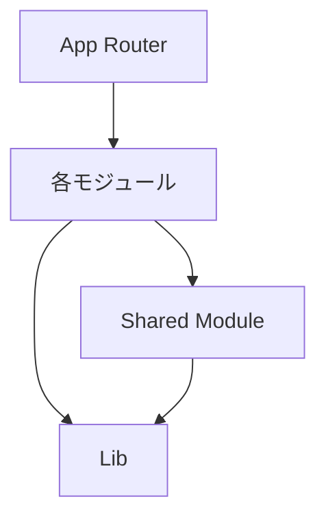
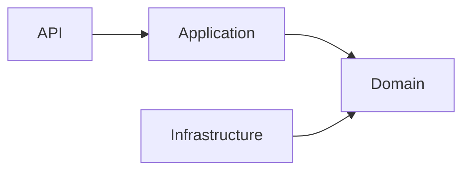

# アーキテクチャ設計書

## 概要

本プロジェクトは**モジュラーモノリス（垂直スライス型）**アーキテクチャを採用しています。
これにより、初期開発の速度を保ちながら、将来的なマイクロサービス化への移行パスを確保しています。

## アーキテクチャの特徴

### 1. モジュラーモノリス

単一のコードベースでありながら、ビジネス機能ごとに独立したモジュールとして分離。

**メリット**:

- 開発初期のオーバーヘッドを削減
- モジュール間の依存関係が明確
- 将来的な分離が容易

### 2. 垂直スライス型

各モジュールが以下の層を持つ完結した構造：

- **Client層**: UI、状態管理、APIクライアント
- **Server層**: ビジネスロジック、データアクセス
- **Shared層**: モジュール内共有リソース

### 3. ドメイン駆動設計（DDD）の採用

Server層においてDDDの原則を適用：

- **Domain層**: ビジネスルールとエンティティ
- **Application層**: ユースケースとDTO
- **Infrastructure層**: 外部システムとの連携

## モジュール構成

```
src/modules/
├── ingredients/          # 食材管理モジュール
│   ├── client/          # クライアントサイド
│   │   ├── components/  # UIコンポーネント
│   │   ├── hooks/       # カスタムフック
│   │   ├── stores/      # 状態管理
│   │   ├── services/    # APIクライアント
│   │   └── pages/       # ページコンポーネント
│   │
│   ├── server/          # サーバーサイド
│   │   ├── api/         # APIエンドポイント
│   │   ├── application/ # アプリケーション層
│   │   ├── domain/      # ドメイン層
│   │   └── infrastructure/ # インフラ層
│   │
│   └── shared/          # モジュール内共有
│       ├── types/       # 型定義
│       ├── constants/   # 定数
│       └── utils/       # ユーティリティ
│
└── shared/              # モジュール間共有
    ├── client/          # 共通UIコンポーネント
    ├── server/          # 共通サーバー機能
    └── types/           # 共通型定義
```

## 依存関係ルール

### 1. モジュール間の依存



- 各モジュールは`shared`モジュールのみに依存可能
- モジュール間の直接的な依存は禁止
- 循環依存は厳禁

### 2. レイヤー間の依存（Server層）



- API → Application → Domain ← Infrastructure
- Domainは他層に依存しない（依存性逆転の原則）

## データフロー

### 1. 読み取り操作

```
Client → API Route → Use Case → Repository → Database
                                      ↓
Client ← API Route ← Use Case ← Domain Entity
```

### 2. 書き込み操作

```
Client → API Route → Use Case → Domain Logic → Repository → Database
                          ↓
                    Validation
```

## 拡張性の考慮

### 1. 新規モジュールの追加

1. `/src/modules/[module-name]/`に配置
2. client/server/sharedの3層構造を維持
3. 既存モジュールからコピーして修正

### 2. マイクロサービス化への移行

各モジュールが独立しているため：

1. モジュールをそのまま別サービスとして切り出し可能
2. APIインターフェースを維持したまま移行
3. 段階的な移行が可能

### 3. 将来の拡張例

```
modules/
├── recipes/          # レシピ管理
├── meal-planning/    # 献立計画
├── shopping-list/    # 買い物リスト
└── nutrition/        # 栄養管理
```

## セキュリティ考慮事項

### 1. 認証・認可

- Supabase Authenticationを使用（将来実装）
- Row Level Securityでデータアクセス制御
- JWTトークンベースの認証

### 2. データ検証

- Zodによる入力検証
- サーバーサイドでの再検証
- SQLインジェクション対策（Prisma使用）

### 3. 環境変数管理

- センシティブな情報は環境変数で管理
- `.env.local`はGit管理外
- 本番環境はVercelの環境変数機能を使用

## パフォーマンス最適化

### 1. コード分割

- Next.jsの動的インポート
- モジュール単位での遅延読み込み

### 2. キャッシング

- TanStack Queryによるクライアントサイドキャッシュ
- Next.jsのサーバーコンポーネントキャッシュ

### 3. データベース最適化

- Prismaのクエリ最適化
- インデックスの適切な設定
- N+1問題の回避
