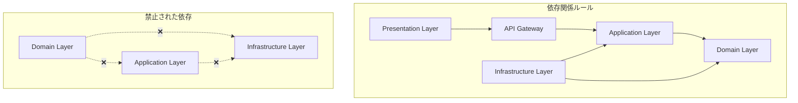
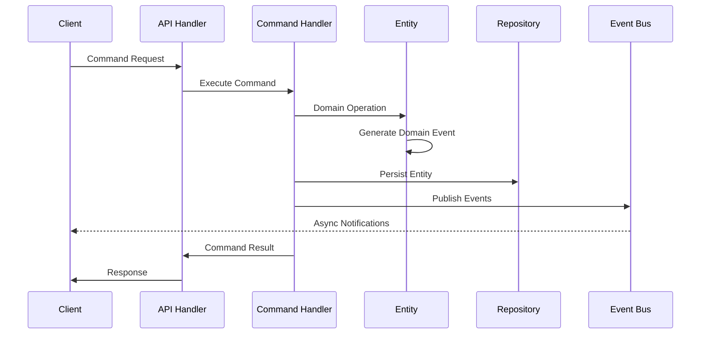
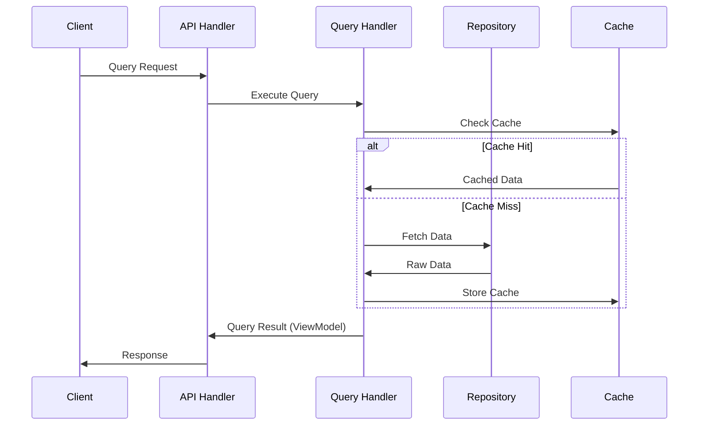
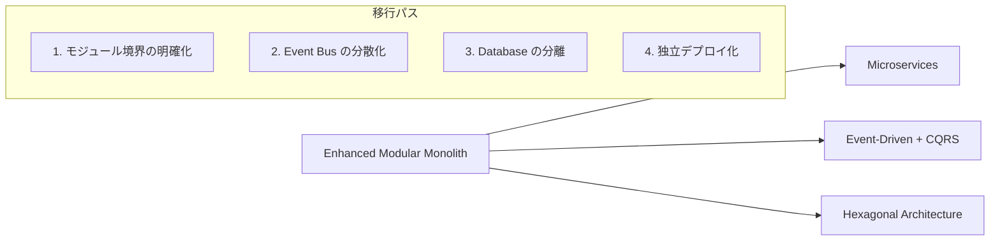

# アーキテクチャ設計書

## 概要

本プロジェクトは**Enhanced Modular Monolith**アーキテクチャを採用しています。
これは従来のモジュラーモノリスにドメイン駆動設計（DDD）、Hexagonal Architecture、CQRSパターンを完全に統合した先進的なアーキテクチャです。

> **📋 詳細情報**
>
> - 📁 **アーキテクチャ設計資料**: [architecture/](./architecture/) - 包括的な設計資料集
> - 🏗️ **完全な設計仕様**: [architecture/ARCHITECTURE_ENHANCED.md](./architecture/ARCHITECTURE_ENHANCED.md)
> - 📊 **アーキテクチャパターン比較**: [architecture/ARCHITECTURE_PATTERNS_COMPARISON.md](./architecture/ARCHITECTURE_PATTERNS_COMPARISON.md)

## アーキテクチャの特徴

### 1. Enhanced Modular Monolith

従来のモジュラーモノリスを進化させた先進的なアーキテクチャ：

**主要要素**:

- 🏗️ **モジュール独立性**: 各ビジネス機能が完全に独立
- 🎯 **ドメイン中心設計**: ビジネスロジックがアーキテクチャの中核
- 🔄 **CQRS パターン**: 読み書き責務の最適分離
- 🔌 **Hexagonal 境界**: 外部システムとの疎結合
- 📡 **Event-Driven**: ドメインイベントによる非同期処理

### 2. 4層アーキテクチャ

各モジュールは以下の4層で構成：

- **Presentation Layer (client/)**: UI、状態管理、Anti-Corruption Layer
- **Application Layer (server/application/)**: Command/Query Handlers、Application Services
- **Domain Layer (server/domain/)**: Entities、Value Objects、Domain Services、Events
- **Infrastructure Layer (server/infrastructure/)**: Repository実装、外部システム連携

### 3. ドメイン駆動設計（DDD）の完全実装

DDD原則の完全適用：

- **Entities**: ビジネスアイデンティティを持つオブジェクト
- **Value Objects**: 不変性を保証する値オブジェクト
- **Aggregates**: データ整合性の境界
- **Domain Events**: ビジネス上重要な出来事の記録
- **Specifications**: ビジネスルールの明示的表現

## ディレクトリ構造

### 基本構造（モジュラーモノリス - 垂直スライス型）

```
/
├── src/
│   ├── app/                           # Next.js App Router（ルーティング層）
│   │   ├── (dashboard)/               # ダッシュボード関連ページグループ
│   │   │   ├── ingredients/           # 食材管理ページ
│   │   │   ├── layout.tsx             # ダッシュボードレイアウト
│   │   │   └── page.tsx               # ダッシュボードトップ
│   │   ├── api/                       # API Routes
│   │   │   └── v1/                    # APIバージョニング
│   │   │       └── ingredients/       # 食材管理API
│   │   ├── layout.tsx                 # ルートレイアウト
│   │   └── page.tsx                   # ランディングページ
│   │
│   ├── modules/                       # ビジネスモジュール（垂直スライス）
│   │   ├── ingredients/               # 食材管理モジュール
│   │   │   ├── client/                # クライアントサイド
│   │   │   ├── server/                # サーバーサイド
│   │   │   ├── shared/                # モジュール内共有
│   │   │   └── index.ts               # モジュールエクスポート
│   │   │
│   │   └── shared/                    # モジュール間共有
│   │       ├── client/                # 共有クライアント
│   │       ├── server/                # 共有サーバー
│   │       └── types/                 # 共通型定義
│   │
│   ├── lib/                           # アプリケーション基盤
│   │   ├── api/                       # API基盤
│   │   ├── auth/                      # 認証基盤
│   │   ├── config/                    # 設定
│   │   └── prisma/                    # Prismaクライアント
│   │
│   └── styles/                        # グローバルスタイル
│
├── prisma/                            # Prismaスキーマとマイグレーション
├── public/                            # 静的ファイル
├── tests/                             # テスト
└── docs/                              # ドキュメント
```

### モジュール詳細構造

```
src/modules/
├── ingredients/          # 食材管理モジュール
│   ├── client/          # Presentation Layer
│   │   ├── components/  # UIコンポーネント
│   │   ├── hooks/       # カスタムフック (queries/commands/state)
│   │   ├── stores/      # クライアント状態管理 (Zustand)
│   │   ├── adapters/    # Anti-Corruption Layer
│   │   └── types/       # フロントエンド型定義
│   │
│   ├── server/          # サーバーサイド
│   │   ├── api/         # Web Adapters (Controllers)
│   │   │   ├── handlers/     # Request Handlers
│   │   │   ├── validators/   # Input Validation (Zod)
│   │   │   ├── serializers/ # Response Serialization
│   │   │   └── middleware/   # Custom Middleware
│   │   │
│   │   ├── application/ # Application Layer
│   │   │   ├── commands/     # Command Handlers (CQRS)
│   │   │   ├── queries/      # Query Handlers (CQRS)
│   │   │   ├── services/     # Application Services
│   │   │   ├── ports/        # Interfaces
│   │   │   └── dtos/         # Data Transfer Objects
│   │   │
│   │   ├── domain/      # Domain Layer
│   │   │   ├── entities/     # Domain Entities
│   │   │   ├── value-objects/# Value Objects
│   │   │   ├── services/     # Domain Services
│   │   │   ├── events/       # Domain Events
│   │   │   ├── repositories/ # Repository Interfaces
│   │   │   ├── specifications/# Business Rules
│   │   │   └── exceptions/   # Domain Exceptions
│   │   │
│   │   └── infrastructure/ # Infrastructure Layer
│   │       ├── persistence/  # Database Adapters
│   │       ├── events/       # Event Handlers
│   │       ├── external/     # External Service Adapters
│   │       ├── messaging/    # Event Bus Implementation
│   │       └── caching/      # Caching Layer
│   │
│   └── shared/          # Shared Kernel
│       ├── types/       # 共通型定義
│       ├── events/      # 共有イベント
│       ├── exceptions/  # 共通例外
│       └── utils/       # ユーティリティ
│
└── shared/              # Global Shared Kernel
    ├── client/          # 共通UIコンポーネント
    ├── server/          # 共通サーバー機能
    ├── types/           # グローバル型定義
    ├── utils/           # 共通ユーティリティ
    └── constants/       # グローバル定数
```

### インポートパスエイリアス

```typescript
// tsconfig.json のパスマッピング
{
  "compilerOptions": {
    "paths": {
      "@/*": ["./src/*"],
      "@/app/*": ["./src/app/*"],
      "@/modules/*": ["./src/modules/*"],
      "@/lib/*": ["./src/lib/*"],
      "@ingredients/*": ["./src/modules/ingredients/*"],
      "@shared/*": ["./src/modules/shared/*"]
    }
  }
}
```

> **📚 詳細なディレクトリ構造**
> 完全なディレクトリ構造と各ファイルの責務については [architecture/ARCHITECTURE_ENHANCED.md](./architecture/ARCHITECTURE_ENHANCED.md#モジュール構成) を参照してください。

## 依存関係ルール

### 1. モジュール間の依存


- 各モジュールは`shared`モジュールのみに依存可能
- モジュール間の直接的な依存は禁止
- 循環依存は厳禁

### 2. レイヤー間の依存（Enhanced構成）



- **依存性逆転の原則**: Domainが外部に依存しない
- **Hexagonal境界**: ポート&アダプターによる分離
- **CQRS分離**: Command/Queryの明確な責務分離

## データフロー

### 1. Command Flow (書き込み処理)



### 2. Query Flow (読み取り処理)



## 拡張性の考慮

### 1. 新規モジュールの追加

1. `/src/modules/[module-name]/`に4層構造で配置
2. DDD原則に従ったDomain層の設計
3. CQRS対応のApplication層実装
4. Event-Driven連携の実装

### 2. マイクロサービス化への移行

Enhanced Modular Monolith設計により：



1. **モジュール独立性**: 既に分離されたモジュールを独立サービス化
2. **Event-Driven基盤**: ドメインイベントをマイクロサービス間通信に活用
3. **CQRS活用**: 読み書き分離によりサービス間結合度を最小化
4. **段階的移行**: リスクを最小化した段階的なサービス分離

### 3. 将来の拡張例

```
modules/
├── ingredients/      # 食材管理 (既存)
├── recipes/          # レシピ管理
├── meal-planning/    # 献立計画
├── shopping-list/    # 買い物リスト
├── nutrition/        # 栄養管理
├── inventory/        # 在庫統計
└── recommendations/  # レコメンド
```

各モジュールはDomain Eventsを通じて疎結合で連携

## セキュリティ考慮事項

### 1. 認証・認可

- Supabase Authenticationを使用（将来実装）
- Row Level Securityでデータアクセス制御
- JWTトークンベースの認証

### 2. データ検証

- Zodによる入力検証
- サーバーサイドでの再検証
- SQLインジェクション対策（Prisma使用）

### 3. 環境変数管理

- センシティブな情報は環境変数で管理
- `.env.local`はGit管理外
- 本番環境はVercelの環境変数機能を使用

## パフォーマンス最適化

### 1. CQRS による読み書き分離

- **Write Model**: ビジネスロジック重視の正規化モデル
- **Read Model**: パフォーマンス重視の非正規化ビュー
- **プロジェクション**: イベント駆動による読み取りモデル更新

### 2. 多層キャッシング戦略

- **クライアント**: TanStack Query による状態管理
- **CDN**: Next.js静的ファイルキャッシュ
- **アプリケーション**: Redis による API レスポンスキャッシュ
- **データベース**: Prisma クエリキャッシュ

### 3. イベント駆動による非同期処理

- **Domain Events**: 重い処理の非同期実行
- **Event Bus**: プロジェクション更新の並列処理
- **Background Jobs**: 通知、分析処理の分離

### 4. データベース最適化

- **読み取り専用ビュー**: 複雑な集計クエリの事前計算
- **インデックス戦略**: クエリパターンに応じた最適化
- **Connection Pooling**: 効率的なデータベース接続管理

> **🔍 詳細なパフォーマンス戦略**
> 具体的な実装方法については [architecture/ARCHITECTURE_ENHANCED.md](./architecture/ARCHITECTURE_ENHANCED.md#パフォーマンス最適化) を参照してください。

## 実装ロードマップ

### Phase 1: 基盤強化（4-6週間）

- Domain Layer構築（Entities, Value Objects, Domain Services）
- Application Layer構築（Command/Query Handlers）
- Infrastructure Layer構築（Repository実装、Event Bus）

### Phase 2: API & Client層改善（3-4週間）

- CQRS対応API層の実装
- Anti-Corruption Layer実装
- Client層の最適化

### Phase 3: 高度機能（2-3週間）

- Event-Driven機能の拡充
- パフォーマンス最適化
- 監視・ログ機能の追加

> **📋 詳細な実装計画**
> 段階的な移行戦略については [architecture/ARCHITECTURE_ENHANCEMENT_PROPOSAL.md](./architecture/ARCHITECTURE_ENHANCEMENT_PROPOSAL.md#実装フェーズと優先度) を参照してください。
