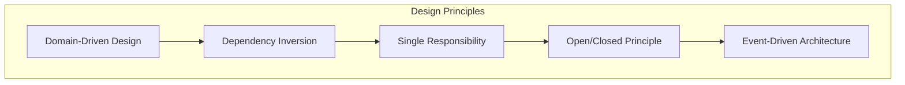
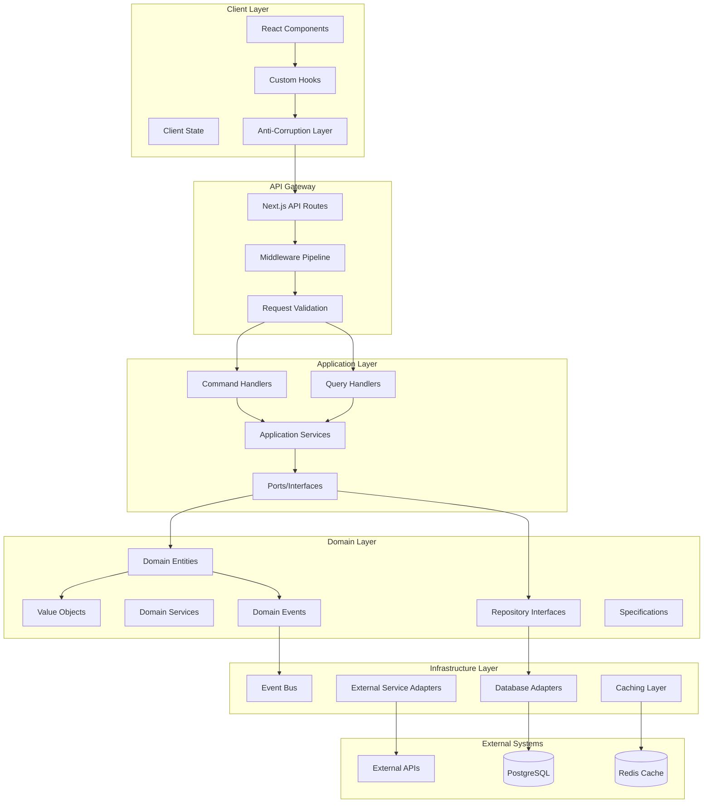
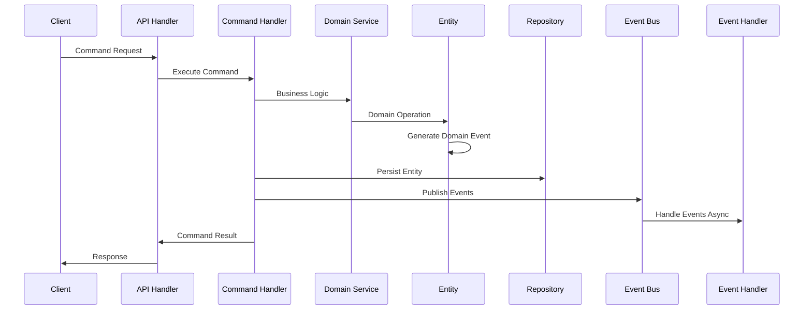
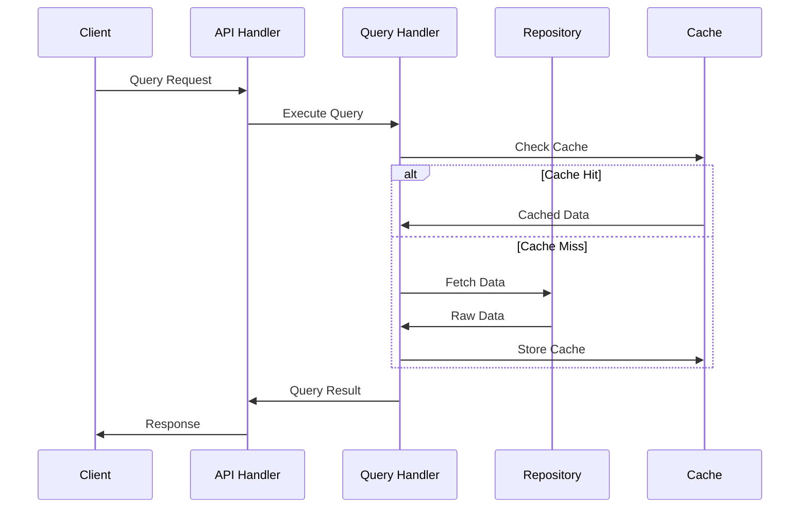
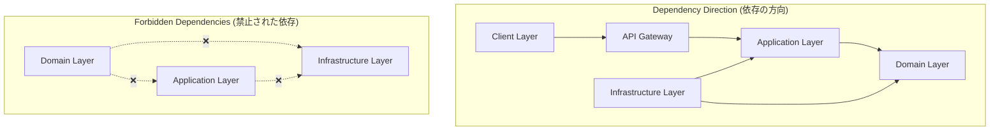
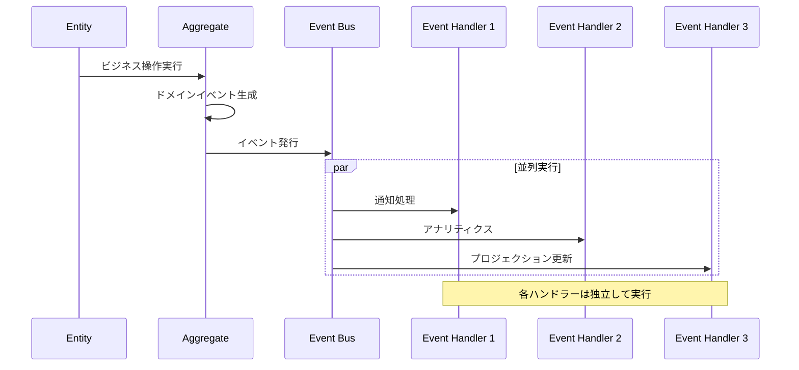

# Enhanced Modular Monolith アーキテクチャ設計書

## 概要

本プロジェクトは **Enhanced Modular Monolith** アーキテクチャを採用しています。これは従来のモジュラーモノリスにドメイン駆動設計（DDD）のベストプラクティスを完全に適用し、Hexagonal Architecture と CQRS パターンを組み合わせた先進的なアーキテクチャです。

## アーキテクチャの特徴

### 1. Enhanced Modular Monolith

**定義**: モジュラーモノリスにDDD、Hexagonal Architecture、CQRSを統合したハイブリッドアーキテクチャ

**主な特徴**:

- 🏗️ **モジュール独立性**: 各ビジネス機能が完全に独立
- 🎯 **ドメイン中心設計**: ビジネスロジックがアーキテクチャの中核
- 🔄 **CQRS パターン**: 読み書き責務の最適分離
- 🔌 **Hexagonal 境界**: 外部システムとの疎結合
- 📡 **Event-Driven**: ドメインイベントによる非同期処理

### 2. 設計原則



#### Domain-Driven Design (DDD)

- **Ubiquitous Language**: ビジネス用語をコードに反映
- **Bounded Context**: モジュール境界の明確化
- **Aggregate Root**: データ整合性の責任範囲定義
- **Value Objects**: 不変性とビジネスルールの保証

#### Dependency Inversion Principle

- **高レベルモジュール** は低レベルモジュールに依存しない
- **抽象化** に依存し、具象に依存しない
- **Ports & Adapters** による外部システム分離

#### Event-Driven Architecture

- **Domain Events**: ビジネス上重要な出来事の記録
- **Eventually Consistent**: 結果整合性による高性能
- **Loose Coupling**: モジュール間の疎結合

## 全体アーキテクチャ

### システム構成図



### データフロー

#### Command Flow (書き込み処理)



#### Query Flow (読み取り処理)



## モジュール構成

### ディレクトリ構造

```
src/modules/ingredients/
├── client/                         # Presentation Layer (フロントエンド)
│   ├── components/
│   │   ├── forms/                 # フォームコンポーネント
│   │   │   ├── CreateIngredientForm.tsx
│   │   │   ├── EditIngredientForm.tsx
│   │   │   └── QuickStockActions.tsx
│   │   ├── lists/                 # リストコンポーネント
│   │   │   ├── IngredientList.tsx
│   │   │   ├── IngredientCard.tsx
│   │   │   └── FilterPanel.tsx
│   │   ├── modals/                # モーダルコンポーネント
│   │   │   ├── StockOperationModal.tsx
│   │   │   └── DeleteConfirmModal.tsx
│   │   └── layouts/               # レイアウトコンポーネント
│   │       ├── IngredientLayout.tsx
│   │       └── IngredientHeader.tsx
│   ├── hooks/                     # カスタムフック
│   │   ├── queries/               # クエリフック (TanStack Query)
│   │   │   ├── useIngredients.ts  # 一覧取得
│   │   │   ├── useIngredient.ts   # 詳細取得
│   │   │   ├── useCategories.ts   # カテゴリ取得
│   │   │   └── useUnits.ts        # 単位取得
│   │   ├── commands/              # コマンドフック
│   │   │   ├── useCreateIngredient.ts
│   │   │   ├── useUpdateIngredient.ts
│   │   │   ├── useConsumeIngredient.ts
│   │   │   ├── useReplenishIngredient.ts
│   │   │   ├── useDiscardIngredient.ts
│   │   │   └── useDeleteIngredient.ts
│   │   ├── state/                 # ローカル状態フック
│   │   │   ├── useIngredientForm.ts
│   │   │   ├── useIngredientFilters.ts
│   │   │   └── useStockOperation.ts
│   │   └── utilities/             # ユーティリティフック
│   │       ├── useDebounce.ts
│   │       ├── usePagination.ts
│   │       └── useErrorHandler.ts
│   ├── stores/                    # クライアント状態管理
│   │   ├── ingredient.store.ts    # Zustand Store
│   │   ├── filter.store.ts        # フィルター状態
│   │   └── ui.store.ts           # UI状態
│   ├── adapters/                  # Anti-Corruption Layer
│   │   ├── api.adapter.ts         # API通信アダプター
│   │   ├── dto.mapper.ts          # DTO変換
│   │   └── error.adapter.ts       # エラー変換
│   └── types/                     # フロントエンド型定義
│       ├── view-models.ts         # ViewModel定義
│       ├── form-data.ts          # フォームデータ型
│       └── api-responses.ts      # APIレスポンス型
│
├── server/                        # Server Layer (バックエンド)
│   ├── api/                       # Web Adapters (API層)
│   │   ├── handlers/              # リクエストハンドラー
│   │   │   ├── commands/          # コマンドエンドポイント
│   │   │   │   ├── create-ingredient.handler.ts
│   │   │   │   ├── update-ingredient.handler.ts
│   │   │   │   ├── consume-ingredient.handler.ts
│   │   │   │   ├── replenish-ingredient.handler.ts
│   │   │   │   ├── discard-ingredient.handler.ts
│   │   │   │   └── delete-ingredient.handler.ts
│   │   │   └── queries/           # クエリエンドポイント
│   │   │       ├── get-ingredients.handler.ts
│   │   │       ├── get-ingredient.handler.ts
│   │   │       ├── search-ingredients.handler.ts
│   │   │       ├── get-categories.handler.ts
│   │   │       └── get-units.handler.ts
│   │   ├── validators/            # 入力検証 (Zod)
│   │   │   ├── create-ingredient.validator.ts
│   │   │   ├── update-ingredient.validator.ts
│   │   │   ├── consume-ingredient.validator.ts
│   │   │   ├── query-params.validator.ts
│   │   │   └── common.validator.ts
│   │   ├── serializers/           # レスポンス変換
│   │   │   ├── ingredient.serializer.ts
│   │   │   ├── ingredient-list.serializer.ts
│   │   │   ├── category.serializer.ts
│   │   │   └── error.serializer.ts
│   │   ├── middleware/            # カスタムミドルウェア
│   │   │   ├── auth.middleware.ts
│   │   │   ├── error.middleware.ts
│   │   │   ├── logging.middleware.ts
│   │   │   └── rate-limit.middleware.ts
│   │   └── routes/                # ルート定義
│   │       ├── ingredients.routes.ts
│   │       ├── categories.routes.ts
│   │       └── units.routes.ts
│   │
│   ├── application/               # Application Layer (アプリケーション層)
│   │   ├── commands/              # コマンドハンドラー (CQRS)
│   │   │   ├── create-ingredient/
│   │   │   │   ├── create-ingredient.command.ts
│   │   │   │   ├── create-ingredient.handler.ts
│   │   │   │   └── create-ingredient.validator.ts
│   │   │   ├── update-ingredient/
│   │   │   │   ├── update-ingredient.command.ts
│   │   │   │   ├── update-ingredient.handler.ts
│   │   │   │   └── update-ingredient.validator.ts
│   │   │   ├── consume-ingredient/
│   │   │   │   ├── consume-ingredient.command.ts
│   │   │   │   ├── consume-ingredient.handler.ts
│   │   │   │   └── consume-ingredient.validator.ts
│   │   │   ├── replenish-ingredient/
│   │   │   ├── discard-ingredient/
│   │   │   ├── adjust-ingredient/
│   │   │   └── delete-ingredient/
│   │   ├── queries/               # クエリハンドラー (CQRS)
│   │   │   ├── get-ingredients/
│   │   │   │   ├── get-ingredients.query.ts
│   │   │   │   ├── get-ingredients.handler.ts
│   │   │   │   └── ingredient-list.view.ts
│   │   │   ├── get-ingredient/
│   │   │   │   ├── get-ingredient.query.ts
│   │   │   │   ├── get-ingredient.handler.ts
│   │   │   │   └── ingredient-detail.view.ts
│   │   │   ├── search-ingredients/
│   │   │   ├── get-ingredient-summary/
│   │   │   ├── get-categories/
│   │   │   └── get-units/
│   │   ├── services/              # アプリケーションサービス
│   │   │   ├── ingredient.service.ts          # 食材管理サービス
│   │   │   ├── stock-management.service.ts    # 在庫管理サービス
│   │   │   ├── notification.service.ts        # 通知サービス
│   │   │   ├── analytics.service.ts           # 分析サービス
│   │   │   └── export.service.ts              # エクスポートサービス
│   │   ├── ports/                 # ポート定義 (インターフェース)
│   │   │   ├── repositories/      # リポジトリインターフェース
│   │   │   │   ├── ingredient.repository.ts
│   │   │   │   ├── ingredient-stock.repository.ts
│   │   │   │   ├── category.repository.ts
│   │   │   │   └── unit.repository.ts
│   │   │   ├── services/          # サービスインターフェース
│   │   │   │   ├── notification.service.interface.ts
│   │   │   │   ├── analytics.service.interface.ts
│   │   │   │   └── file-storage.service.interface.ts
│   │   │   └── events/            # イベントインターフェース
│   │   │       ├── event-bus.interface.ts
│   │   │       └── event-handler.interface.ts
│   │   ├── dtos/                  # データ転送オブジェクト
│   │   │   ├── commands/          # コマンドDTO
│   │   │   │   ├── create-ingredient.dto.ts
│   │   │   │   ├── update-ingredient.dto.ts
│   │   │   │   └── consume-ingredient.dto.ts
│   │   │   ├── queries/           # クエリDTO
│   │   │   │   ├── get-ingredients.dto.ts
│   │   │   │   ├── search-ingredients.dto.ts
│   │   │   │   └── ingredient-filters.dto.ts
│   │   │   └── responses/         # レスポンスDTO
│   │   │       ├── ingredient.dto.ts
│   │   │       ├── ingredient-list.dto.ts
│   │   │       ├── category.dto.ts
│   │   │       └── pagination.dto.ts
│   │   └── mappers/               # DTOマッピング
│   │       ├── ingredient.mapper.ts
│   │       ├── category.mapper.ts
│   │       └── pagination.mapper.ts
│   │
│   ├── domain/                    # Domain Layer (ドメイン層)
│   │   ├── entities/              # ドメインエンティティ
│   │   │   ├── ingredient.entity.ts           # 食材エンティティ
│   │   │   ├── ingredient-stock.entity.ts     # 在庫エンティティ
│   │   │   ├── category.entity.ts             # カテゴリエンティティ
│   │   │   ├── unit.entity.ts                 # 単位エンティティ
│   │   │   └── aggregate-root.ts              # 集約ルート基底クラス
│   │   ├── value-objects/         # 値オブジェクト
│   │   │   ├── ingredient-id.vo.ts            # 食材ID
│   │   │   ├── quantity.vo.ts                 # 数量
│   │   │   ├── storage-location.vo.ts         # 保存場所
│   │   │   ├── expiry-date.vo.ts             # 賞味期限
│   │   │   ├── price.vo.ts                   # 価格
│   │   │   └── ingredient-name.vo.ts          # 食材名
│   │   ├── services/              # ドメインサービス
│   │   │   ├── stock-calculation.service.ts   # 在庫計算サービス
│   │   │   ├── expiry-detection.service.ts    # 期限検知サービス
│   │   │   ├── ingredient-validation.service.ts # 食材検証サービス
│   │   │   └── stock-operation.service.ts     # 在庫操作サービス
│   │   ├── events/                # ドメインイベント
│   │   │   ├── ingredient-created.event.ts
│   │   │   ├── ingredient-updated.event.ts
│   │   │   ├── ingredient-consumed.event.ts
│   │   │   ├── ingredient-replenished.event.ts
│   │   │   ├── ingredient-discarded.event.ts
│   │   │   ├── ingredient-expired.event.ts
│   │   │   ├── stock-low.event.ts
│   │   │   └── base-domain.event.ts
│   │   ├── repositories/          # リポジトリインターフェース
│   │   │   ├── ingredient.repository.interface.ts
│   │   │   ├── ingredient-stock.repository.interface.ts
│   │   │   ├── category.repository.interface.ts
│   │   │   └── unit.repository.interface.ts
│   │   ├── specifications/        # 仕様パターン (ビジネスルール)
│   │   │   ├── has-sufficient-stock.specification.ts
│   │   │   ├── is-not-expired.specification.ts
│   │   │   ├── is-valid-quantity.specification.ts
│   │   │   ├── is-within-storage-limit.specification.ts
│   │   │   └── base.specification.ts
│   │   ├── exceptions/            # ドメイン例外
│   │   │   ├── ingredient-not-found.exception.ts
│   │   │   ├── insufficient-stock.exception.ts
│   │   │   ├── expired-ingredient.exception.ts
│   │   │   ├── invalid-quantity.exception.ts
│   │   │   ├── invalid-storage-location.exception.ts
│   │   │   └── domain-exception.base.ts
│   │   ├── enums/                 # ドメイン列挙型
│   │   │   ├── storage-location.enum.ts
│   │   │   ├── expiry-status.enum.ts
│   │   │   ├── unit-type.enum.ts
│   │   │   └── operation-type.enum.ts
│   │   └── constants/             # ドメイン定数
│   │       ├── ingredient.constants.ts
│   │       ├── stock.constants.ts
│   │       └── validation.constants.ts
│   │
│   └── infrastructure/            # Infrastructure Layer (インフラ層)
│       ├── persistence/           # データ永続化
│       │   ├── repositories/      # リポジトリ実装
│       │   │   ├── prisma-ingredient.repository.ts
│       │   │   ├── prisma-ingredient-stock.repository.ts
│       │   │   ├── prisma-category.repository.ts
│       │   │   ├── prisma-unit.repository.ts
│       │   │   └── base-prisma.repository.ts
│       │   ├── mappers/           # エンティティ-モデル変換
│       │   │   ├── ingredient.mapper.ts
│       │   │   ├── ingredient-stock.mapper.ts
│       │   │   ├── category.mapper.ts
│       │   │   ├── unit.mapper.ts
│       │   │   └── base.mapper.ts
│       │   ├── models/            # データベースモデル型
│       │   │   ├── ingredient.model.ts
│       │   │   ├── ingredient-stock.model.ts
│       │   │   ├── category.model.ts
│       │   │   └── unit.model.ts
│       │   └── migrations/        # データベースマイグレーション
│       │       ├── 001_initial_schema.sql
│       │       ├── 002_add_stock_tracking.sql
│       │       └── 003_add_event_store.sql
│       ├── events/                # イベント処理
│       │   ├── handlers/          # イベントハンドラー実装
│       │   │   ├── ingredient-created.handler.ts
│       │   │   ├── ingredient-consumed.handler.ts
│       │   │   ├── ingredient-expired.handler.ts
│       │   │   ├── stock-low.handler.ts
│       │   │   └── base-event.handler.ts
│       │   ├── publishers/        # イベント発行者
│       │   │   ├── domain-event.publisher.ts
│       │   │   └── integration-event.publisher.ts
│       │   └── projections/       # プロジェクション (読み取り最適化)
│       │       ├── ingredient-summary.projection.ts
│       │       ├── stock-status.projection.ts
│       │       └── expiry-alert.projection.ts
│       ├── external/              # 外部サービス連携
│       │   ├── notification/      # 通知サービス
│       │   │   ├── email.service.ts
│       │   │   ├── push.service.ts
│       │   │   └── sms.service.ts
│       │   ├── analytics/         # 分析サービス
│       │   │   ├── google-analytics.service.ts
│       │   │   └── custom-analytics.service.ts
│       │   ├── storage/           # ファイルストレージ
│       │   │   ├── s3.service.ts
│       │   │   └── local-storage.service.ts
│       │   └── apis/              # 外部API
│       │       ├── nutrition-api.service.ts
│       │       └── product-api.service.ts
│       ├── messaging/             # メッセージング・イベントバス
│       │   ├── event-bus.ts       # インメモリイベントバス
│       │   ├── event-store.ts     # イベントストア
│       │   ├── message-queue.ts   # メッセージキュー (将来実装)
│       │   └── event-serializer.ts # イベントシリアライゼーション
│       ├── caching/               # キャッシング
│       │   ├── redis.service.ts   # Redisキャッシュ
│       │   ├── memory.service.ts  # インメモリキャッシュ
│       │   └── cache.decorator.ts # キャッシュデコレーター
│       ├── monitoring/            # 監視・ログ
│       │   ├── logger.service.ts  # ロガー
│       │   ├── metrics.service.ts # メトリクス
│       │   └── health-check.service.ts # ヘルスチェック
│       └── configuration/         # 設定管理
│           ├── database.config.ts
│           ├── cache.config.ts
│           ├── event.config.ts
│           └── external-service.config.ts
│
└── shared/                        # Shared Kernel (共有カーネル)
    ├── types/                     # 共通型定義
    │   ├── common.types.ts        # 基本型
    │   ├── api.types.ts           # API関連型
    │   ├── database.types.ts      # データベース関連型
    │   └── event.types.ts         # イベント関連型
    ├── events/                    # 共有イベント
    │   ├── base-domain.event.ts   # ドメインイベント基底クラス
    │   ├── integration.event.ts   # 統合イベント基底クラス
    │   └── event-handler.interface.ts # イベントハンドラーインターフェース
    ├── exceptions/                # 共通例外
    │   ├── base.exception.ts      # 基底例外クラス
    │   ├── validation.exception.ts # バリデーション例外
    │   ├── not-found.exception.ts # 404例外
    │   ├── business-rule.exception.ts # ビジネスルール例外
    │   └── system.exception.ts    # システム例外
    ├── utils/                     # ユーティリティ
    │   ├── date.utils.ts          # 日付ユーティリティ
    │   ├── validation.utils.ts    # バリデーションユーティリティ
    │   ├── format.utils.ts        # フォーマットユーティリティ
    │   ├── crypto.utils.ts        # 暗号化ユーティリティ
    │   └── async.utils.ts         # 非同期ユーティリティ
    ├── constants/                 # 共通定数
    │   ├── app.constants.ts       # アプリケーション定数
    │   ├── api.constants.ts       # API定数
    │   ├── error.constants.ts     # エラー定数
    │   └── cache.constants.ts     # キャッシュ定数
    ├── decorators/                # デコレーター
    │   ├── cache.decorator.ts     # キャッシュデコレーター
    │   ├── retry.decorator.ts     # リトライデコレーター
    │   ├── log.decorator.ts       # ログデコレーター
    │   └── measure.decorator.ts   # パフォーマンス測定デコレーター
    └── interfaces/                # 共通インターフェース
        ├── repository.interface.ts # リポジトリ基底インターフェース
        ├── service.interface.ts   # サービス基底インターフェース
        ├── mapper.interface.ts    # マッパー基底インターフェース
        └── cache.interface.ts     # キャッシュ基底インターフェース
```

## レイヤー責務定義

### 1. Presentation Layer (client/)

**責務**: ユーザーインターフェースと状態管理

**主要コンポーネント**:

- **React Components**: UIコンポーネント（表示専用）
- **Custom Hooks**: ビジネスロジックとUIの橋渡し
- **Stores**: クライアント状態管理（Zustand）
- **Anti-Corruption Layer**: サーバーとの境界

**設計原則**:

```typescript
// ✅ 良い例: UIコンポーネントは表示に専念
export const IngredientCard: React.FC<IngredientCardProps> = ({ ingredient, onAction }) => {
  return (
    <Card>
      <CardHeader>{ingredient.name}</CardHeader>
      <CardContent>
        <p>数量: {ingredient.quantity.displayText}</p>
        <p>場所: {ingredient.storageLocation.displayName}</p>
        <ExpiryStatusBadge status={ingredient.expiryInfo.status} />
      </CardContent>
      <CardActions>
        <Button onClick={() => onAction('consume')}>消費</Button>
        <Button onClick={() => onAction('replenish')}>補充</Button>
      </CardActions>
    </Card>
  )
}

// ✅ 良い例: Custom Hookはビジネスロジックを抽象化
export const useIngredientOperations = (ingredientId: string) => {
  const queryClient = useQueryClient()

  const consumeMutation = useMutation({
    mutationFn: (data: ConsumeIngredientData) =>
      ingredientApiAdapter.consumeIngredient(ingredientId, data),
    onSuccess: () => {
      queryClient.invalidateQueries(['ingredients'])
      toast.success('食材を消費しました')
    },
    onError: (error) => {
      if (error instanceof InsufficientStockError) {
        toast.error(`在庫不足: ${error.details.shortage}${error.details.unit}不足しています`)
      } else {
        toast.error('消費に失敗しました')
      }
    }
  })

  return {
    consume: consumeMutation.mutate,
    isConsuming: consumeMutation.isLoading
  }
}
```

### 2. API Gateway Layer (server/api/)

**責務**: HTTPリクエスト処理とルーティング

**主要コンポーネント**:

- **Handlers**: リクエスト/レスポンス処理
- **Validators**: 入力検証（Zod）
- **Serializers**: レスポンス形式統一
- **Middleware**: 横断的関心事

**設計原則**:

```typescript
// ✅ 良い例: API HandlerはWebアダプターとして機能
export async function POST(request: Request, { params }: { params: { id: string } }) {
  try {
    // 1. 入力検証
    const body = await request.json()
    const validatedData = consumeIngredientValidator.parse(body)

    // 2. コマンド作成
    const command = new ConsumeIngredientCommand(
      params.id,
      validatedData.amount,
      validatedData.reason
    )

    // 3. アプリケーション層に委譲
    const result = await commandBus.execute(command)

    // 4. レスポンス生成
    const response = consumeIngredientSerializer.serialize(result)

    return NextResponse.json(response)
  } catch (error) {
    return errorMiddleware.handle(error)
  }
}
```

### 3. Application Layer (server/application/)

**責務**: ユースケース実行とトランザクション管理

**主要コンポーネント**:

- **Command Handlers**: 書き込み処理
- **Query Handlers**: 読み取り処理
- **Application Services**: 複雑なビジネスワークフロー
- **Ports**: 外部システムとのインターフェース

**設計原則**:

```typescript
// ✅ 良い例: Command Handlerはユースケースを実装
export class ConsumeIngredientHandler {
  constructor(
    private readonly ingredientRepo: IngredientRepository,
    private readonly stockService: StockManagementService,
    private readonly eventPublisher: DomainEventPublisher
  ) {}

  async handle(command: ConsumeIngredientCommand): Promise<ConsumeIngredientResult> {
    // 1. エンティティ取得
    const ingredient = await this.ingredientRepo.findById(command.ingredientId)
    if (!ingredient) {
      throw new IngredientNotFoundException(command.ingredientId)
    }

    // 2. ドメインロジック実行
    ingredient.consume(command.amount, command.reason)

    // 3. 副作用処理
    await this.stockService.updateStockStatus(ingredient)

    // 4. 永続化
    await this.ingredientRepo.save(ingredient)

    // 5. イベント発行
    await this.eventPublisher.publishAll(ingredient.domainEvents)

    return new ConsumeIngredientResult(ingredient)
  }
}
```

### 4. Domain Layer (server/domain/)

**責務**: ビジネスルールとドメインモデル

**主要コンポーネント**:

- **Entities**: ビジネスエンティティ
- **Value Objects**: 不変値オブジェクト
- **Domain Services**: エンティティ間のビジネスロジック
- **Specifications**: ビジネスルール仕様

**設計原則**:

```typescript
// ✅ 良い例: エンティティはビジネスルールを保護
export class Ingredient extends AggregateRoot<IngredientId> {
  constructor(
    id: IngredientId,
    private _name: IngredientName,
    private _quantity: Quantity,
    private _storageLocation: StorageLocation,
    private _expiryDate?: ExpiryDate
  ) {
    super(id)
  }

  consume(amount: number, reason?: string): void {
    // ビジネスルール検証
    if (!this.hasSufficientStock(amount)) {
      throw new InsufficientStockException(
        `要求された数量 ${amount} は利用可能な在庫 ${this._quantity.amount} を超えています`,
        {
          requested: amount,
          available: this._quantity.amount,
          shortage: amount - this._quantity.amount,
        }
      )
    }

    // 状態変更
    const previousQuantity = this._quantity
    this._quantity = this._quantity.subtract(amount)

    // ドメインイベント発行
    this.addDomainEvent(
      new IngredientConsumedEvent(
        this.id,
        this._name.value,
        previousQuantity,
        this._quantity,
        amount,
        reason
      )
    )
  }

  private hasSufficientStock(amount: number): boolean {
    return this._quantity.amount >= amount
  }
}
```

### 5. Infrastructure Layer (server/infrastructure/)

**責務**: 外部システム連携と技術的実装

**主要コンポーネント**:

- **Repository Implementations**: データアクセス実装
- **Event Handlers**: イベント処理実装
- **External Service Adapters**: 外部API連携
- **Messaging**: イベントバス実装

**設計原則**:

```typescript
// ✅ 良い例: リポジトリ実装は技術的詳細を隠蔽
export class PrismaIngredientRepository implements IngredientRepository {
  constructor(
    private readonly prisma: PrismaClient,
    private readonly mapper: IngredientEntityMapper
  ) {}

  async save(ingredient: Ingredient): Promise<void> {
    const model = this.mapper.toModel(ingredient)

    await this.prisma.$transaction(async (tx) => {
      // エンティティ保存
      await tx.ingredient.upsert({
        where: { id: ingredient.id.value },
        create: model,
        update: model,
      })

      // ドメインイベント保存
      if (ingredient.domainEvents.length > 0) {
        await tx.domainEvent.createMany({
          data: ingredient.domainEvents.map((event) => ({
            id: event.id,
            aggregateId: ingredient.id.value,
            eventType: event.constructor.name,
            eventData: JSON.stringify(event),
            occurredAt: event.occurredAt,
          })),
        })
      }
    })
  }
}
```

## 依存関係ルール

### 層間依存関係



### 依存性逆転の実装

```typescript
// ✅ Domain Layer: インターフェース定義
export interface IngredientRepository {
  save(ingredient: Ingredient): Promise<void>
  findById(id: IngredientId): Promise<Ingredient | null>
}

// ✅ Application Layer: インターフェースに依存
export class CreateIngredientHandler {
  constructor(
    private readonly ingredientRepo: IngredientRepository // ← インターフェースに依存
  ) {}
}

// ✅ Infrastructure Layer: インターフェース実装
export class PrismaIngredientRepository implements IngredientRepository {
  // 実装
}

// ✅ DI Container: 依存関係注入
export const createIngredientHandler = new CreateIngredientHandler(
  new PrismaIngredientRepository(prisma, mapper)
)
```

## イベント駆動アーキテクチャ

### イベントフロー



### イベント設計

```typescript
// ✅ ドメインイベント定義
export class IngredientConsumedEvent extends DomainEvent {
  constructor(
    public readonly ingredientId: IngredientId,
    public readonly ingredientName: string,
    public readonly previousQuantity: Quantity,
    public readonly newQuantity: Quantity,
    public readonly consumedAmount: number,
    public readonly reason?: string
  ) {
    super()
  }
}

// ✅ イベントハンドラー実装
export class IngredientConsumedEventHandler implements EventHandler<IngredientConsumedEvent> {
  constructor(
    private readonly notificationService: NotificationService,
    private readonly analyticsService: AnalyticsService
  ) {}

  async handle(event: IngredientConsumedEvent): Promise<void> {
    // 1. 在庫不足通知
    if (event.newQuantity.amount <= 0) {
      await this.notificationService.notifyStockOut({
        ingredientId: event.ingredientId.value,
        ingredientName: event.ingredientName,
      })
    }

    // 2. 消費パターン分析
    await this.analyticsService.recordConsumption({
      ingredientId: event.ingredientId.value,
      amount: event.consumedAmount,
      timestamp: event.occurredAt,
      reason: event.reason,
    })
  }
}
```

## パフォーマンス最適化

### 1. CQRS による読み書き分離

```typescript
// ✅ Write Model (正規化、整合性重視)
export class Ingredient extends AggregateRoot<IngredientId> {
  // ビジネスロジック中心
  consume(amount: number): void {
    /* ... */
  }
  replenish(amount: number): void {
    /* ... */
  }
}

// ✅ Read Model (非正規化、パフォーマンス重視)
export class IngredientListView {
  constructor(
    public readonly id: string,
    public readonly name: string,
    public readonly categoryName: string,
    public readonly quantityDisplay: string,
    public readonly storageLocationDisplay: string,
    public readonly expiryStatusDisplay: string,
    public readonly daysUntilExpiry: number | null
  ) {}
}

// ✅ クエリハンドラー: 読み取り最適化
export class GetIngredientsHandler {
  async handle(query: GetIngredientsQuery): Promise<IngredientListView[]> {
    // 非正規化テーブルから高速取得
    const data = await this.prisma.ingredientView.findMany({
      where: this.buildWhereClause(query.filters),
      orderBy: this.buildOrderBy(query.sorting),
    })

    return data.map(
      (item) =>
        new IngredientListView(
          item.id,
          item.name,
          item.categoryName,
          `${item.quantity}${item.unitSymbol}`,
          item.storageLocationDisplay,
          item.expiryStatusDisplay,
          item.daysUntilExpiry
        )
    )
  }
}
```

### 2. プロジェクション パターン

```typescript
// ✅ イベントハンドラーによるプロジェクション更新
export class IngredientProjectionHandler {
  async handle(event: IngredientConsumedEvent): Promise<void> {
    // 読み取り最適化テーブル更新
    await this.prisma.ingredientView.update({
      where: { id: event.ingredientId.value },
      data: {
        quantity: event.newQuantity.amount,
        quantityDisplay: event.newQuantity.toString(),
        lastConsumedAt: event.occurredAt,
        isOutOfStock: event.newQuantity.amount <= 0,
      },
    })

    // 統計テーブル更新
    await this.updateConsumptionStatistics(event)
  }
}
```

### 3. キャッシング戦略

```typescript
// ✅ キャッシュデコレーター
export const cacheDecoratorFactory = (ttl: number, keyGenerator: Function) => {
  return function (target: any, propertyName: string, descriptor: PropertyDescriptor) {
    const method = descriptor.value

    descriptor.value = async function (...args: any[]) {
      const cacheKey = keyGenerator(...args)

      // キャッシュから取得
      const cached = await this.cacheService.get(cacheKey)
      if (cached) return cached

      // メソッド実行
      const result = await method.apply(this, args)

      // キャッシュに保存
      await this.cacheService.set(cacheKey, result, ttl)

      return result
    }
  }
}

// ✅ 使用例
export class GetIngredientsHandler {
  @cacheDecoratorFactory(300, (query) => `ingredients:${JSON.stringify(query)}`)
  async handle(query: GetIngredientsQuery): Promise<IngredientListView[]> {
    // 実装
  }
}
```

## セキュリティ

### 1. 認証・認可

```typescript
// ✅ 認証ミドルウェア
export const authMiddleware = async (request: Request): Promise<User | null> => {
  const token = request.headers.get('Authorization')?.replace('Bearer ', '')

  if (!token) return null

  try {
    const payload = await jwt.verify(token, process.env.JWT_SECRET!)
    return await userRepository.findById(payload.userId)
  } catch {
    return null
  }
}

// ✅ 認可ガード
export const requireAuth = (handler: AuthenticatedHandler) => {
  return async (request: Request, context: any) => {
    const user = await authMiddleware(request)

    if (!user) {
      return NextResponse.json({ error: 'Unauthorized' }, { status: 401 })
    }

    return handler(request, context, user)
  }
}
```

### 2. 入力検証

```typescript
// ✅ Zodスキーマによる厳密な検証
export const createIngredientSchema = z.object({
  name: z
    .string()
    .min(1, '食材名は必須です')
    .max(50, '食材名は50文字以下で入力してください')
    .regex(/^[^\x00-\x1f]+$/, '制御文字は使用できません'),

  quantity: z.object({
    amount: z
      .number()
      .positive('数量は正の数である必要があります')
      .max(999999, '数量は999,999以下である必要があります')
      .multipleOf(0.01, '数量は小数点以下2桁まで入力可能です'),
    unitId: z.string().cuid('単位IDの形式が正しくありません'),
  }),

  storageLocation: z.object({
    type: z.enum(['REFRIGERATED', 'FROZEN', 'ROOM_TEMPERATURE']),
    detail: z.string().max(50, '保存場所の詳細は50文字以下で入力してください').optional(),
  }),
})
```

## 監視・ログ

### 1. 構造化ログ

```typescript
// ✅ 構造化ログ実装
export class StructuredLogger {
  info(message: string, context: Record<string, any> = {}) {
    console.log(
      JSON.stringify({
        level: 'info',
        message,
        timestamp: new Date().toISOString(),
        ...context,
      })
    )
  }

  error(message: string, error: Error, context: Record<string, any> = {}) {
    console.error(
      JSON.stringify({
        level: 'error',
        message,
        error: {
          name: error.name,
          message: error.message,
          stack: error.stack,
        },
        timestamp: new Date().toISOString(),
        ...context,
      })
    )
  }
}

// ✅ 使用例
export class ConsumeIngredientHandler {
  async handle(command: ConsumeIngredientCommand): Promise<void> {
    this.logger.info('食材消費処理開始', {
      ingredientId: command.ingredientId,
      amount: command.amount,
      userId: command.userId,
    })

    try {
      // 処理実行
      const result = await this.executeConsumption(command)

      this.logger.info('食材消費処理完了', {
        ingredientId: command.ingredientId,
        remainingQuantity: result.remainingQuantity,
        processingTime: result.processingTime,
      })
    } catch (error) {
      this.logger.error('食材消費処理失敗', error, {
        ingredientId: command.ingredientId,
        amount: command.amount,
      })
      throw error
    }
  }
}
```

### 2. メトリクス収集

```typescript
// ✅ メトリクス収集
export class MetricsService {
  private counters = new Map<string, number>()
  private histograms = new Map<string, number[]>()

  incrementCounter(name: string, tags: Record<string, string> = {}) {
    const key = this.createKey(name, tags)
    this.counters.set(key, (this.counters.get(key) || 0) + 1)
  }

  recordTime(name: string, duration: number, tags: Record<string, string> = {}) {
    const key = this.createKey(name, tags)
    const values = this.histograms.get(key) || []
    values.push(duration)
    this.histograms.set(key, values)
  }

  private createKey(name: string, tags: Record<string, string>): string {
    const tagString = Object.entries(tags)
      .sort()
      .map(([k, v]) => `${k}=${v}`)
      .join(',')
    return `${name}{${tagString}}`
  }
}

// ✅ メトリクスデコレーター
export const measurePerformance = (metricName: string) => {
  return function (target: any, propertyName: string, descriptor: PropertyDescriptor) {
    const method = descriptor.value

    descriptor.value = async function (...args: any[]) {
      const startTime = Date.now()

      try {
        const result = await method.apply(this, args)
        const duration = Date.now() - startTime

        this.metricsService.recordTime(metricName, duration, {
          method: propertyName,
          status: 'success',
        })

        return result
      } catch (error) {
        const duration = Date.now() - startTime

        this.metricsService.recordTime(metricName, duration, {
          method: propertyName,
          status: 'error',
        })

        throw error
      }
    }
  }
}
```

## テスト戦略

### 1. 単体テスト（Domain Layer）

```typescript
// ✅ ドメインエンティティのテスト
describe('Ingredient Entity', () => {
  describe('consume', () => {
    it('十分な在庫がある場合、消費が成功する', () => {
      // Arrange
      const ingredient = Ingredient.create({
        name: 'テスト食材',
        quantity: new Quantity(10, Unit.PIECE),
        storageLocation: StorageLocation.REFRIGERATED,
      })

      // Act
      ingredient.consume(5, '料理で使用')

      // Assert
      expect(ingredient.quantity.amount).toBe(5)
      expect(ingredient.domainEvents).toHaveLength(1)
      expect(ingredient.domainEvents[0]).toBeInstanceOf(IngredientConsumedEvent)
    })

    it('在庫不足の場合、例外が発生する', () => {
      // Arrange
      const ingredient = Ingredient.create({
        name: 'テスト食材',
        quantity: new Quantity(3, Unit.PIECE),
        storageLocation: StorageLocation.REFRIGERATED,
      })

      // Act & Assert
      expect(() => ingredient.consume(5)).toThrow(InsufficientStockException)
    })
  })
})
```

### 2. 統合テスト（Application Layer）

```typescript
// ✅ コマンドハンドラーの統合テスト
describe('ConsumeIngredientHandler', () => {
  let handler: ConsumeIngredientHandler
  let mockRepo: jest.Mocked<IngredientRepository>
  let mockEventBus: jest.Mocked<EventBus>

  beforeEach(() => {
    mockRepo = createMock<IngredientRepository>()
    mockEventBus = createMock<EventBus>()
    handler = new ConsumeIngredientHandler(mockRepo, mockEventBus)
  })

  it('正常な消費処理が実行される', async () => {
    // Arrange
    const ingredientId = IngredientId.generate()
    const ingredient = Ingredient.create({
      name: 'テスト食材',
      quantity: new Quantity(10, Unit.PIECE),
      storageLocation: StorageLocation.REFRIGERATED,
    })

    mockRepo.findById.mockResolvedValue(ingredient)

    const command = new ConsumeIngredientCommand(ingredientId.value, 5, 'テスト消費')

    // Act
    await handler.handle(command)

    // Assert
    expect(mockRepo.save).toHaveBeenCalledWith(ingredient)
    expect(mockEventBus.publishAll).toHaveBeenCalledWith(ingredient.domainEvents)
    expect(ingredient.quantity.amount).toBe(5)
  })
})
```

### 3. E2Eテスト（API Layer）

```typescript
// ✅ APIエンドポイントのE2Eテスト
describe('POST /api/v1/ingredients/{id}/consume', () => {
  let testDb: TestDatabase
  let testServer: TestServer

  beforeAll(async () => {
    testDb = await TestDatabase.create()
    testServer = await TestServer.create()
  })

  afterAll(async () => {
    await testDb.cleanup()
    await testServer.cleanup()
  })

  it('食材消費APIが正常に動作する', async () => {
    // Arrange
    const ingredient = await testDb.createIngredient({
      name: 'テスト食材',
      quantity: 10,
      unitId: 'piece-unit-id',
      storageLocation: 'REFRIGERATED',
    })

    // Act
    const response = await testServer.post(`/api/v1/ingredients/${ingredient.id}/consume`, {
      amount: 5,
      reason: 'テスト消費',
    })

    // Assert
    expect(response.status).toBe(200)
    expect(response.body.data.remainingQuantity.amount).toBe(5)

    // データベース確認
    const updatedIngredient = await testDb.findIngredient(ingredient.id)
    expect(updatedIngredient.quantity).toBe(5)
  })

  it('在庫不足の場合、適切なエラーが返される', async () => {
    // Arrange
    const ingredient = await testDb.createIngredient({
      name: 'テスト食材',
      quantity: 3,
      unitId: 'piece-unit-id',
      storageLocation: 'REFRIGERATED',
    })

    // Act
    const response = await testServer.post(`/api/v1/ingredients/${ingredient.id}/consume`, {
      amount: 5,
      reason: 'テスト消費',
    })

    // Assert
    expect(response.status).toBe(400)
    expect(response.body.error.code).toBe('INSUFFICIENT_STOCK')
    expect(response.body.error.details.shortage).toBe(2)
  })
})
```

## 運用・デプロイ

### 1. ヘルスチェック

```typescript
// ✅ ヘルスチェックエンドポイント
export async function GET() {
  const checks = await Promise.allSettled([checkDatabase(), checkRedis(), checkExternalServices()])

  const results = checks.map((check, index) => ({
    name: ['database', 'redis', 'external'][index],
    status: check.status === 'fulfilled' ? 'healthy' : 'unhealthy',
    details: check.status === 'fulfilled' ? check.value : check.reason,
  }))

  const isHealthy = results.every((result) => result.status === 'healthy')

  return NextResponse.json(
    {
      status: isHealthy ? 'healthy' : 'unhealthy',
      timestamp: new Date().toISOString(),
      checks: results,
    },
    { status: isHealthy ? 200 : 503 }
  )
}
```

### 2. 設定管理

```typescript
// ✅ 環境設定管理
export class ApplicationConfig {
  static load(): ApplicationConfig {
    return new ApplicationConfig({
      database: {
        url: this.getRequired('DATABASE_URL'),
        poolSize: this.getNumber('DATABASE_POOL_SIZE', 10),
        timeout: this.getNumber('DATABASE_TIMEOUT', 5000),
      },
      redis: {
        url: this.getRequired('REDIS_URL'),
        ttl: this.getNumber('REDIS_TTL', 300),
      },
      auth: {
        jwtSecret: this.getRequired('JWT_SECRET'),
        jwtExpiry: this.getString('JWT_EXPIRY', '24h'),
      },
      monitoring: {
        logLevel: this.getString('LOG_LEVEL', 'info'),
        enableMetrics: this.getBoolean('ENABLE_METRICS', true),
      },
    })
  }

  private static getRequired(key: string): string {
    const value = process.env[key]
    if (!value) {
      throw new Error(`Environment variable ${key} is required`)
    }
    return value
  }
}
```

## まとめ

**Enhanced Modular Monolith** は以下の特徴により、現代的なWebアプリケーション開発に最適なアーキテクチャです：

### 🎯 **ビジネス価値の最大化**

- ドメイン駆動設計によるビジネスロジックの明確化
- 迅速な機能開発と安全な変更

### 🏗️ **技術的卓越性**

- Hexagonal Architecture による疎結合設計
- CQRS による読み書き最適化
- Event-Driven による拡張性

### 🚀 **開発効率**

- モジュラー構造による並行開発
- 明確な責務分離による保守性
- 包括的なテスト戦略

### 📈 **将来への拡張性**

- マイクロサービス化への自然な移行パス
- 新機能追加時の既存システムへの影響最小化
- クラウドネイティブ対応

このアーキテクチャにより、スタートアップの迅速性と エンタープライズの堅牢性を両立したシステムを構築できます。
