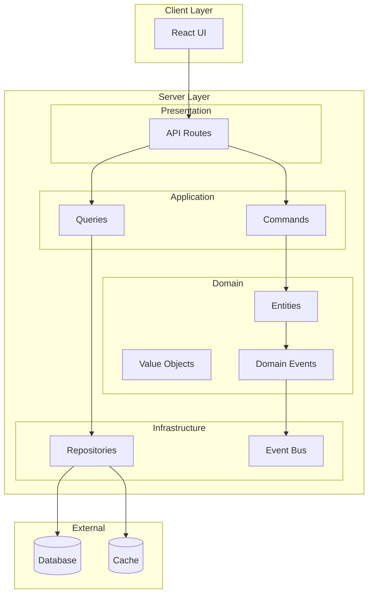

# Enhanced Modular Monolith アーキテクチャ設計書

## 概要

本プロジェクトは **Enhanced Modular Monolith** アーキテクチャを採用しています。これは従来のモジュラーモノリスにドメイン駆動設計（DDD）のベストプラクティスを完全に適用し、レイヤードアーキテクチャと CQRS パターンを組み合わせた先進的なアーキテクチャです。

## アーキテクチャの特徴

### 主な特徴

- 🏗️ **モジュール独立性**: 各ビジネス機能が完全に独立したモジュールとして実装
- 🎯 **ドメイン中心設計**: ビジネスロジックがアーキテクチャの中核
- 🔄 **CQRS パターン**: 読み書き責務の明確な分離による最適化
- 📡 **Event-Driven**: ドメインイベントによるモジュール間の疎結合
- 🚀 **将来の拡張性**: マイクロサービスへの自然な移行パス

### システム構成図



## アーキテクチャドキュメント構成

本アーキテクチャの詳細は、以下の構造で整理されています：

### 📁 [core/](./core/) - コアコンセプト
- [**アーキテクチャ概要**](./core/OVERVIEW.md) - 全体構造と設計原則
- [**レイヤー責務定義**](./core/LAYERS.md) - 各レイヤーの詳細な責務
- [**モジュール構成**](./core/MODULE_STRUCTURE.md) - ディレクトリ構造と命名規則

### 📁 [implementation/](./implementation/) - 実装パターン
- [**CQRS パターン**](./implementation/CQRS_PATTERN.md) - Command/Query分離の実装
- [**ドメインイベント**](./implementation/DOMAIN_EVENTS.md) - イベント駆動の実装
- [**リポジトリパターン**](./implementation/REPOSITORY_PATTERN.md) - データアクセスの抽象化
- [**値オブジェクト**](./implementation/VALUE_OBJECTS.md) - 不変性とビジネスルール

### 📁 [operations/](./operations/) - 運用ガイド
- [**監視・ログ設計**](./operations/MONITORING_LOGGING.md) - 可観測性の実装
- [**セキュリティ実装**](./operations/SECURITY.md) - セキュリティのベストプラクティス
- [**パフォーマンス最適化**](./operations/PERFORMANCE_OPTIMIZATION.md) - 最適化手法
- [**デプロイメント戦略**](./operations/DEPLOYMENT.md) - CI/CDと本番運用

## クイックスタート

### 1. アーキテクチャを理解する

まず以下のドキュメントを順に読んで、アーキテクチャの基本を理解してください：

1. [アーキテクチャ概要](./core/OVERVIEW.md) - 全体像の把握
2. [レイヤー責務定義](./core/LAYERS.md) - 各層の役割
3. [モジュール構成](./core/MODULE_STRUCTURE.md) - プロジェクト構造

### 2. 実装パターンを学ぶ

次に、具体的な実装方法を学びます：

1. [CQRSパターン](./implementation/CQRS_PATTERN.md) - 基本的な実装フロー
2. [値オブジェクト](./implementation/VALUE_OBJECTS.md) - ドメインモデルの基礎

### 3. 新機能を実装する

新しい機能を追加する際の基本的なステップ：

```typescript
// 1. 値オブジェクトを定義
export class IngredientName extends ValueObject<string> {
  protected validate(value: string): void {
    if (!value || value.length > 50) {
      throw new DomainError('Invalid ingredient name')
    }
  }
}

// 2. エンティティを作成
export class Ingredient extends AggregateRoot<IngredientId> {
  consume(amount: number): void {
    // ビジネスロジック
    this.addDomainEvent(new IngredientConsumedEvent(/*...*/))
  }
}

// 3. コマンドハンドラーを実装
export class ConsumeIngredientHandler {
  async handle(command: ConsumeIngredientCommand): Promise<void> {
    const ingredient = await this.repo.findById(command.ingredientId)
    ingredient.consume(command.amount)
    await this.repo.save(ingredient)
  }
}
```

## ベストプラクティス

### ドメイン中心の設計

- ビジネスロジックは必ずドメイン層に配置
- 技術的な詳細はインフラストラクチャ層に隔離
- ドメインイベントでモジュール間を疎結合に

### テスタビリティ

- 依存性注入によるテスト容易性
- ドメインロジックの単体テスト
- 統合テストでのシナリオ検証

### パフォーマンス

- CQRSによる読み書きの最適化
- 適切なキャッシング戦略
- 非同期処理の活用

## 関連資料

### 参考アーキテクチャ
- [アーキテクチャパターン比較](./ARCHITECTURE_PATTERNS_COMPARISON.md) - 他のパターンとの詳細比較

### プロジェクトドキュメント
- [開発ガイド](../DEVELOPMENT_GUIDE.md) - 開発環境のセットアップ
- [API仕様](../API_SPECIFICATION.md) - APIエンドポイント一覧
- [データベース設計](../DATABASE_DESIGN.md) - スキーマ定義

## まとめ

Enhanced Modular Monolith は、以下の利点を提供します：

- **開発効率**: 明確な構造による高い開発生産性
- **保守性**: ドメイン中心設計による理解しやすいコード
- **拡張性**: 将来のマイクロサービス化への準備
- **パフォーマンス**: CQRSとキャッシングによる最適化

詳細な実装方法については、各ドキュメントを参照してください。