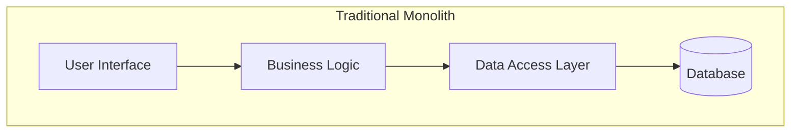
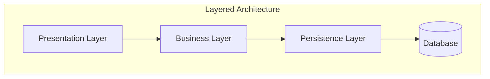
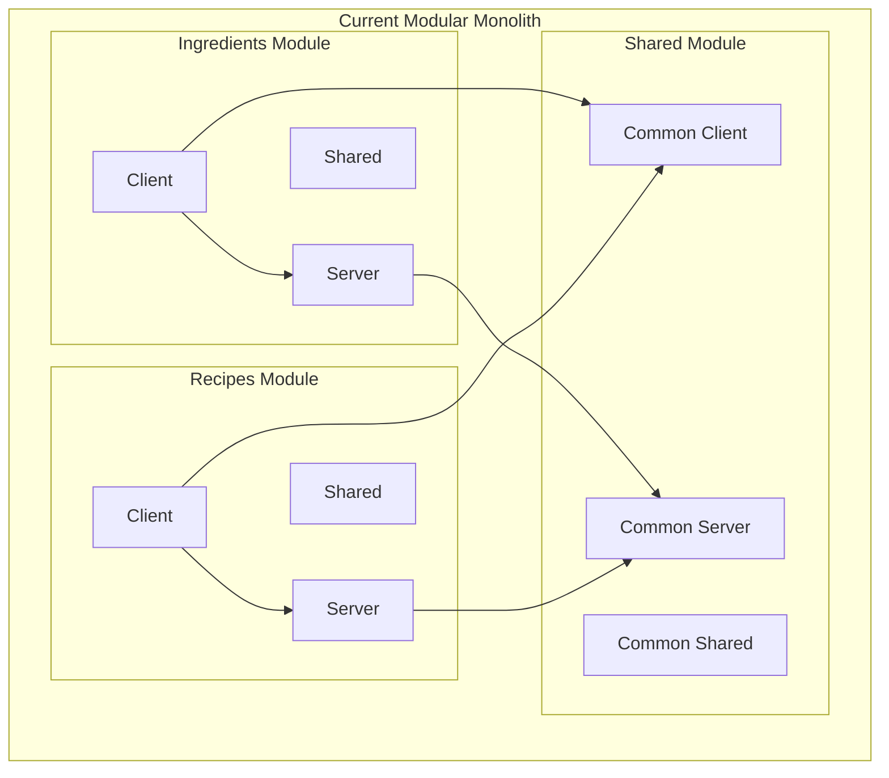
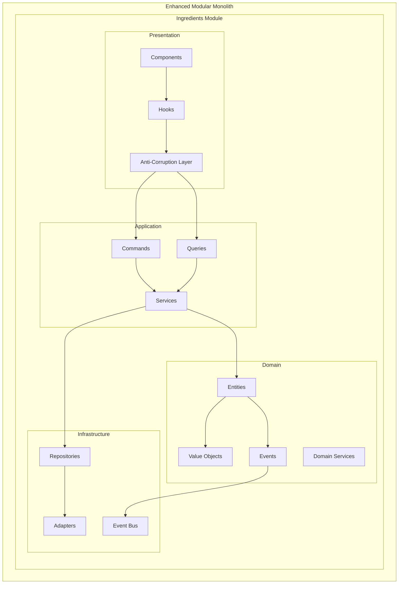
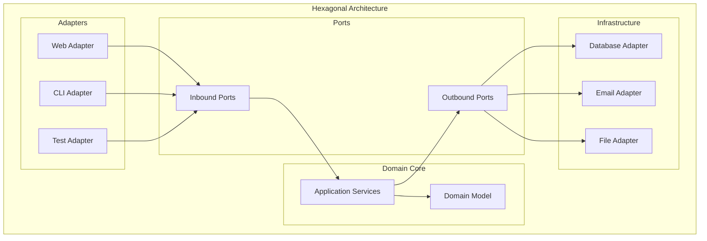
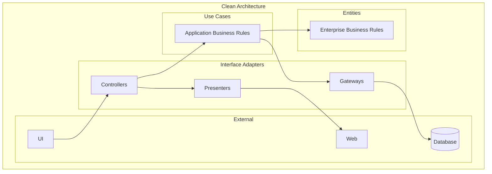
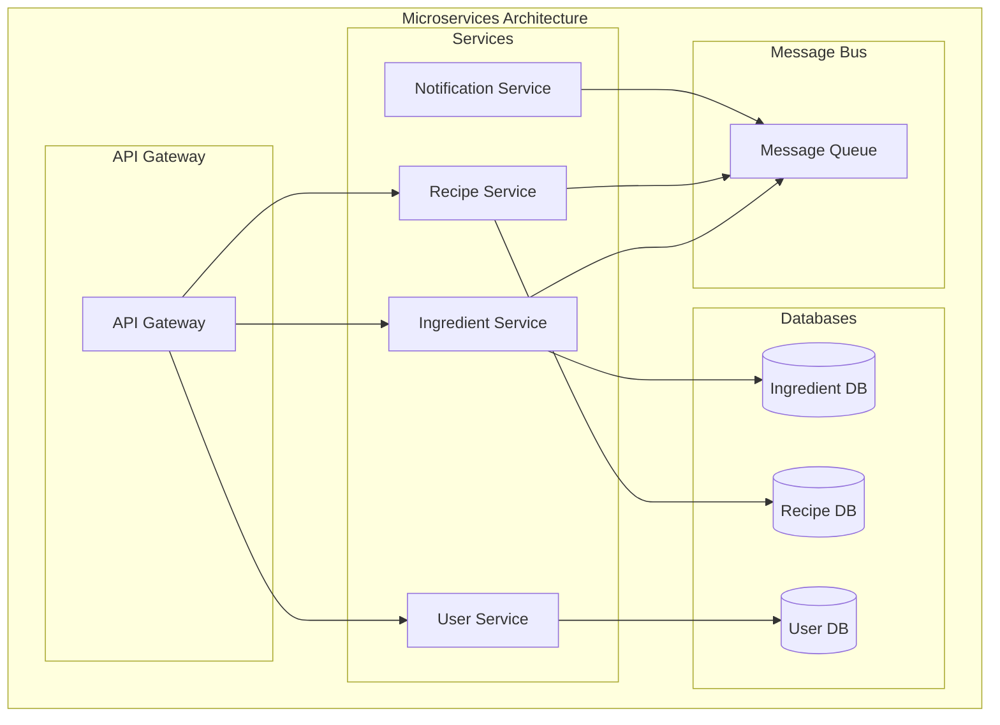
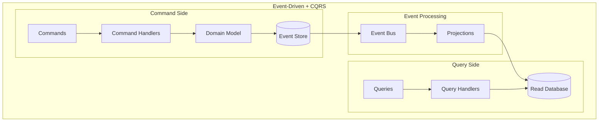
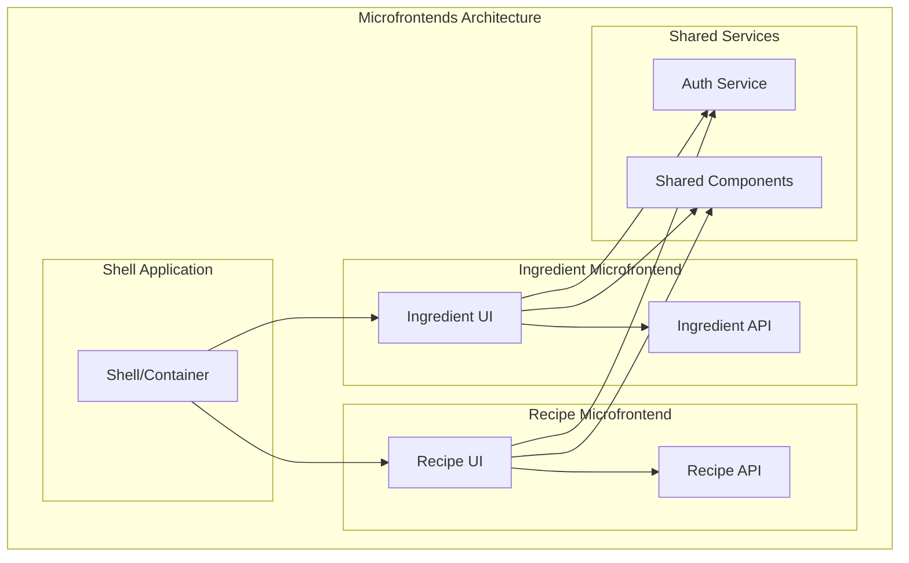
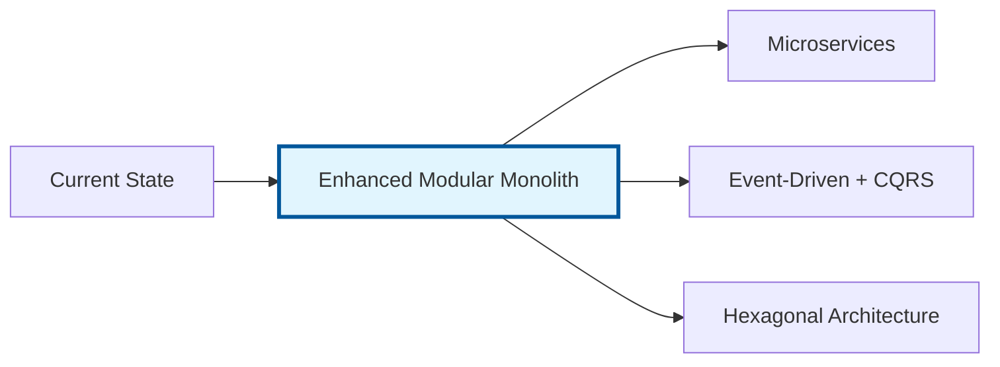

# アーキテクチャパターン詳細比較資料

## 概要

本資料では、食材管理アプリケーションに適用可能な主要なアーキテクチャパターンを詳細に比較分析し、最適解の選択根拠を明確にします。

## 比較対象アーキテクチャ

1. **Traditional Monolith** - 従来のモノリシックアーキテクチャ
2. **Layered Architecture** - レイヤードアーキテクチャ
3. **Current Modular Monolith** - 現在のモジュラーモノリス
4. **Enhanced Modular Monolith** - 提案された改善版（採用案）
5. **Hexagonal Architecture** - ヘキサゴナルアーキテクチャ
6. **Clean Architecture** - クリーンアーキテクチャ
7. **Microservices** - マイクロサービスアーキテクチャ
8. **Event-Driven + CQRS** - イベント駆動 + CQRS
9. **Microfrontends** - マイクロフロントエンド

## 詳細比較分析

### 1. Traditional Monolith



#### 特徴

- **単一デプロイメント単位**: アプリケーション全体が一つのパッケージ
- **共有データベース**: 全機能が同一データベースを使用
- **密結合**: モジュール間の境界が曖昧

#### 実装例

```typescript
// ❌ 従来のモノリス: 全てが一つのファイルに
export class IngredientController {
  async createIngredient(req: Request, res: Response) {
    try {
      // バリデーション、ビジネスロジック、データアクセスが混在
      if (!req.body.name) {
        return res.status(400).json({ error: 'Name is required' })
      }

      const ingredient = await prisma.ingredient.create({
        data: {
          name: req.body.name,
          quantity: req.body.quantity,
          unitId: req.body.unitId,
          categoryId: req.body.categoryId,
        },
      })

      // 通知処理も直接記述
      await sendEmail(user.email, 'Ingredient added', `${ingredient.name} has been added`)

      res.json(ingredient)
    } catch (error) {
      res.status(500).json({ error: 'Internal server error' })
    }
  }
}
```

#### 評価

| 項目                   | 評価       | 理由                                   |
| ---------------------- | ---------- | -------------------------------------- |
| **開発初期速度**       | ⭐⭐⭐⭐⭐ | 設定不要で即座に開発開始可能           |
| **理解しやすさ**       | ⭐⭐⭐⭐⭐ | シンプルな構造で学習コスト低           |
| **保守性**             | ⭐⭐       | コードが密結合で変更の影響範囲が不明確 |
| **テスタビリティ**     | ⭐⭐       | 単体テストが困難、モックが複雑         |
| **スケーラビリティ**   | ⭐         | 一部だけのスケールが困難               |
| **拡張性**             | ⭐⭐       | 新機能追加時の既存機能への影響大       |
| **技術負債蓄積リスク** | ⭐         | 境界が曖昧で負債が蓄積しやすい         |

#### 適用場面

- プロトタイプ開発
- 小規模アプリケーション（～5つの画面）
- 短期間のプロジェクト

---

### 2. Layered Architecture



#### 特徴

- **明確な層分離**: プレゼンテーション、ビジネス、データアクセス層
- **上位依存**: 上位層が下位層に依存
- **横断的関心事**: 各層で共通機能を実装

#### 実装例

```typescript
// ✅ レイヤード: 層ごとに責務分離
// Presentation Layer
export class IngredientController {
  constructor(private ingredientService: IngredientService) {}

  async createIngredient(req: Request, res: Response) {
    try {
      const dto = new CreateIngredientDto(req.body)
      const ingredient = await this.ingredientService.createIngredient(dto)
      res.json(ingredient)
    } catch (error) {
      res.status(400).json({ error: error.message })
    }
  }
}

// Business Layer
export class IngredientService {
  constructor(private ingredientRepository: IngredientRepository) {}

  async createIngredient(dto: CreateIngredientDto): Promise<Ingredient> {
    // ビジネスロジック
    this.validateIngredient(dto)

    const ingredient = new Ingredient(dto.name, dto.quantity, dto.unitId)
    return await this.ingredientRepository.save(ingredient)
  }

  private validateIngredient(dto: CreateIngredientDto): void {
    if (dto.quantity <= 0) {
      throw new Error('Quantity must be positive')
    }
  }
}

// Persistence Layer
export class IngredientRepository {
  async save(ingredient: Ingredient): Promise<Ingredient> {
    return await prisma.ingredient.create({
      data: {
        name: ingredient.name,
        quantity: ingredient.quantity,
        unitId: ingredient.unitId,
      },
    })
  }
}
```

#### 評価

| 項目                   | 評価     | 理由                             |
| ---------------------- | -------- | -------------------------------- |
| **開発初期速度**       | ⭐⭐⭐⭐ | 層構造が明確で開発しやすい       |
| **理解しやすさ**       | ⭐⭐⭐⭐ | 一般的なパターンで理解しやすい   |
| **保守性**             | ⭐⭐⭐   | 層分離により変更の影響を制限     |
| **テスタビリティ**     | ⭐⭐⭐   | 各層でのテストが可能             |
| **スケーラビリティ**   | ⭐⭐     | 層単位でのスケールは可能         |
| **拡張性**             | ⭐⭐⭐   | 新機能は層ごとに追加             |
| **技術負債蓄積リスク** | ⭐⭐⭐   | 構造化されているが依存関係は課題 |

#### 課題

- **下位層への依存**: ビジネス層がデータベース構造に依存
- **横断的関心事**: ログ、認証などの実装が分散
- **循環依存のリスク**: 層間での循環依存発生の可能性

---

### 3. Current Modular Monolith



#### 特徴

- **垂直スライス**: 機能ごとの完結したモジュール
- **Client/Server/Shared構造**: 各モジュールが3層構造
- **モジュール独立性**: モジュール間は共有モジュール経由でのみ通信

#### 実装例

```typescript
// ✅ 現在のモジュラーモノリス
// modules/ingredients/server/api/create-ingredient.ts
export async function POST(request: Request) {
  const body = await request.json()

  // 簡単なバリデーション
  if (!body.name || !body.quantity) {
    return NextResponse.json({ error: 'Invalid input' }, { status: 400 })
  }

  // データベース操作
  const ingredient = await prisma.ingredient.create({
    data: {
      name: body.name,
      quantity: body.quantity,
      unitId: body.unitId,
      categoryId: body.categoryId,
    },
  })

  return NextResponse.json({ ingredient })
}

// modules/ingredients/client/hooks/useCreateIngredient.ts
export const useCreateIngredient = () => {
  return useMutation({
    mutationFn: async (data: CreateIngredientData) => {
      const response = await fetch('/api/ingredients', {
        method: 'POST',
        headers: { 'Content-Type': 'application/json' },
        body: JSON.stringify(data),
      })
      return response.json()
    },
    onSuccess: () => {
      // キャッシュ無効化
      queryClient.invalidateQueries(['ingredients'])
    },
  })
}
```

#### 評価

| 項目                   | 評価     | 理由                               |
| ---------------------- | -------- | ---------------------------------- |
| **開発初期速度**       | ⭐⭐⭐⭐ | Next.jsの利点を活かした高速開発    |
| **理解しやすさ**       | ⭐⭐⭐⭐ | モジュール境界が明確               |
| **保守性**             | ⭐⭐⭐   | モジュール独立性により保守しやすい |
| **テスタビリティ**     | ⭐⭐⭐   | モジュール単位でのテストが可能     |
| **スケーラビリティ**   | ⭐⭐⭐   | 機能単位でのスケールが可能         |
| **拡張性**             | ⭐⭐⭐⭐ | 新モジュール追加が容易             |
| **技術負債蓄積リスク** | ⭐⭐⭐   | 境界は明確だがDDD原則は未適用      |

#### 課題

- **DDDの部分的実装**: ドメインモデルが不完全
- **依存関係制御不足**: 依存性逆転の原則未適用
- **ビジネスロジック分散**: APIハンドラーにビジネスロジックが混在

---

### 4. Enhanced Modular Monolith（採用案）



#### 特徴

- **DDD完全適用**: エンティティ、値オブジェクト、ドメインサービス
- **Hexagonal境界**: ポート&アダプターによる外部システム分離
- **CQRS実装**: コマンド・クエリ責務分離
- **Event-Driven**: ドメインイベントによる疎結合

#### 実装例

```typescript
// ✅ Enhanced Modular Monolith
// Domain Layer
export class Ingredient extends AggregateRoot<IngredientId> {
  constructor(
    id: IngredientId,
    private _name: IngredientName,
    private _quantity: Quantity,
    private _storageLocation: StorageLocation
  ) {
    super(id)
  }

  consume(amount: number, reason?: string): void {
    if (!this.hasSufficientStock(amount)) {
      throw new InsufficientStockException(
        `要求された数量 ${amount} は利用可能な在庫 ${this._quantity.amount} を超えています`,
        {
          requested: amount,
          available: this._quantity.amount,
          shortage: amount - this._quantity.amount,
        }
      )
    }

    const previousQuantity = this._quantity
    this._quantity = this._quantity.subtract(amount)

    this.addDomainEvent(
      new IngredientConsumedEvent(
        this.id,
        this._name.value,
        previousQuantity,
        this._quantity,
        amount,
        reason
      )
    )
  }
}

// Application Layer - Command Handler
export class ConsumeIngredientHandler {
  constructor(
    private readonly ingredientRepo: IngredientRepository,
    private readonly eventPublisher: DomainEventPublisher
  ) {}

  async handle(command: ConsumeIngredientCommand): Promise<ConsumeIngredientResult> {
    const ingredient = await this.ingredientRepo.findById(command.ingredientId)
    if (!ingredient) {
      throw new IngredientNotFoundException(command.ingredientId)
    }

    ingredient.consume(command.amount, command.reason)

    await this.ingredientRepo.save(ingredient)
    await this.eventPublisher.publishAll(ingredient.domainEvents)

    return new ConsumeIngredientResult(ingredient)
  }
}

// Infrastructure Layer - Repository
export class PrismaIngredientRepository implements IngredientRepository {
  constructor(
    private readonly prisma: PrismaClient,
    private readonly mapper: IngredientMapper
  ) {}

  async save(ingredient: Ingredient): Promise<void> {
    const model = this.mapper.toModel(ingredient)
    await this.prisma.ingredient.upsert({
      where: { id: ingredient.id.value },
      create: model,
      update: model,
    })
  }
}

// Presentation Layer - Hook
export const useConsumeIngredient = (ingredientId: string) => {
  return useMutation({
    mutationFn: (data: ConsumeIngredientData) =>
      ingredientApiAdapter.consumeIngredient(ingredientId, data),
    onError: (error) => {
      if (error instanceof InsufficientStockError) {
        toast.error(`在庫不足: ${error.details.shortage}${error.details.unit}不足`)
      }
    },
  })
}
```

#### 評価

| 項目                   | 評価       | 理由                                   |
| ---------------------- | ---------- | -------------------------------------- |
| **開発初期速度**       | ⭐⭐⭐     | 初期設定コストはあるが中長期で高速     |
| **理解しやすさ**       | ⭐⭐⭐     | DDDパターンの学習コストあり            |
| **保守性**             | ⭐⭐⭐⭐⭐ | 明確な責務分離と依存制御               |
| **テスタビリティ**     | ⭐⭐⭐⭐⭐ | 各層の独立テストが容易                 |
| **スケーラビリティ**   | ⭐⭐⭐⭐   | CQRS により読み書き最適化              |
| **拡張性**             | ⭐⭐⭐⭐⭐ | 新機能追加時の既存影響最小             |
| **技術負債蓄積リスク** | ⭐⭐⭐⭐⭐ | アーキテクチャ原則により負債蓄積を防止 |

---

### 5. Hexagonal Architecture



#### 特徴

- **ポート&アダプター**: 外部システムとの完全分離
- **依存性逆転**: ドメインが外部に依存しない
- **テスタビリティ**: アダプターのモック化が容易

#### 実装例

```typescript
// ✅ Hexagonal Architecture
// Inbound Port (Application Service Interface)
export interface IngredientManagementService {
  createIngredient(command: CreateIngredientCommand): Promise<IngredientId>
  consumeIngredient(command: ConsumeIngredientCommand): Promise<void>
  getIngredient(query: GetIngredientQuery): Promise<IngredientView>
}

// Outbound Port (Repository Interface)
export interface IngredientRepository {
  save(ingredient: Ingredient): Promise<void>
  findById(id: IngredientId): Promise<Ingredient | null>
}

// Domain Core
export class IngredientManagementServiceImpl implements IngredientManagementService {
  constructor(
    private readonly ingredientRepo: IngredientRepository,
    private readonly notificationService: NotificationService
  ) {}

  async createIngredient(command: CreateIngredientCommand): Promise<IngredientId> {
    const ingredient = Ingredient.create({
      name: command.name,
      quantity: new Quantity(command.quantity, command.unit),
      storageLocation: new StorageLocation(command.storageLocation),
    })

    await this.ingredientRepo.save(ingredient)
    await this.notificationService.notifyIngredientCreated(ingredient)

    return ingredient.id
  }
}

// Inbound Adapter (Web Adapter)
export class IngredientWebAdapter {
  constructor(private readonly service: IngredientManagementService) {}

  async createIngredient(req: Request, res: Response) {
    const command = new CreateIngredientCommand(
      req.body.name,
      req.body.quantity,
      req.body.unit,
      req.body.storageLocation
    )

    const ingredientId = await this.service.createIngredient(command)
    res.json({ id: ingredientId.value })
  }
}

// Outbound Adapter (Database Adapter)
export class PrismaIngredientRepository implements IngredientRepository {
  async save(ingredient: Ingredient): Promise<void> {
    await prisma.ingredient.upsert({
      where: { id: ingredient.id.value },
      create: {
        id: ingredient.id.value,
        name: ingredient.name,
        quantity: ingredient.quantity.amount,
        unit: ingredient.quantity.unit.name,
      },
      update: {
        name: ingredient.name,
        quantity: ingredient.quantity.amount,
      },
    })
  }
}
```

#### 評価

| 項目                   | 評価       | 理由                             |
| ---------------------- | ---------- | -------------------------------- |
| **開発初期速度**       | ⭐⭐       | 多くのインターフェース定義が必要 |
| **理解しやすさ**       | ⭐⭐       | 抽象化レベルが高く学習コスト大   |
| **保守性**             | ⭐⭐⭐⭐⭐ | 完全な依存性逆転により変更に強い |
| **テスタビリティ**     | ⭐⭐⭐⭐⭐ | 全てのアダプターがモック可能     |
| **スケーラビリティ**   | ⭐⭐⭐     | アダプター単位でのスケール       |
| **拡張性**             | ⭐⭐⭐⭐⭐ | 新しいアダプター追加が容易       |
| **技術負債蓄積リスク** | ⭐⭐⭐⭐⭐ | 外部依存の変更影響なし           |

#### 課題

- **実装コスト**: 多くのインターフェースとアダプターが必要
- **オーバーエンジニアリング**: 小規模プロジェクトには過剰
- **学習コスト**: 概念の理解に時間を要する

---

### 6. Clean Architecture



#### 特徴

- **同心円構造**: 内側は外側に依存しない
- **依存関係ルール**: 依存は内向きのみ
- **フレームワーク独立**: 特定技術に依存しない

#### 実装例

```typescript
// ✅ Clean Architecture
// Entities (最内層)
export class Ingredient {
  constructor(
    public readonly id: string,
    public readonly name: string,
    private _quantity: number,
    public readonly unit: string
  ) {}

  consume(amount: number): void {
    if (this._quantity < amount) {
      throw new Error('Insufficient stock')
    }
    this._quantity -= amount
  }

  get quantity(): number {
    return this._quantity
  }
}

// Use Cases (アプリケーション層)
export class ConsumeIngredientUseCase {
  constructor(
    private readonly ingredientGateway: IngredientGateway,
    private readonly outputPort: ConsumeIngredientOutputPort
  ) {}

  async execute(inputData: ConsumeIngredientInputData): Promise<void> {
    const ingredient = await this.ingredientGateway.findById(inputData.ingredientId)
    if (!ingredient) {
      return this.outputPort.ingredientNotFound()
    }

    try {
      ingredient.consume(inputData.amount)
      await this.ingredientGateway.save(ingredient)
      this.outputPort.success(ingredient)
    } catch (error) {
      this.outputPort.insufficientStock(ingredient, inputData.amount)
    }
  }
}

// Interface Adapters
export interface ConsumeIngredientOutputPort {
  success(ingredient: Ingredient): void
  ingredientNotFound(): void
  insufficientStock(ingredient: Ingredient, requestedAmount: number): void
}

export class ConsumeIngredientController {
  constructor(private readonly useCase: ConsumeIngredientUseCase) {}

  async handle(request: Request): Promise<Response> {
    const inputData = new ConsumeIngredientInputData(request.params.id, request.body.amount)

    const presenter = new ConsumeIngredientPresenter()
    await this.useCase.execute(inputData)

    return presenter.getResponse()
  }
}

export class ConsumeIngredientPresenter implements ConsumeIngredientOutputPort {
  private response?: Response

  success(ingredient: Ingredient): void {
    this.response = new Response(
      JSON.stringify({
        success: true,
        ingredient: {
          id: ingredient.id,
          name: ingredient.name,
          quantity: ingredient.quantity,
        },
      }),
      { status: 200 }
    )
  }

  ingredientNotFound(): void {
    this.response = new Response(
      JSON.stringify({
        error: 'Ingredient not found',
      }),
      { status: 404 }
    )
  }

  insufficientStock(ingredient: Ingredient, requestedAmount: number): void {
    this.response = new Response(
      JSON.stringify({
        error: 'Insufficient stock',
        available: ingredient.quantity,
        requested: requestedAmount,
      }),
      { status: 400 }
    )
  }

  getResponse(): Response {
    if (!this.response) {
      throw new Error('Response not set')
    }
    return this.response
  }
}
```

#### 評価

| 項目                   | 評価       | 理由                           |
| ---------------------- | ---------- | ------------------------------ |
| **開発初期速度**       | ⭐⭐       | 厳密な層分離により初期コスト高 |
| **理解しやすさ**       | ⭐⭐       | 抽象化が多く概念理解が困難     |
| **保守性**             | ⭐⭐⭐⭐⭐ | 完璧な依存制御により変更に強い |
| **テスタビリティ**     | ⭐⭐⭐⭐⭐ | 全層が独立してテスト可能       |
| **スケーラビリティ**   | ⭐⭐⭐     | ユースケース単位でのスケール   |
| **拡張性**             | ⭐⭐⭐⭐⭐ | 新機能追加が既存に影響しない   |
| **技術負債蓄積リスク** | ⭐⭐⭐⭐⭐ | 厳密なルールにより負債蓄積困難 |

#### 課題

- **開発コスト**: Presenter、Gateway等の多くの抽象化が必要
- **複雑性**: 簡単な処理にも多くのクラスが必要
- **オーバーヘッド**: 小中規模アプリには過剰

---

### 7. Microservices



#### 特徴

- **独立デプロイ**: サービスごとに個別デプロイ可能
- **技術多様性**: サービスごとに異なる技術スタック選択可能
- **データ分離**: サービスごとに専用データベース

#### 実装例

```typescript
// ✅ Microservices - Ingredient Service
// ingredient-service/src/app.ts
export class IngredientService {
  constructor(
    private readonly repository: IngredientRepository,
    private readonly eventBus: EventBus
  ) {}

  async createIngredient(data: CreateIngredientData): Promise<Ingredient> {
    const ingredient = new Ingredient(data)
    await this.repository.save(ingredient)

    // 他サービスへのイベント発行
    await this.eventBus.publish(new IngredientCreatedEvent(ingredient))

    return ingredient
  }

  async consumeIngredient(id: string, amount: number): Promise<void> {
    const ingredient = await this.repository.findById(id)
    ingredient.consume(amount)
    await this.repository.save(ingredient)

    // 在庫変更イベント発行
    await this.eventBus.publish(new IngredientConsumedEvent(ingredient, amount))
  }
}

// recipe-service/src/event-handlers/ingredient-events.handler.ts
export class IngredientEventHandler {
  async handleIngredientConsumed(event: IngredientConsumedEvent): Promise<void> {
    // レシピサービス側でのデータ更新
    await this.recipeRepository.updateIngredientQuantity(
      event.ingredientId,
      event.remainingQuantity
    )
  }
}

// api-gateway/src/routes/ingredients.ts
export class IngredientGateway {
  async createIngredient(req: Request, res: Response): Promise<void> {
    try {
      const response = await fetch('http://ingredient-service:3001/ingredients', {
        method: 'POST',
        headers: { 'Content-Type': 'application/json' },
        body: JSON.stringify(req.body),
      })

      const data = await response.json()
      res.json(data)
    } catch (error) {
      res.status(500).json({ error: 'Service unavailable' })
    }
  }
}
```

#### 評価

| 項目                   | 評価       | 理由                                           |
| ---------------------- | ---------- | ---------------------------------------------- |
| **開発初期速度**       | ⭐         | サービス間通信、デプロイ設定等で大幅に遅延     |
| **理解しやすさ**       | ⭐⭐       | 分散システムの複雑性により理解困難             |
| **保守性**             | ⭐⭐⭐     | サービス独立性は高いが分散トレーシング等が必要 |
| **テスタビリティ**     | ⭐⭐       | 統合テストが複雑、契約テスト必要               |
| **スケーラビリティ**   | ⭐⭐⭐⭐⭐ | サービス単位での個別スケール可能               |
| **拡張性**             | ⭐⭐⭐⭐   | 新サービス追加は容易                           |
| **技術負債蓄積リスク** | ⭐⭐⭐     | サービス間の依存関係管理が課題                 |

#### 課題

- **運用複雑性**: 複数サービスの監視、ログ集約、デプロイが複雑
- **分散システムの課題**: ネットワーク分断、結果整合性、分散トランザクション
- **データ一貫性**: サービス間でのデータ整合性保証が困難
- **開発チーム規模**: 小規模チームには過剰

---

### 8. Event-Driven + CQRS



#### 特徴

- **コマンド・クエリ分離**: 書き込みと読み取りの完全分離
- **イベントソーシング**: 状態変更をイベントとして保存
- **結果整合性**: 非同期でのデータ整合性

#### 実装例

```typescript
// ✅ Event-Driven + CQRS
// Command Side
export class CreateIngredientCommand {
  constructor(
    public readonly name: string,
    public readonly quantity: number,
    public readonly unitId: string
  ) {}
}

export class CreateIngredientHandler {
  constructor(
    private readonly eventStore: EventStore,
    private readonly eventBus: EventBus
  ) {}

  async handle(command: CreateIngredientCommand): Promise<void> {
    const ingredientId = IngredientId.generate()

    // イベント生成
    const event = new IngredientCreatedEvent(
      ingredientId,
      command.name,
      command.quantity,
      command.unitId,
      new Date()
    )

    // イベントストア保存
    await this.eventStore.saveEvent(event)

    // イベント発行
    await this.eventBus.publish(event)
  }
}

// Event Store
export class EventStore {
  async saveEvent(event: DomainEvent): Promise<void> {
    await this.db.events.create({
      data: {
        id: event.id,
        aggregateId: event.aggregateId,
        eventType: event.constructor.name,
        eventData: JSON.stringify(event),
        version: event.version,
        timestamp: event.timestamp,
      },
    })
  }

  async getEvents(aggregateId: string): Promise<DomainEvent[]> {
    const events = await this.db.events.findMany({
      where: { aggregateId },
      orderBy: { version: 'asc' },
    })

    return events.map((event) => this.deserializeEvent(event))
  }
}

// Query Side - Projection
export class IngredientListProjection {
  async handle(event: IngredientCreatedEvent): Promise<void> {
    await this.readDb.ingredientViews.create({
      data: {
        id: event.aggregateId,
        name: event.name,
        quantity: event.quantity,
        unitId: event.unitId,
        displayText: `${event.quantity}${event.unitName}`,
        createdAt: event.timestamp,
      },
    })
  }

  async handle(event: IngredientConsumedEvent): Promise<void> {
    await this.readDb.ingredientViews.update({
      where: { id: event.aggregateId },
      data: {
        quantity: event.remainingQuantity,
        displayText: `${event.remainingQuantity}${event.unitName}`,
        lastConsumedAt: event.timestamp,
      },
    })
  }
}

// Query Handler
export class GetIngredientsHandler {
  async handle(query: GetIngredientsQuery): Promise<IngredientListView> {
    // 読み取り最適化されたビューから取得
    const ingredients = await this.readDb.ingredientViews.findMany({
      where: this.buildWhereClause(query.filters),
      orderBy: { [query.sortBy]: query.sortOrder },
    })

    return new IngredientListView(ingredients)
  }
}
```

#### 評価

| 項目                   | 評価       | 理由                                           |
| ---------------------- | ---------- | ---------------------------------------------- |
| **開発初期速度**       | ⭐         | イベントストア、プロジェクション等の設定が複雑 |
| **理解しやすさ**       | ⭐⭐       | 結果整合性等の概念理解が困難                   |
| **保守性**             | ⭐⭐⭐     | イベント履歴による完全な監査が可能             |
| **テスタビリティ**     | ⭐⭐⭐⭐   | イベント単位でのテストが可能                   |
| **スケーラビリティ**   | ⭐⭐⭐⭐⭐ | 読み書き完全分離により高いスケーラビリティ     |
| **拡張性**             | ⭐⭐⭐⭐   | 新しいプロジェクション追加が容易               |
| **技術負債蓄積リスク** | ⭐⭐⭐     | イベントスキーマの変更管理が課題               |

#### 課題

- **結果整合性**: データの即座な一貫性が保証されない
- **複雑性**: イベントストア、プロジェクション管理が複雑
- **デバッグ難易度**: 非同期処理によりデバッグが困難

---

### 9. Microfrontends



#### 特徴

- **フロントエンド分割**: UI機能ごとに独立した開発・デプロイ
- **技術スタック自由度**: マイクロフロントエンドごとに異なる技術選択可能
- **チーム独立性**: 機能チームごとの完全な自律性

#### 実装例

```typescript
// ✅ Microfrontends
// shell-app/src/App.tsx (シェルアプリケーション)
export const App: React.FC = () => {
  return (
    <Router>
      <div className="app">
        <Header />
        <nav>
          <Link to="/ingredients">食材管理</Link>
          <Link to="/recipes">レシピ</Link>
        </nav>

        <Suspense fallback={<div>Loading...</div>}>
          <Routes>
            <Route
              path="/ingredients/*"
              element={<IngredientMicrofrontend />}
            />
            <Route
              path="/recipes/*"
              element={<RecipeMicrofrontend />}
            />
          </Routes>
        </Suspense>
      </div>
    </Router>
  )
}

// ingredients-mfe/src/bootstrap.tsx (食材マイクロフロントエンド)
const mount = (element: HTMLElement, { routing, auth }: MountOptions) => {
  const root = createRoot(element)

  root.render(
    <IngredientApp
      routing={routing}
      authService={auth}
    />
  )

  return {
    unmount: () => root.unmount()
  }
}

// シェルから呼び出される場合
if (process.env.NODE_ENV === 'development' && !window.__SHELL_APP__) {
  const root = document.getElementById('ingredients-dev-root')
  if (root) {
    mount(root, {
      routing: { type: 'memory', initialEntries: ['/'] },
      auth: new MockAuthService()
    })
  }
}

export { mount }

// ingredients-mfe/src/IngredientApp.tsx
export const IngredientApp: React.FC<IngredientAppProps> = ({ routing, authService }) => {
  return (
    <AuthProvider authService={authService}>
      <QueryClient client={queryClient}>
        <Router history={routing.history}>
          <Routes>
            <Route path="/" element={<IngredientList />} />
            <Route path="/create" element={<CreateIngredient />} />
            <Route path="/:id/edit" element={<EditIngredient />} />
          </Routes>
        </Router>
      </QueryClient>
    </AuthProvider>
  )
}

// shell-app/src/components/IngredientMicrofrontend.tsx
export const IngredientMicrofrontend: React.FC = () => {
  const ref = useRef<HTMLDivElement>(null)
  const history = useHistory()
  const auth = useAuth()

  useEffect(() => {
    const { mount, unmount } = require('ingredients-mfe/IngredientApp')

    if (ref.current) {
      const mountedApp = mount(ref.current, {
        routing: {
          type: 'browser',
          history: history
        },
        auth: auth
      })

      return () => mountedApp.unmount()
    }
  }, [history, auth])

  return <div ref={ref} />
}

// webpack federation configuration
// ingredients-mfe/webpack.config.js
module.exports = {
  mode: 'development',
  devServer: {
    port: 3001,
  },
  module: {
    rules: [
      // React, TypeScript loaders
    ],
  },
  plugins: [
    new ModuleFederationPlugin({
      name: 'ingredients_mfe',
      filename: 'remoteEntry.js',
      exposes: {
        './IngredientApp': './src/bootstrap',
      },
      shared: {
        react: { singleton: true },
        'react-dom': { singleton: true },
      },
    }),
  ],
}

// shell-app/webpack.config.js
module.exports = {
  plugins: [
    new ModuleFederationPlugin({
      name: 'shell',
      remotes: {
        'ingredients-mfe': 'ingredients_mfe@http://localhost:3001/remoteEntry.js',
        'recipes-mfe': 'recipes_mfe@http://localhost:3002/remoteEntry.js',
      },
      shared: {
        react: { singleton: true },
        'react-dom': { singleton: true },
      },
    }),
  ],
}
```

#### 評価

| 項目                   | 評価     | 理由                                           |
| ---------------------- | -------- | ---------------------------------------------- |
| **開発初期速度**       | ⭐⭐     | Module Federation等の設定が複雑                |
| **理解しやすさ**       | ⭐⭐     | 分散フロントエンドの概念理解が必要             |
| **保守性**             | ⭐⭐⭐   | マイクロフロントエンド独立性により保守しやすい |
| **テスタビリティ**     | ⭐⭐⭐   | 個別テストは容易だが統合テストが複雑           |
| **スケーラビリティ**   | ⭐⭐⭐⭐ | 機能単位での個別スケールが可能                 |
| **拡張性**             | ⭐⭐⭐⭐ | 新機能をマイクロフロントエンドとして独立追加   |
| **技術負債蓄積リスク** | ⭐⭐⭐   | 共有依存関係の管理が課題                       |

#### 課題

- **運用複雑性**: 複数のフロントエンドアプリケーションの管理
- **共有ライブラリ管理**: React、共通コンポーネントのバージョン管理
- **パフォーマンス**: 複数のJavaScriptバンドルロード
- **チーム規模**: 小規模チームには過剰

---

## 総合比較表

| アーキテクチャ                   | 初期速度   | 理解容易性 | 保守性     | テスト性   | スケーラビリティ | 拡張性     | 負債リスク | 適用規模     |
| -------------------------------- | ---------- | ---------- | ---------- | ---------- | ---------------- | ---------- | ---------- | ------------ |
| **Traditional Monolith**         | ⭐⭐⭐⭐⭐ | ⭐⭐⭐⭐⭐ | ⭐⭐       | ⭐⭐       | ⭐               | ⭐⭐       | ⭐         | 小規模       |
| **Layered Architecture**         | ⭐⭐⭐⭐   | ⭐⭐⭐⭐   | ⭐⭐⭐     | ⭐⭐⭐     | ⭐⭐             | ⭐⭐⭐     | ⭐⭐⭐     | 小〜中規模   |
| **Current Modular Monolith**     | ⭐⭐⭐⭐   | ⭐⭐⭐⭐   | ⭐⭐⭐     | ⭐⭐⭐     | ⭐⭐⭐           | ⭐⭐⭐⭐   | ⭐⭐⭐     | 中規模       |
| **🏆 Enhanced Modular Monolith** | ⭐⭐⭐     | ⭐⭐⭐     | ⭐⭐⭐⭐⭐ | ⭐⭐⭐⭐⭐ | ⭐⭐⭐⭐         | ⭐⭐⭐⭐⭐ | ⭐⭐⭐⭐⭐ | 中〜大規模   |
| **Hexagonal Architecture**       | ⭐⭐       | ⭐⭐       | ⭐⭐⭐⭐⭐ | ⭐⭐⭐⭐⭐ | ⭐⭐⭐           | ⭐⭐⭐⭐⭐ | ⭐⭐⭐⭐⭐ | 大規模       |
| **Clean Architecture**           | ⭐⭐       | ⭐⭐       | ⭐⭐⭐⭐⭐ | ⭐⭐⭐⭐⭐ | ⭐⭐⭐           | ⭐⭐⭐⭐⭐ | ⭐⭐⭐⭐⭐ | 大規模       |
| **Microservices**                | ⭐         | ⭐⭐       | ⭐⭐⭐     | ⭐⭐       | ⭐⭐⭐⭐⭐       | ⭐⭐⭐⭐   | ⭐⭐⭐     | 超大規模     |
| **Event-Driven + CQRS**          | ⭐         | ⭐⭐       | ⭐⭐⭐     | ⭐⭐⭐⭐   | ⭐⭐⭐⭐⭐       | ⭐⭐⭐⭐   | ⭐⭐⭐     | 大〜超大規模 |
| **Microfrontends**               | ⭐⭐       | ⭐⭐       | ⭐⭐⭐     | ⭐⭐⭐     | ⭐⭐⭐⭐         | ⭐⭐⭐⭐   | ⭐⭐⭐     | 大規模       |

## コンテキスト別推奨パターン

### プロジェクト段階別

#### 🚀 **プロトタイプ・MVP段階**

**推奨**: Traditional Monolith

- 最速で価値検証が可能
- 技術的負債は後で解決

#### 📈 **成長段階**

**推奨**: Current Modular Monolith → Enhanced Modular Monolith

- 段階的な改善により技術負債を解決
- ビジネス成長に合わせたアーキテクチャ進化

#### 🏢 **成熟段階**

**推奨**: Enhanced Modular Monolith / Hexagonal Architecture

- 安定性と拡張性の両立
- 将来のマイクロサービス化への準備

#### 🌐 **大規模・複数チーム段階**

**推奨**: Microservices / Event-Driven + CQRS

- チーム独立性の確保
- 高いスケーラビリティ要件への対応

### チーム規模別

#### 👨‍💻 **1-3人チーム**

- **最適**: Traditional Monolith / Layered Architecture
- **許容**: Current Modular Monolith

#### 👥 **4-8人チーム**

- **最適**: Enhanced Modular Monolith
- **許容**: Hexagonal Architecture

#### 🏢 **9-15人チーム**

- **最適**: Enhanced Modular Monolith / Microservices
- **許容**: Clean Architecture / Event-Driven + CQRS

#### 🌐 **16人以上チーム**

- **最適**: Microservices / Event-Driven + CQRS
- **許容**: Microfrontends (フロントエンド重視の場合)

### 技術要件別

#### 🔒 **高セキュリティ要件**

**推奨**: Clean Architecture / Hexagonal Architecture

- 外部依存の完全制御
- セキュリティレイヤーの明確な分離

#### ⚡ **高パフォーマンス要件**

**推奨**: Event-Driven + CQRS / Microservices

- 読み書き最適化
- 水平スケーリング対応

#### 🔄 **高可用性要件**

**推奨**: Microservices / Event-Driven + CQRS

- 部分障害の分離
- 冗長化とフェイルオーバー

#### 🧪 **高テスト要件**

**推奨**: Enhanced Modular Monolith / Hexagonal Architecture

- 優れたテスタビリティ
- モック化の容易さ

## 決定理由：Enhanced Modular Monolith

### 🎯 **食材管理アプリケーションに最適な理由**

#### 1. **プロジェクト特性との適合性**

- **中規模アプリケーション**: 5-10の主要機能（食材、レシピ、買い物、栄養管理等）
- **段階的成長**: MVPから本格運用への段階的拡張
- **Next.jsフルスタック**: フレームワークの特性を最大活用

#### 2. **開発チーム特性との適合性**

- **小〜中規模チーム**: 1-8人程度での開発を想定
- **フルスタック志向**: フロントエンド・バックエンド両方をカバー
- **学習コスト**: DDDパターンは学習価値が高い

#### 3. **技術要件との適合性**

- **保守性重視**: 長期運用における変更容易性
- **拡張性重視**: 新機能追加の頻度が高い想定
- **テスト性重視**: 品質保証が重要

#### 4. **移行パスの明確性**



### 🚀 **実装ロードマップ**

#### Phase 1: 基盤強化（4-6週間）

1. **Domain Layer構築**

   - Value Objects実装
   - Entity実装
   - Domain Services実装
   - Specifications実装

2. **Application Layer構築**

   - Command Handlers実装
   - Query Handlers実装
   - Ports定義

3. **Infrastructure Layer構築**
   - Repository実装
   - Event Bus実装
   - Adapters実装

#### Phase 2: API & Client層改善（3-4週間）

1. **API Layer強化**

   - CQRS対応
   - Validation強化
   - Error Handling統一

2. **Client Layer強化**
   - Anti-Corruption Layer実装
   - Custom Hooks CQRS対応
   - Error Boundary改善

#### Phase 3: 高度機能（2-3週間）

1. **Event-Driven機能**

   - Event Handlers拡充
   - Projections実装
   - 非同期処理改善

2. **監視・最適化**
   - Metrics収集
   - Performance最適化
   - Log改善

### 💰 **コスト対効果分析**

#### 初期投資コスト

- **学習コスト**: DDDパターンの理解 (2-3週間)
- **実装コスト**: アーキテクチャ構築 (6-8週間)
- **移行コスト**: 既存コードの段階的移行 (4-6週間)

#### 長期的効果

- **開発速度向上**: 明確な責務分離により並行開発が容易
- **保守コスト削減**: 変更の影響範囲が限定的
- **品質向上**: テスタビリティの向上によりバグ減少
- **拡張コスト削減**: 新機能追加時の既存機能への影響最小化

#### ROI計算

```
初期投資: 12-17週間
回収期間: 6-12ヶ月
長期効果: 開発効率30-50%向上、保守コスト40-60%削減
```

## まとめ

**Enhanced Modular Monolith** は、食材管理アプリケーションの要件、チーム特性、技術制約を総合的に考慮した最適解です。

### 🏆 **主要な成功要因**

1. **段階的実装**: リスクを最小化しながら価値を早期実現
2. **実用性重視**: 過度な複雑性を避けビジネス価値に集中
3. **将来への拡張性**: マイクロサービス化への自然な移行パス
4. **Next.js最適化**: フルスタックフレームワークの特性を最大活用
5. **チーム生産性**: 明確な責務分離による並行開発促進

### 🎯 **期待される成果**

- **短期**: ビジネスロジックの明確化、テスタビリティ向上
- **中期**: 開発速度向上、保守性向上
- **長期**: 拡張性確保、技術負債蓄積防止

この選択により、現在の開発効率を維持しながら、将来の成長に対応できる堅牢で拡張性の高いシステムを構築できます。
