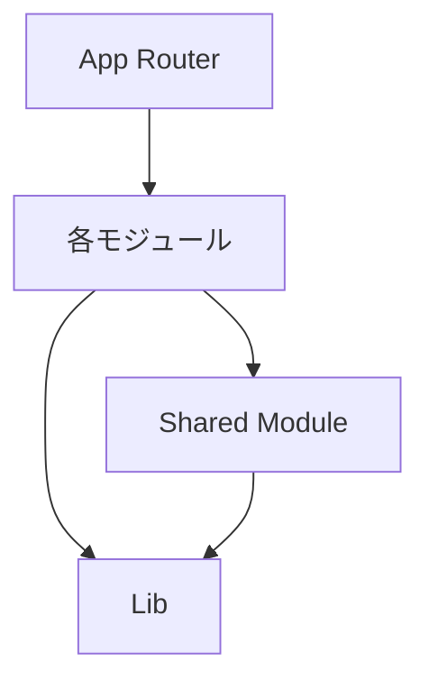
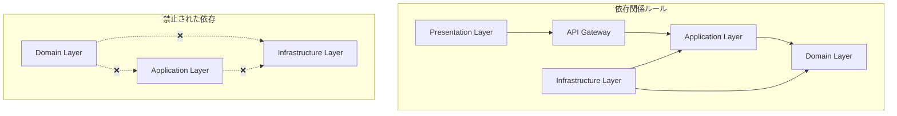
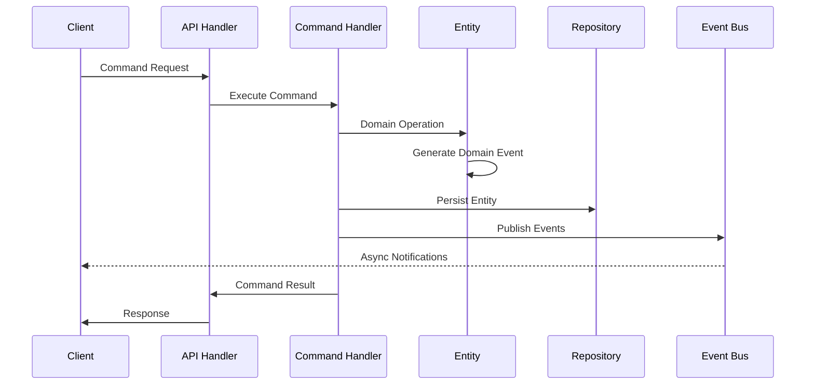
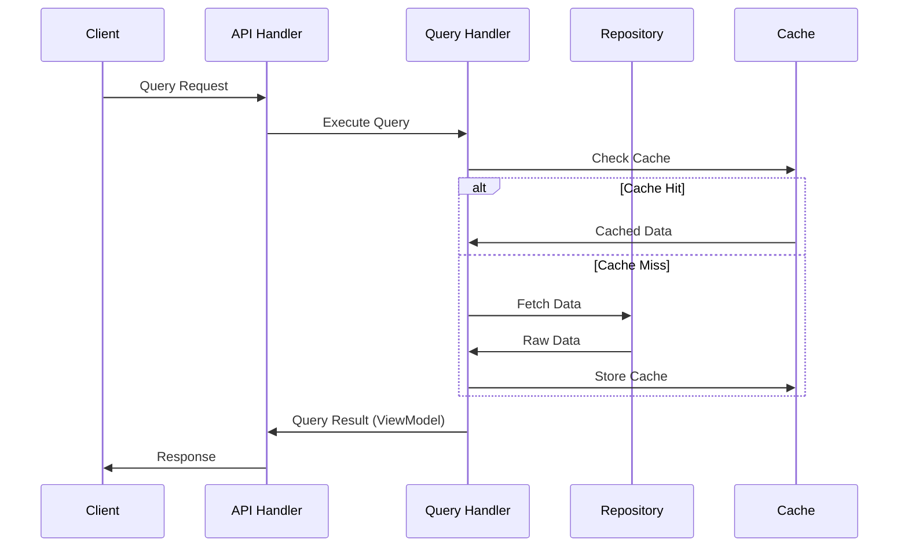
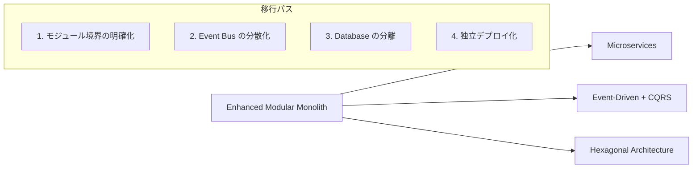

# アーキテクチャ設計書

## 概要

本プロジェクトは**Enhanced Modular Monolith**アーキテクチャを採用しています。
これは従来のモジュラーモノリスにドメイン駆動設計（DDD）、Hexagonal Architecture、CQRSパターンを完全に統合した先進的なアーキテクチャです。

## アーキテクチャの特徴

### 1. Enhanced Modular Monolith

従来のモジュラーモノリスを進化させた先進的なアーキテクチャ：

**主要要素**:

- 🏗️ **モジュール独立性**: 各ビジネス機能が完全に独立
- 🎯 **ドメイン中心設計**: ビジネスロジックがアーキテクチャの中核
- 🔄 **CQRS パターン**: 読み書き責務の最適分離
- 🔌 **Hexagonal 境界**: 外部システムとの疎結合
- 📡 **Event-Driven**: ドメインイベントによる非同期処理

### 2. 4層アーキテクチャ

各モジュールは以下の4層で構成：

- **Presentation Layer (client/)**: UI、状態管理、Anti-Corruption Layer
- **Application Layer (server/application/)**: Command/Query Handlers、Application Services
- **Domain Layer (server/domain/)**: Entities、Value Objects、Domain Services、Events
- **Infrastructure Layer (server/infrastructure/)**: Repository実装、外部システム連携

### 3. ドメイン駆動設計（DDD）の完全実装

DDD原則の完全適用：

- **Entities**: ビジネスアイデンティティを持つオブジェクト
- **Value Objects**: 不変性を保証する値オブジェクト
- **Aggregates**: データ整合性の境界
- **Domain Events**: ビジネス上重要な出来事の記録
- **Specifications**: ビジネスルールの明示的表現

## モジュール構成

```
src/modules/
├── ingredients/          # 食材管理モジュール
│   ├── client/          # Presentation Layer
│   │   ├── components/  # UIコンポーネント
│   │   ├── hooks/       # カスタムフック (queries/commands/state)
│   │   ├── stores/      # クライアント状態管理 (Zustand)
│   │   ├── adapters/    # Anti-Corruption Layer
│   │   └── types/       # フロントエンド型定義
│   │
│   ├── server/          # サーバーサイド
│   │   ├── api/         # Web Adapters (Controllers)
│   │   ├── application/ # Application Layer
│   │   ├── domain/      # Domain Layer
│   │   └── infrastructure/ # Infrastructure Layer
│   │
│   └── shared/          # Shared Kernel
│
└── shared/              # Global Shared Kernel
```

> **📚 詳細なディレクトリ構造**
> 完全なディレクトリ構造と各ファイルの責務については [ARCHITECTURE_ENHANCED.md](./ARCHITECTURE_ENHANCED.md#モジュール構成) を参照してください。

## 📁 設計資料一覧

## 依存関係ルール

### 1. モジュール間の依存



- 各モジュールは`shared`モジュールのみに依存可能
- モジュール間の直接的な依存は禁止
- 循環依存は厳禁

### 2. レイヤー間の依存（Enhanced構成）



- **依存性逆転の原則**: Domainが外部に依存しない
- **Hexagonal境界**: ポート&アダプターによる分離
- **CQRS分離**: Command/Queryの明確な責務分離

## データフロー

### 1. Command Flow (書き込み処理)



### 2. Query Flow (読み取り処理)



## 拡張性の考慮

### 1. 新規モジュールの追加

1. `/src/modules/[module-name]/`に4層構造で配置
2. DDD原則に従ったDomain層の設計
3. CQRS対応のApplication層実装
4. Event-Driven連携の実装

### 2. マイクロサービス化への移行

Enhanced Modular Monolith設計により：



1. **モジュール独立性**: 既に分離されたモジュールを独立サービス化
2. **Event-Driven基盤**: ドメインイベントをマイクロサービス間通信に活用
3. **CQRS活用**: 読み書き分離によりサービス間結合度を最小化
4. **段階的移行**: リスクを最小化した段階的なサービス分離

### 3. 将来の拡張例

```
modules/
├── ingredients/      # 食材管理 (既存)
├── recipes/          # レシピ管理
├── meal-planning/    # 献立計画
├── shopping-list/    # 買い物リスト
├── nutrition/        # 栄養管理
├── inventory/        # 在庫統計
└── recommendations/  # レコメンド
```

各モジュールはDomain Eventsを通じて疎結合で連携

## セキュリティ考慮事項

### 1. 認証・認可

- Supabase Authenticationを使用（将来実装）
- Row Level Securityでデータアクセス制御
- JWTトークンベースの認証

### 2. データ検証

- Zodによる入力検証
- サーバーサイドでの再検証
- SQLインジェクション対策（Prisma使用）

### 3. 環境変数管理

- センシティブな情報は環境変数で管理
- `.env.local`はGit管理外
- 本番環境はVercelの環境変数機能を使用

## パフォーマンス最適化

### 1. CQRS による読み書き分離

- **Write Model**: ビジネスロジック重視の正規化モデル
- **Read Model**: パフォーマンス重視の非正規化ビュー
- **プロジェクション**: イベント駆動による読み取りモデル更新

### 2. 多層キャッシング戦略

- **クライアント**: TanStack Query による状態管理
- **CDN**: Next.js静的ファイルキャッシュ
- **アプリケーション**: Redis による API レスポンスキャッシュ
- **データベース**: Prisma クエリキャッシュ

### 3. イベント駆動による非同期処理

- **Domain Events**: 重い処理の非同期実行
- **Event Bus**: プロジェクション更新の並列処理
- **Background Jobs**: 通知、分析処理の分離

### 4. データベース最適化

- **読み取り専用ビュー**: 複雑な集計クエリの事前計算
- **インデックス戦略**: クエリパターンに応じた最適化
- **Connection Pooling**: 効率的なデータベース接続管理

> **🔍 詳細なパフォーマンス戦略**
> 具体的な実装方法については [ARCHITECTURE_ENHANCED.md](./ARCHITECTURE_ENHANCED.md#パフォーマンス最適化) を参照してください。

## 実装ロードマップ

### Phase 1: 基盤強化（4-6週間）

- Domain Layer構築（Entities, Value Objects, Domain Services）
- Application Layer構築（Command/Query Handlers）
- Infrastructure Layer構築（Repository実装、Event Bus）

### Phase 2: API & Client層改善（3-4週間）

- CQRS対応API層の実装
- Anti-Corruption Layer実装
- Client層の最適化

### Phase 3: 高度機能（2-3週間）

- Event-Driven機能の拡充
- パフォーマンス最適化
- 監視・ログ機能の追加

> **📋 詳細な実装計画**
> 段階的な移行戦略については [ARCHITECTURE_ENHANCEMENT_PROPOSAL.md](./ARCHITECTURE_ENHANCEMENT_PROPOSAL.md#実装フェーズと優先度) を参照してください。

## 📁 詳細設計資料

### 🏗️ **メイン設計書**

- **[ARCHITECTURE_ENHANCED.md](./ARCHITECTURE_ENHANCED.md)** - Enhanced Modular Monolith の完全設計仕様書
  - 全体アーキテクチャと詳細ディレクトリ構造
  - 各層の責務定義と実装例
  - データフローとイベント駆動アーキテクチャ
  - パフォーマンス最適化とテスト戦略
  - 運用・デプロイガイド

### 📊 **比較分析資料**

- **[ARCHITECTURE_PATTERNS_COMPARISON.md](./ARCHITECTURE_PATTERNS_COMPARISON.md)** - 9つのアーキテクチャパターン詳細比較
  - Traditional Monolith から Microfrontends まで
  - 実装例、評価、適用場面の詳細分析
  - コンテキスト別・チーム規模別推奨パターン
  - ROI計算と採用決定理由

### 📋 **移行提案書**

- **[ARCHITECTURE_ENHANCEMENT_PROPOSAL.md](./ARCHITECTURE_ENHANCEMENT_PROPOSAL.md)** - 段階的移行計画
  - 現状の課題分析と改善提案
  - 詳細なコード例と実装パターン
  - 3フェーズの実装ロードマップ
  - リスク軽減策と期待効果

## 🎯 **期待される効果**

- **開発効率30-50%向上**: 明確な責務分離による並行開発
- **保守コスト40-60%削減**: 変更の影響範囲限定
- **技術負債蓄積防止**: アーキテクチャ原則による制御
- **将来への拡張性**: マイクロサービス化への自然な移行パス

## 🔗 **関連資料**

- [プロジェクト全体の設計資料](../README.md)
- [DDD設計資料](../domain/)
- [API設計資料](../api/)
- [データベース設計資料](../database/)
- [画面設計資料](../screens/)

## 📚 **読み進め方**

### 🆕 **新規参加者向け**

1. [ARCHITECTURE_ENHANCED.md](./ARCHITECTURE_ENHANCED.md) - 全体概要の理解
2. [../ARCHITECTURE.md](../ARCHITECTURE.md) - 簡潔な要約
3. プロジェクト固有のドメイン設計資料

### 🔍 **詳細検討者向け**

1. [ARCHITECTURE_PATTERNS_COMPARISON.md](./ARCHITECTURE_PATTERNS_COMPARISON.md) - 選択根拠の理解
2. [ARCHITECTURE_ENHANCED.md](./ARCHITECTURE_ENHANCED.md) - 実装詳細の確認
3. [ARCHITECTURE_ENHANCEMENT_PROPOSAL.md](./ARCHITECTURE_ENHANCEMENT_PROPOSAL.md) - 移行計画の詳細

### 🛠️ **実装者向け**

1. [ARCHITECTURE_ENHANCED.md](./ARCHITECTURE_ENHANCED.md) の実装例確認
2. [../domain/](../domain/) の DDD設計資料
3. [../api/](../api/) の API設計資料
4. 段階的実装の開始

---

> **💡 ヒント**  
> アーキテクチャの理解を深めるため、図表や実装例を中心に読み進めることをお勧めします。疑問点があれば、関連する設計資料も併せて参照してください。
