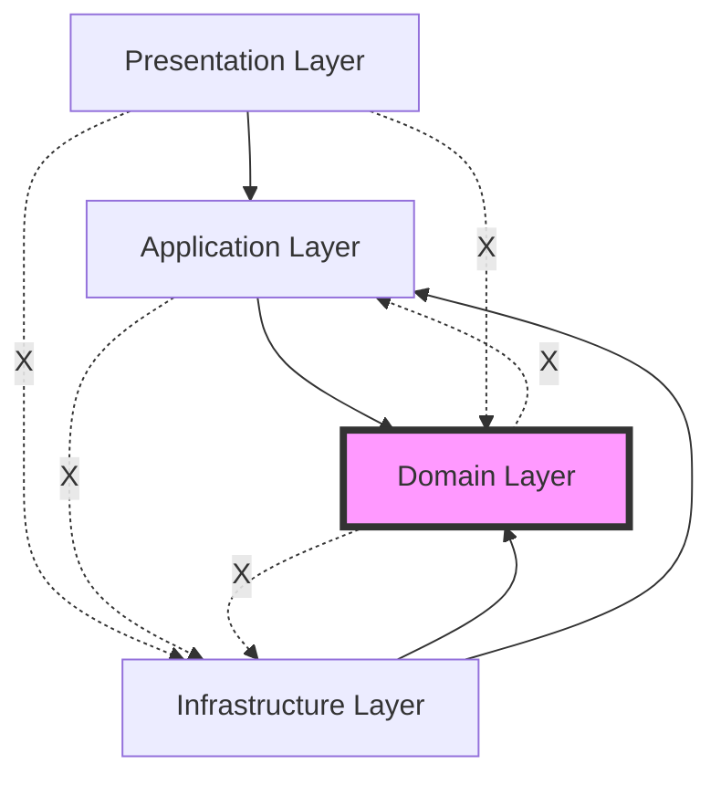

# レイヤー責務定義

## レイヤー構成の概要

Enhanced Modular Monolith は、以下の5つのレイヤーで構成されています。各レイヤーは明確な責務を持ち、単方向の依存関係を維持します。

## 依存関係ルール

### レイヤー間の依存関係



**重要な原則:**
- **単方向依存**: 上位層は下位層に依存するが、逆は禁止
- **Domain層の独立性**: Domain層は他のどの層にも依存しない
- **Infrastructure層の柔軟性**: Infrastructure層はDomain層とApplication層の実装を提供

## 1. Presentation Layer (client/)

**責務**: ユーザーインターフェースと状態管理

**主要コンポーネント**:

- **React Components**: UIコンポーネント（表示専用）
- **Custom Hooks**: ビジネスロジックとUIの橋渡し
- **Stores**: クライアント状態管理（Zustand）
- **Anti-Corruption Layer**: サーバーとの境界

**設計原則**:

```typescript
// ✅ 良い例: UIコンポーネントは表示に専念
export const IngredientCard: React.FC<IngredientCardProps> = ({ ingredient, onAction }) => {
  return (
    <Card>
      <CardHeader>{ingredient.name}</CardHeader>
      <CardContent>
        <p>数量: {ingredient.quantity.displayText}</p>
        <p>場所: {ingredient.storageLocation.displayName}</p>
        <ExpiryStatusBadge status={ingredient.expiryInfo.status} />
      </CardContent>
      <CardActions>
        <Button onClick={() => onAction('consume')}>消費</Button>
        <Button onClick={() => onAction('replenish')}>補充</Button>
      </CardActions>
    </Card>
  )
}

// ✅ 良い例: Custom Hookはビジネスロジックを抽象化
export const useIngredientOperations = (ingredientId: string) => {
  const queryClient = useQueryClient()

  const consumeMutation = useMutation({
    mutationFn: (data: ConsumeIngredientData) =>
      ingredientApiAdapter.consumeIngredient(ingredientId, data),
    onSuccess: () => {
      queryClient.invalidateQueries(['ingredients'])
      toast.success('食材を消費しました')
    },
    onError: (error) => {
      if (error instanceof InsufficientStockError) {
        toast.error(`在庫不足: ${error.details.shortage}${error.details.unit}不足しています`)
      } else {
        toast.error('消費に失敗しました')
      }
    }
  })

  return {
    consume: consumeMutation.mutate,
    isConsuming: consumeMutation.isLoading
  }
}
```

## 2. API Gateway Layer (server/api/)

**責務**: HTTPリクエスト処理とルーティング

**主要コンポーネント**:

- **Handlers**: リクエスト/レスポンス処理
- **Validators**: 入力検証（Zod）
- **Serializers**: レスポンス形式統一
- **Middleware**: 横断的関心事

**設計原則**:

```typescript
// ✅ 良い例: API HandlerはWebアダプターとして機能
export async function POST(request: Request, { params }: { params: { id: string } }) {
  try {
    // 1. 入力検証
    const body = await request.json()
    const validatedData = consumeIngredientValidator.parse(body)

    // 2. コマンド作成
    const command = new ConsumeIngredientCommand(
      params.id,
      validatedData.amount,
      validatedData.reason
    )

    // 3. アプリケーション層に委譲
    const container = IngredientsModuleContainer.getInstance()
    const result = await container.consumeIngredientHandler.handle(command)

    // 4. レスポンス生成
    const response = consumeIngredientSerializer.serialize(result)

    return NextResponse.json(response)
  } catch (error) {
    return errorMiddleware.handle(error)
  }
}
```

## 3. Application Layer (server/application/)

**責務**: ユースケース実行とトランザクション管理

**主要コンポーネント**:

- **Command Handlers**: 書き込み処理
- **Query Handlers**: 読み取り処理
- **Application Services**: 複雑なビジネスワークフロー
- **Ports**: 外部システムとのインターフェース

**設計原則**:

```typescript
// ✅ 良い例: Command Handlerはユースケースを実装
export class ConsumeIngredientHandler {
  constructor(
    private readonly ingredientRepo: IngredientRepository,
    private readonly stockService: StockManagementService,
    private readonly eventPublisher: DomainEventPublisher
  ) {}

  async handle(command: ConsumeIngredientCommand): Promise<ConsumeIngredientResult> {
    // 1. エンティティ取得
    const ingredient = await this.ingredientRepo.findById(command.ingredientId)
    if (!ingredient) {
      throw new IngredientNotFoundException(command.ingredientId)
    }

    // 2. ドメインロジック実行
    ingredient.consume(command.amount, command.reason)

    // 3. 副作用処理
    await this.stockService.updateStockStatus(ingredient)

    // 4. 永続化
    await this.ingredientRepo.save(ingredient)

    // 5. イベント発行
    await this.eventPublisher.publishAll(ingredient.domainEvents)

    return new ConsumeIngredientResult(ingredient)
  }
}

// ✅ 良い例: Query Handlerは読み取り専用
export class GetIngredientsHandler {
  constructor(
    private readonly ingredientRepo: IngredientRepository,
    private readonly cacheService: CacheService
  ) {}

  async handle(query: GetIngredientsQuery): Promise<IngredientsListDTO> {
    // キャッシュチェック
    const cached = await this.cacheService.get(query.getCacheKey())
    if (cached) return cached

    // データ取得
    const ingredients = await this.ingredientRepo.findAll(query.filters)
    
    // DTO変換
    const dto = IngredientsListDTO.fromDomain(ingredients)
    
    // キャッシュ保存
    await this.cacheService.set(query.getCacheKey(), dto)
    
    return dto
  }
}
```

## 4. Domain Layer (server/domain/)

**責務**: ビジネスルールとドメインモデル

**主要コンポーネント**:

- **Entities**: ビジネスエンティティ
- **Value Objects**: 不変値オブジェクト
- **Domain Services**: エンティティ間のビジネスロジック
- **Specifications**: ビジネスルール仕様
- **Repository Interfaces**: データアクセス抽象化
- **Domain Events**: ビジネス上重要な出来事

**設計原則**:

```typescript
// ✅ 良い例: エンティティはビジネスルールを保護
export class Ingredient extends AggregateRoot<IngredientId> {
  constructor(
    id: IngredientId,
    private _name: IngredientName,
    private _quantity: Quantity,
    private _storageLocation: StorageLocation,
    private _expiryDate?: ExpiryDate
  ) {
    super(id)
  }

  consume(amount: number, reason?: string): void {
    // ビジネスルール検証
    if (!this.hasSufficientStock(amount)) {
      throw new InsufficientStockException(
        `要求された数量 ${amount} は利用可能な在庫 ${this._quantity.amount} を超えています`,
        {
          requested: amount,
          available: this._quantity.amount,
          shortage: amount - this._quantity.amount,
        }
      )
    }

    // 状態変更
    const previousQuantity = this._quantity
    this._quantity = this._quantity.subtract(amount)

    // ドメインイベント発行
    this.addDomainEvent(
      new IngredientConsumedEvent(
        this.id,
        this._name.value,
        previousQuantity,
        this._quantity,
        amount,
        reason
      )
    )
  }

  private hasSufficientStock(amount: number): boolean {
    return this._quantity.amount >= amount
  }
}

// ✅ 良い例: Value Objectは不変性を保証
export class Quantity {
  constructor(
    readonly amount: number,
    readonly unit: Unit
  ) {
    if (amount < 0) {
      throw new InvalidQuantityException('数量は0以上である必要があります')
    }
  }

  subtract(amount: number): Quantity {
    return new Quantity(this.amount - amount, this.unit)
  }

  add(amount: number): Quantity {
    return new Quantity(this.amount + amount, this.unit)
  }
}
```

## 5. Infrastructure Layer (server/infrastructure/)

**責務**: 外部システム連携と技術的実装

**主要コンポーネント**:

- **Repository Implementations**: データアクセス実装
- **Event Handlers**: イベント処理実装
- **External Service Adapters**: 外部API連携
- **Messaging**: イベントバス実装
- **Composition Root**: 依存性注入コンテナ

**設計原則**:

```typescript
// ✅ 良い例: リポジトリ実装は技術的詳細を隠蔽
export class PrismaIngredientRepository implements IngredientRepository {
  constructor(
    private readonly prisma: PrismaClient,
    private readonly mapper: IngredientEntityMapper
  ) {}

  async save(ingredient: Ingredient): Promise<void> {
    const model = this.mapper.toModel(ingredient)

    await this.prisma.$transaction(async (tx) => {
      // エンティティ保存
      await tx.ingredient.upsert({
        where: { id: ingredient.id.value },
        create: model,
        update: model,
      })

      // ドメインイベント保存
      if (ingredient.domainEvents.length > 0) {
        await tx.domainEvent.createMany({
          data: ingredient.domainEvents.map((event) => ({
            id: event.id,
            aggregateId: ingredient.id.value,
            eventType: event.constructor.name,
            eventData: JSON.stringify(event),
            occurredAt: event.occurredAt,
          })),
        })
      }
    })
  }

  async findById(id: IngredientId): Promise<Ingredient | null> {
    const model = await this.prisma.ingredient.findUnique({
      where: { id: id.value }
    })

    if (!model) return null

    return this.mapper.toDomain(model)
  }
}

// ✅ 良い例: Composition Rootは依存関係を管理
export class IngredientsModuleContainer {
  private static instance: IngredientsModuleContainer
  
  // Handlers
  readonly getIngredientsHandler: GetIngredientsHandler
  readonly createIngredientHandler: CreateIngredientHandler
  readonly consumeIngredientHandler: ConsumeIngredientHandler
  
  private constructor() {
    // Infrastructure
    const prisma = new PrismaClient()
    const ingredientRepository = new PrismaIngredientRepository(prisma, new IngredientEntityMapper())
    const eventBus = EventBus.getInstance()
    
    // Application Services
    const stockService = new StockManagementService(ingredientRepository)
    const eventPublisher = new DomainEventPublisher(eventBus)
    
    // Handlers
    this.getIngredientsHandler = new GetIngredientsHandler(
      ingredientRepository,
      new RedisCacheService()
    )
    
    this.createIngredientHandler = new CreateIngredientHandler(
      ingredientRepository,
      eventPublisher
    )
    
    this.consumeIngredientHandler = new ConsumeIngredientHandler(
      ingredientRepository,
      stockService,
      eventPublisher
    )
  }
  
  static getInstance(): IngredientsModuleContainer {
    if (!this.instance) {
      this.instance = new IngredientsModuleContainer()
    }
    return this.instance
  }
}
```

## 依存性逆転の実装例

```typescript
// ✅ Domain Layer: インターフェース定義
export interface IngredientRepository {
  save(ingredient: Ingredient): Promise<void>
  findById(id: IngredientId): Promise<Ingredient | null>
  findAll(filters: IngredientFilters): Promise<Ingredient[]>
}

// ✅ Application Layer: インターフェースに依存
export class CreateIngredientHandler {
  constructor(
    private readonly ingredientRepo: IngredientRepository // ← インターフェースに依存
  ) {}
}

// ✅ Infrastructure Layer: インターフェース実装
export class PrismaIngredientRepository implements IngredientRepository {
  // 実装
}

// ✅ Composition Root: 依存関係注入
const handler = new CreateIngredientHandler(
  new PrismaIngredientRepository(prisma, mapper)
)
```

## 関連ドキュメント

- [アーキテクチャ概要](./OVERVIEW.md) - 全体構造
- [モジュール構成](./MODULE_STRUCTURE.md) - ディレクトリ構造
- [実装パターン](../implementation/PATTERNS.md) - 具体的な実装例