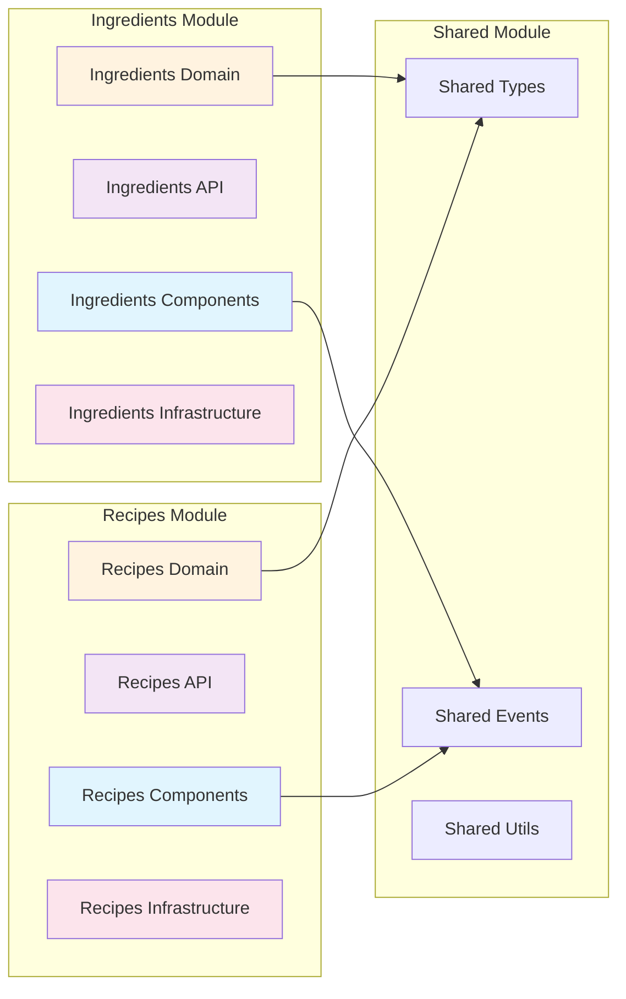
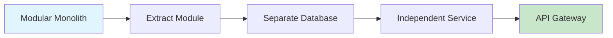

# モジュール構成

## モジュラーモノリスの構造

Enhanced Modular Monolith では、各ビジネス機能をモジュールとして独立させ、将来的なマイクロサービス化を見据えた構造を採用しています。

## モジュール境界の原則



**原則:**
- 各モジュールは独立して開発・テスト・デプロイ可能
- モジュール間の直接的な依存は禁止
- 共有モジュールを通じた連携のみ許可

## ディレクトリ構造

### 全体構造

```
src/
├── app/                    # Next.js App Router
├── modules/               # ビジネスモジュール
│   ├── ingredients/       # 食材管理モジュール
│   ├── recipes/          # レシピ管理モジュール（将来）
│   ├── meal-planning/    # 献立計画モジュール（将来）
│   └── shared/           # 共有モジュール
├── lib/                   # アプリケーション基盤
└── styles/               # グローバルスタイル
```

### モジュール詳細構造

```
src/modules/ingredients/
├── client/                         # Presentation Layer (フロントエンド)
│   ├── components/
│   │   ├── forms/                 # フォームコンポーネント
│   │   │   ├── CreateIngredientForm.tsx
│   │   │   ├── EditIngredientForm.tsx
│   │   │   └── QuickStockActions.tsx
│   │   ├── lists/                 # リストコンポーネント
│   │   │   ├── IngredientList.tsx
│   │   │   ├── IngredientCard.tsx
│   │   │   └── FilterPanel.tsx
│   │   ├── modals/                # モーダルコンポーネント
│   │   │   ├── StockOperationModal.tsx
│   │   │   └── DeleteConfirmModal.tsx
│   │   └── layouts/               # レイアウトコンポーネント
│   │       ├── IngredientLayout.tsx
│   │       └── IngredientHeader.tsx
│   ├── hooks/                     # カスタムフック
│   │   ├── queries/               # クエリフック (TanStack Query)
│   │   │   ├── useIngredients.ts
│   │   │   ├── useIngredient.ts
│   │   │   ├── useCategories.ts
│   │   │   └── useUnits.ts
│   │   ├── commands/              # コマンドフック
│   │   │   ├── useCreateIngredient.ts
│   │   │   ├── useUpdateIngredient.ts
│   │   │   ├── useConsumeIngredient.ts
│   │   │   └── useDeleteIngredient.ts
│   │   ├── state/                 # ローカル状態フック
│   │   │   ├── useIngredientForm.ts
│   │   │   └── useIngredientFilters.ts
│   │   └── utilities/             # ユーティリティフック
│   │       ├── useDebounce.ts
│   │       └── usePagination.ts
│   ├── stores/                    # クライアント状態管理
│   │   ├── ingredient.store.ts    # Zustand Store
│   │   ├── filter.store.ts
│   │   └── ui.store.ts
│   ├── adapters/                  # Anti-Corruption Layer
│   │   ├── api.adapter.ts
│   │   ├── dto.mapper.ts
│   │   └── error.adapter.ts
│   └── types/                     # フロントエンド型定義
│       ├── view-models.ts
│       ├── form-data.ts
│       └── api-responses.ts
│
├── server/                        # Server Layer (バックエンド)
│   ├── api/                       # Infrastructure Layer - Web Adapters
│   │   ├── handlers/              # リクエストハンドラー
│   │   │   ├── commands/
│   │   │   └── queries/
│   │   ├── validators/            # 入力検証 (Zod)
│   │   ├── serializers/           # レスポンス変換
│   │   ├── middleware/            # カスタムミドルウェア
│   │   └── routes/                # ルート定義
│   │
│   ├── application/               # Application Layer
│   │   ├── commands/              # コマンドハンドラー (CQRS)
│   │   │   ├── create-ingredient/
│   │   │   ├── update-ingredient/
│   │   │   └── consume-ingredient/
│   │   ├── queries/               # クエリハンドラー (CQRS)
│   │   │   ├── get-ingredients/
│   │   │   └── get-ingredient/
│   │   ├── services/              # アプリケーションサービス
│   │   ├── ports/                 # ポート定義
│   │   ├── dtos/                  # データ転送オブジェクト
│   │   └── mappers/               # DTOマッピング
│   │
│   ├── domain/                    # Domain Layer
│   │   ├── entities/              # ドメインエンティティ
│   │   ├── value-objects/         # 値オブジェクト
│   │   ├── services/              # ドメインサービス
│   │   ├── events/                # ドメインイベント
│   │   ├── repositories/          # リポジトリインターフェース
│   │   ├── specifications/        # 仕様パターン
│   │   ├── exceptions/            # ドメイン例外
│   │   ├── enums/                 # ドメイン列挙型
│   │   └── constants/             # ドメイン定数
│   │
│   └── infrastructure/            # Infrastructure Layer
│       ├── persistence/           # データ永続化
│       │   ├── repositories/      # リポジトリ実装
│       │   ├── mappers/           # エンティティ-モデル変換
│       │   └── models/            # データベースモデル型
│       ├── events/                # イベント処理
│       │   ├── handlers/          # イベントハンドラー
│       │   ├── publishers/        # イベント発行者
│       │   └── projections/       # プロジェクション
│       ├── external/              # 外部サービス連携
│       │   ├── notification/      # 通知サービス
│       │   ├── analytics/         # 分析サービス
│       │   └── storage/           # ファイルストレージ
│       ├── messaging/             # メッセージング
│       ├── caching/               # キャッシング
│       ├── monitoring/            # 監視・ログ
│       ├── composition-root.ts    # 依存性注入コンテナ
│       └── configuration/         # 設定管理
│
└── shared/                        # Shared Kernel
    ├── types/                     # 共通型定義
    ├── events/                    # 共有イベント
    ├── exceptions/                # 共通例外
    └── utils/                     # ユーティリティ
```

## ファイル命名規則

### 一般規則

- **ケバブケース**: ファイル名とディレクトリ名
- **パスカルケース**: React コンポーネント
- **キャメルケース**: 関数、変数、フック

### 具体例

```
✅ 良い例:
components/ingredient-list.tsx
hooks/use-ingredient.ts
services/ingredient.service.ts
entities/ingredient.entity.ts

❌ 悪い例:
components/IngredientList.tsx
hooks/UseIngredient.ts
services/ingredientService.ts
entities/Ingredient.entity.ts
```

### サフィックス規則

| 種類 | サフィックス | 例 |
|------|-------------|-----|
| Entity | `.entity.ts` | `ingredient.entity.ts` |
| Value Object | `.vo.ts` | `quantity.vo.ts` |
| Service | `.service.ts` | `stock-calculation.service.ts` |
| Repository | `.repository.ts` | `ingredient.repository.ts` |
| Handler | `.handler.ts` | `create-ingredient.handler.ts` |
| Command | `.command.ts` | `create-ingredient.command.ts` |
| Query | `.query.ts` | `get-ingredients.query.ts` |
| Event | `.event.ts` | `ingredient-created.event.ts` |
| Exception | `.exception.ts` | `insufficient-stock.exception.ts` |
| Specification | `.specification.ts` | `has-sufficient-stock.specification.ts` |
| Validator | `.validator.ts` | `create-ingredient.validator.ts` |
| Serializer | `.serializer.ts` | `ingredient.serializer.ts` |
| Mapper | `.mapper.ts` | `ingredient.mapper.ts` |
| DTO | `.dto.ts` | `create-ingredient.dto.ts` |
| Type | `.types.ts` | `common.types.ts` |
| Interface | `.interface.ts` | `repository.interface.ts` |
| Constant | `.constants.ts` | `ingredient.constants.ts` |
| Utility | `.utils.ts` | `date.utils.ts` |
| Decorator | `.decorator.ts` | `cache.decorator.ts` |
| Config | `.config.ts` | `database.config.ts` |
| Store | `.store.ts` | `ingredient.store.ts` |
| Hook | `use-*.ts` | `use-ingredient.ts` |

## インポート順序

ESLintとPrettierにより自動整理されますが、基本的な順序は：

1. React/Next.js
2. 外部ライブラリ
3. 内部モジュール（@/...）
4. 相対パス

```typescript
// ✅ 良い例
import React from 'react'
import { useQuery } from '@tanstack/react-query'
import { z } from 'zod'

import { IngredientEntity } from '@/modules/ingredients/server/domain/entities/ingredient.entity'
import { useToast } from '@/components/ui/use-toast'

import { CreateIngredientDTO } from '../dtos/create-ingredient.dto'
import { validateIngredient } from './validation'
```

## Composition Root の配置

各モジュールの Infrastructure 層に配置し、依存関係を一元管理：

```typescript
// src/modules/ingredients/server/infrastructure/composition-root.ts
export class IngredientsModuleContainer {
  private static instance: IngredientsModuleContainer
  
  // すべてのハンドラーとサービスをここで構築
  readonly getIngredientsHandler: GetIngredientsHandler
  readonly createIngredientHandler: CreateIngredientHandler
  // ... 他のハンドラー
  
  private constructor() {
    // 依存関係の構築
  }
  
  static getInstance(): IngredientsModuleContainer {
    if (!this.instance) {
      this.instance = new IngredientsModuleContainer()
    }
    return this.instance
  }
}
```

## モジュール間通信

### イベント駆動による疎結合

```typescript
// 食材モジュールでイベント発行
class Ingredient {
  consume(amount: number) {
    // ... ビジネスロジック
    this.addDomainEvent(new IngredientConsumedEvent(/*...*/))
  }
}

// レシピモジュールでイベント購読
class RecipeIngredientSyncHandler {
  async handle(event: IngredientConsumedEvent) {
    // レシピ側の在庫情報を更新
  }
}
```

### 共有型定義

```typescript
// src/modules/shared/types/ingredient.types.ts
export interface SharedIngredientInfo {
  id: string
  name: string
  availableQuantity: number
  unit: string
}
```

## 将来の拡張性

### 新モジュールの追加手順

1. `src/modules/[module-name]/` ディレクトリを作成
2. 同じ4層構造（client/server）で実装
3. Shared Module に必要な共有型を追加
4. Event Bus を通じた連携を実装

### マイクロサービス化への移行パス



## 関連ドキュメント

- [アーキテクチャ概要](./OVERVIEW.md) - 全体構造
- [レイヤー責務定義](./LAYERS.md) - 各レイヤーの詳細
- [実装パターン](../implementation/PATTERNS.md) - 具体的な実装例