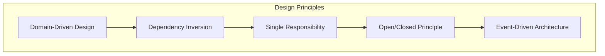
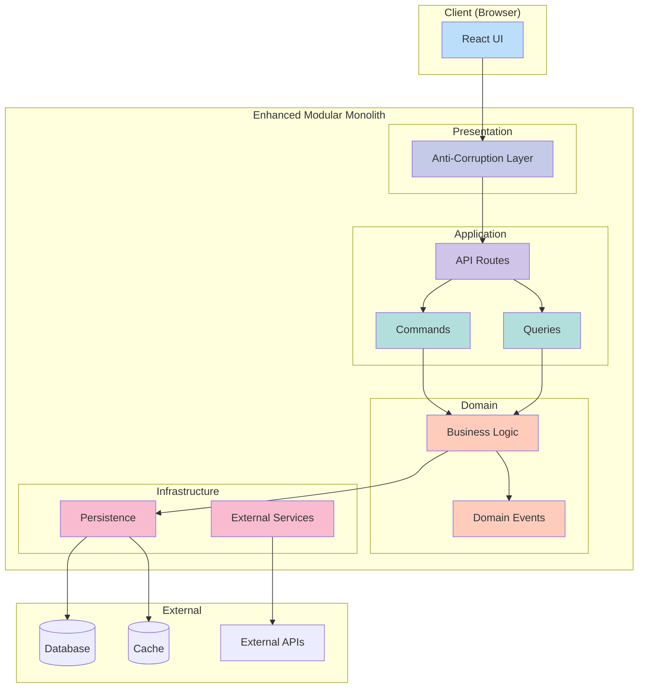
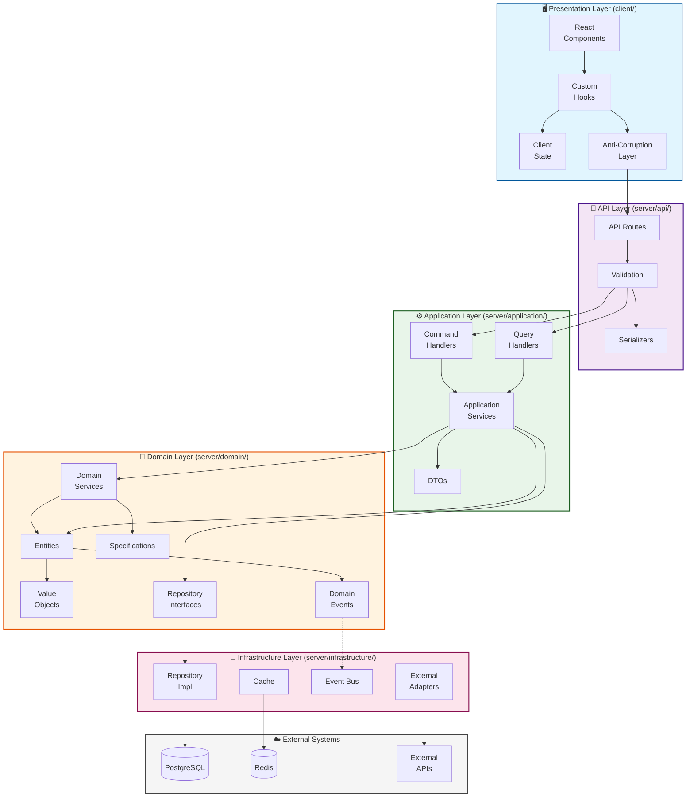
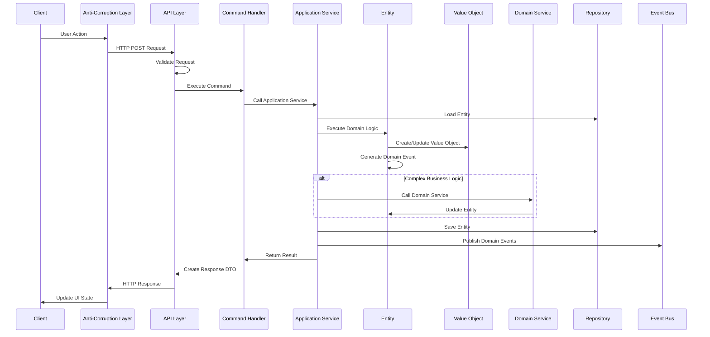
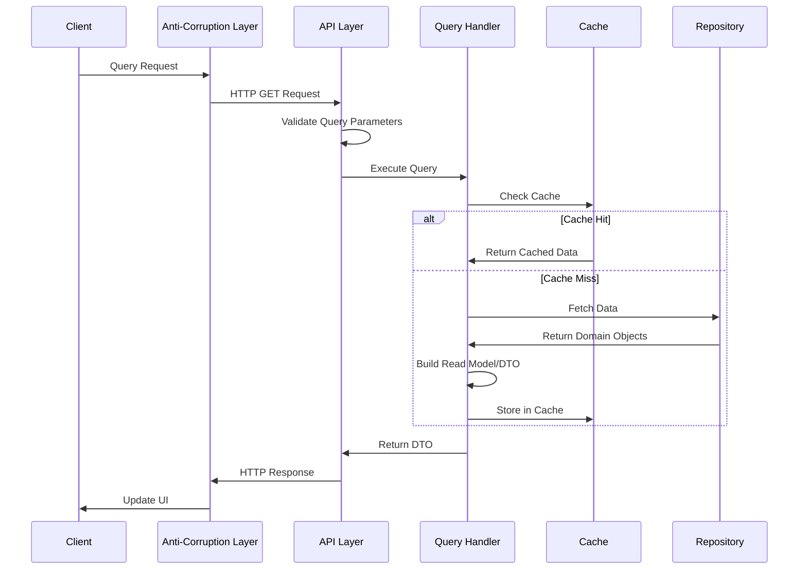
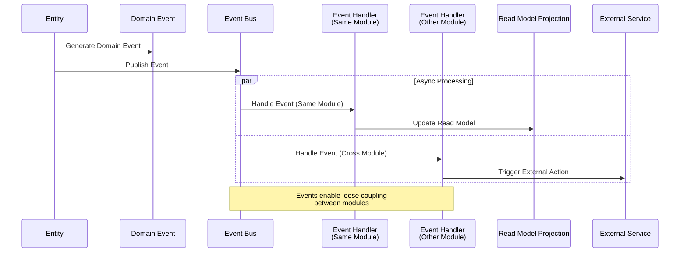

# Enhanced Modular Monolith アーキテクチャ概要

## アーキテクチャの特徴

### 1. Enhanced Modular Monolith

**定義**: モジュラーモノリスにDDD、Hexagonal Architecture、CQRSを統合したハイブリッドアーキテクチャ

**主な特徴**:

- 🏗️ **モジュール独立性**: 各ビジネス機能が完全に独立
- 🎯 **ドメイン中心設計**: ビジネスロジックがアーキテクチャの中核
- 🔄 **CQRS パターン**: 読み書き責務の最適分離
- 🔌 **Hexagonal 境界**: 外部システムとの疎結合
- 📡 **Event-Driven**: ドメインイベントによる非同期処理

### 2. 設計原則

#### Domain-Driven Design (DDD)

- **Ubiquitous Language**: ビジネス用語をコードに反映
- **Bounded Context**: モジュール境界の明確化
- **Aggregate Root**: データ整合性の責任範囲定義
- **Value Objects**: 不変性とビジネスルールの保証

#### Dependency Inversion Principle

- **高レベルモジュール** は低レベルモジュールに依存しない
- **抽象化** に依存し、具象に依存しない
- **Ports & Adapters** による外部システム分離

#### Event-Driven Architecture

- **Domain Events**: ビジネス上重要な出来事の記録
- **Eventually Consistent**: 結果整合性による高性能
- **Loose Coupling**: モジュール間の疎結合

## 全体アーキテクチャ

### システム構成図（概要）

### システム構成図（詳細）

## データフロー

### Command Flow (書き込み処理)

### Query Flow (読み取り処理)

### Event-Driven Flow (イベント駆動処理)

## 関連ドキュメント

- [レイヤー責務定義](./LAYERS.md) - 各レイヤーの詳細な責務
- [モジュール構成](./MODULE_STRUCTURE.md) - ディレクトリ構造とファイル配置
- [実装パターン](../implementation/PATTERNS.md) - 具体的な実装例