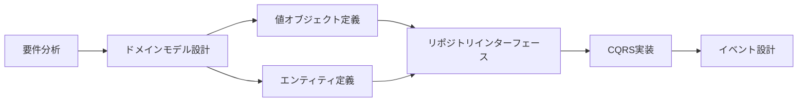

# 実装パターンガイド

このディレクトリには、Enhanced Modular Monolithアーキテクチャにおける具体的な実装パターンのガイドラインが含まれています。

## 📚 ドキュメント一覧

### コアパターン

- [**CQRS パターン**](./CQRS_PATTERN.md)

  - Command/Query責務分離の実装方法
  - Read Model Projectionの構築
  - パフォーマンス最適化戦略

- [**ドメインイベント**](./DOMAIN_EVENTS.md)

  - イベント駆動アーキテクチャの実装
  - イベントバスとハンドラー
  - モジュール間通信パターン

- [**リポジトリパターン**](./REPOSITORY_PATTERN.md)

  - ドメイン層での抽象化
  - 永続化層の実装
  - Unit of Workパターン

- [**値オブジェクト**](./VALUE_OBJECTS.md)
  - 不変性とビジネスルール
  - 複合値オブジェクトの設計
  - カスタム等価性の実装

### 追加パターン（今後作成予定）

- **ドメインエンティティ** (`DOMAIN_ENTITIES.md`)

  - Aggregate Rootの実装
  - エンティティのライフサイクル管理
  - ビジネス不変条件の保護

- **ドメインサービス** (`DOMAIN_SERVICES.md`)

  - 複数エンティティにまたがるロジック
  - ドメインサービスの設計指針
  - アプリケーションサービスとの違い

- **仕様パターン** (`SPECIFICATION_PATTERN.md`)

  - ビジネスルールのカプセル化
  - 複合仕様の構築
  - リポジトリとの統合

- **Anti-Corruption Layer** (`ANTI_CORRUPTION_LAYER.md`)
  - 外部システムとの境界
  - DTOとドメインモデルの変換
  - エラーハンドリング戦略

## 🎯 実装の流れ

### 1. 新機能開発時



### 2. 実装チェックリスト

- [ ] ドメインモデルの設計

  - [ ] エンティティの識別
  - [ ] 値オブジェクトの抽出
  - [ ] ドメインイベントの定義

- [ ] インフラストラクチャ層

  - [ ] リポジトリ実装
  - [ ] 外部サービスアダプター
  - [ ] イベントハンドラー

- [ ] アプリケーション層

  - [ ] コマンドハンドラー
  - [ ] クエリハンドラー
  - [ ] アプリケーションサービス

- [ ] プレゼンテーション層
  - [ ] APIエンドポイント
  - [ ] 入力検証
  - [ ] レスポンス変換

## 💡 ベストプラクティス

### ドメイン中心の設計

1. **ビジネスルールの配置**

   - エンティティ内: エンティティ固有のルール
   - 値オブジェクト内: 値に関するルール
   - ドメインサービス内: 複数エンティティにまたがるルール

2. **不変性の活用**

   - 値オブジェクトは常に不変
   - エンティティの状態変更は明示的なメソッドで

3. **明示的な境界**
   - Aggregate境界の明確化
   - モジュール間はイベント経由で通信

### テスタビリティ

```typescript
// ✅ テストしやすい設計
export class ConsumeIngredientHandler {
  constructor(
    private readonly repo: IngredientRepository,
    private readonly eventBus: EventBus
  ) {}

  // 依存性注入によりモック可能
}

// ❌ テストしにくい設計
export class ConsumeIngredientHandler {
  private readonly repo = new PrismaIngredientRepository()
  // 直接インスタンス化はテストが困難
}
```

### パフォーマンス

- **N+1問題の回避**: 適切なIncludeとJoin
- **キャッシュ戦略**: Read Modelの活用
- **非同期処理**: イベント駆動による疎結合

## 📖 参考資料

### 書籍

- "Domain-Driven Design" - Eric Evans
- "Implementing Domain-Driven Design" - Vaughn Vernon
- "Patterns, Principles, and Practices of Domain-Driven Design" - Scott Millett

### オンラインリソース

- [DDD Community](https://dddcommunity.org/)
- [Martin Fowler's Blog](https://martinfowler.com/)
- [Microsoft DDD Guide](https://docs.microsoft.com/en-us/dotnet/architecture/microservices/microservice-ddd-cqrs-patterns/)

## 🔄 更新履歴

- 2024-12-22: 初版作成
- CQRSパターン、ドメインイベント、リポジトリパターン、値オブジェクトのガイドを追加
