# 監視・ログ設計

## 概要

Enhanced Modular Monolithアーキテクチャにおける監視とログの実装ガイドです。システムの健全性、パフォーマンス、エラーの早期発見を実現します。

## 監視戦略

### 1. 監視レベル

```mermaid
graph TB
    subgraph "Infrastructure Level"
        CPU[CPU使用率]
        MEM[メモリ使用率]
        DISK[ディスク使用率]
        NET[ネットワーク]
    end

    subgraph "Application Level"
        REQ[リクエスト数]
        RES[レスポンス時間]
        ERR[エラー率]
        THR[スループット]
    end

    subgraph "Business Level"
        USER[アクティブユーザー数]
        TRANS[トランザクション数]
        CONV[コンバージョン率]
        REV[収益指標]
    end

    CPU --> REQ
    MEM --> RES
    REQ --> USER
    RES --> TRANS
```



### 2. メトリクス実装

```typescript
// src/modules/shared/infrastructure/monitoring/metrics.service.ts
export class MetricsService {
  private counters = new Map<string, number>()
  private gauges = new Map<string, number>()
  private histograms = new Map<string, number[]>()

  // カウンター：累積値
  incrementCounter(name: string, value: number = 1, tags: Record<string, string> = {}): void {
    const key = this.createKey(name, tags)
    const current = this.counters.get(key) || 0
    this.counters.set(key, current + value)
  }

  // ゲージ：現在値
  setGauge(name: string, value: number, tags: Record<string, string> = {}): void {
    const key = this.createKey(name, tags)
    this.gauges.set(key, value)
  }

  // ヒストグラム：分布
  recordHistogram(name: string, value: number, tags: Record<string, string> = {}): void {
    const key = this.createKey(name, tags)
    const values = this.histograms.get(key) || []
    values.push(value)
    this.histograms.set(key, values)
  }

  // Prometheusフォーマットでエクスポート
  export(): string {
    const lines: string[] = []

    // カウンター
    for (const [key, value] of this.counters) {
      lines.push(`${key} ${value}`)
    }

    // ゲージ
    for (const [key, value] of this.gauges) {
      lines.push(`${key} ${value}`)
    }

    // ヒストグラム
    for (const [key, values] of this.histograms) {
      const summary = this.calculateSummary(values)
      lines.push(`${key}_count ${values.length}`)
      lines.push(`${key}_sum ${summary.sum}`)
      lines.push(`${key}_p50 ${summary.p50}`)
      lines.push(`${key}_p95 ${summary.p95}`)
      lines.push(`${key}_p99 ${summary.p99}`)
    }

    return lines.join('\n')
  }
}
```

### 3. アプリケーションメトリクス

```typescript
// src/modules/shared/infrastructure/monitoring/decorators/metrics.decorator.ts
export function RecordMetrics(metricName: string) {
  return function (target: any, propertyName: string, descriptor: PropertyDescriptor) {
    const originalMethod = descriptor.value

    descriptor.value = async function (...args: any[]) {
      const metrics = MetricsService.getInstance()
      const startTime = Date.now()

      try {
        const result = await originalMethod.apply(this, args)
        const duration = Date.now() - startTime

        // 成功メトリクス
        metrics.incrementCounter(`${metricName}_total`, 1, {
          method: propertyName,
          status: 'success',
        })
        metrics.recordHistogram(`${metricName}_duration_ms`, duration, {
          method: propertyName,
          status: 'success',
        })

        return result
      } catch (error) {
        const duration = Date.now() - startTime

        // エラーメトリクス
        metrics.incrementCounter(`${metricName}_total`, 1, {
          method: propertyName,
          status: 'error',
          error_type: error.constructor.name,
        })
        metrics.recordHistogram(`${metricName}_duration_ms`, duration, {
          method: propertyName,
          status: 'error',
        })

        throw error
      }
    }
  }
}

// 使用例
export class ConsumeIngredientHandler {
  @RecordMetrics('ingredient_consumption')
  async handle(command: ConsumeIngredientCommand): Promise<void> {
    // 実装
  }
}
```

## ログ設計

### 1. 構造化ログ

```typescript
// src/modules/shared/infrastructure/logging/logger.ts
export interface LogContext {
  userId?: string
  requestId?: string
  module?: string
  action?: string
  [key: string]: any
}

export class StructuredLogger {
  constructor(
    private readonly serviceName: string,
    private readonly environment: string
  ) {}

  private formatLog(
    level: string,
    message: string,
    context: LogContext = {},
    error?: Error
  ): string {
    const log = {
      timestamp: new Date().toISOString(),
      level,
      service: this.serviceName,
      environment: this.environment,
      message,
      ...context,
      ...(error && {
        error: {
          name: error.name,
          message: error.message,
          stack: error.stack,
        },
      }),
    }

    return JSON.stringify(log)
  }

  info(message: string, context?: LogContext): void {
    console.log(this.formatLog('INFO', message, context))
  }

  warn(message: string, context?: LogContext): void {
    console.warn(this.formatLog('WARN', message, context))
  }

  error(message: string, error: Error, context?: LogContext): void {
    console.error(this.formatLog('ERROR', message, context, error))
  }

  debug(message: string, context?: LogContext): void {
    if (process.env.NODE_ENV !== 'production') {
      console.debug(this.formatLog('DEBUG', message, context))
    }
  }
}
```

### 2. ドメインイベントログ

```typescript
// src/modules/shared/infrastructure/logging/event-logger.ts
export class DomainEventLogger {
  constructor(private readonly logger: StructuredLogger) {}

  logEvent(event: DomainEvent, result: 'published' | 'handled' | 'failed'): void {
    this.logger.info(`Domain event ${result}`, {
      eventId: event.id,
      eventName: event.eventName,
      aggregateId: event.aggregateId,
      module: this.extractModule(event),
      result,
      payload: this.sanitizePayload(event.toJSON()),
    })
  }

  private extractModule(event: DomainEvent): string {
    // イベント名からモジュールを抽出: "ingredient.consumed" -> "ingredient"
    return event.eventName.split('.')[0]
  }

  private sanitizePayload(payload: any): any {
    // 機密情報をマスク
    const sensitive = ['password', 'token', 'apiKey', 'secret']
    const sanitized = { ...payload }

    for (const key of Object.keys(sanitized)) {
      if (sensitive.some((s) => key.toLowerCase().includes(s))) {
        sanitized[key] = '[REDACTED]'
      }
    }

    return sanitized
  }
}
```

### 3. APIアクセスログ

```typescript
// src/modules/shared/infrastructure/logging/middleware/access-log.middleware.ts
export async function accessLogMiddleware(
  request: Request,
  context: any,
  next: () => Promise<Response>
): Promise<Response> {
  const logger = new StructuredLogger('api', process.env.NODE_ENV!)
  const startTime = Date.now()
  const requestId = crypto.randomUUID()

  // リクエストログ
  logger.info('API request received', {
    requestId,
    method: request.method,
    url: request.url,
    headers: sanitizeHeaders(request.headers),
    ip: request.headers.get('x-forwarded-for') || 'unknown',
  })

  try {
    const response = await next()
    const duration = Date.now() - startTime

    // レスポンスログ
    logger.info('API request completed', {
      requestId,
      method: request.method,
      url: request.url,
      status: response.status,
      duration,
      contentLength: response.headers.get('content-length'),
    })

    // メトリクス記録
    const metrics = MetricsService.getInstance()
    metrics.incrementCounter('http_requests_total', 1, {
      method: request.method,
      status: response.status.toString(),
      path: new URL(request.url).pathname,
    })
    metrics.recordHistogram('http_request_duration_ms', duration, {
      method: request.method,
      status: response.status.toString(),
    })

    return response
  } catch (error) {
    const duration = Date.now() - startTime

    // エラーログ
    logger.error('API request failed', error as Error, {
      requestId,
      method: request.method,
      url: request.url,
      duration,
    })

    throw error
  }
}

function sanitizeHeaders(headers: Headers): Record<string, string> {
  const sanitized: Record<string, string> = {}
  const sensitive = ['authorization', 'cookie', 'x-api-key']

  headers.forEach((value, key) => {
    if (sensitive.includes(key.toLowerCase())) {
      sanitized[key] = '[REDACTED]'
    } else {
      sanitized[key] = value
    }
  })

  return sanitized
}
```

## ヘルスチェック

### 1. ヘルスチェックエンドポイント

```typescript
// src/app/api/health/route.ts
export async function GET() {
  const checks = await performHealthChecks()
  const isHealthy = checks.every((check) => check.status === 'healthy')

  return NextResponse.json(
    {
      status: isHealthy ? 'healthy' : 'unhealthy',
      timestamp: new Date().toISOString(),
      version: process.env.APP_VERSION || 'unknown',
      checks,
    },
    {
      status: isHealthy ? 200 : 503,
    }
  )
}

async function performHealthChecks(): Promise<HealthCheck[]> {
  const checks: HealthCheck[] = []

  // データベース接続チェック
  checks.push(await checkDatabase())

  // Redis接続チェック
  checks.push(await checkRedis())

  // 外部サービスチェック
  checks.push(await checkExternalServices())

  // ディスク容量チェック
  checks.push(await checkDiskSpace())

  return checks
}

interface HealthCheck {
  name: string
  status: 'healthy' | 'unhealthy'
  message?: string
  responseTime?: number
}

async function checkDatabase(): Promise<HealthCheck> {
  const startTime = Date.now()

  try {
    await prisma.$queryRaw`SELECT 1`

    return {
      name: 'database',
      status: 'healthy',
      responseTime: Date.now() - startTime,
    }
  } catch (error) {
    return {
      name: 'database',
      status: 'unhealthy',
      message: error.message,
      responseTime: Date.now() - startTime,
    }
  }
}
```

### 2. Readiness/Livenessプローブ

```typescript
// src/app/api/ready/route.ts
export async function GET() {
  // アプリケーションが新しいリクエストを受け付ける準備ができているか
  const checks = {
    database: await isDatabaseReady(),
    cache: await isCacheReady(),
    migrations: await areMigrationsComplete(),
  }

  const isReady = Object.values(checks).every((check) => check)

  return NextResponse.json(
    {
      ready: isReady,
      checks,
    },
    {
      status: isReady ? 200 : 503,
    }
  )
}

// src/app/api/live/route.ts
export async function GET() {
  // アプリケーションが生きているか（再起動が必要か）
  const memoryUsage = process.memoryUsage()
  const isHealthy = memoryUsage.heapUsed < memoryUsage.heapTotal * 0.9

  return NextResponse.json(
    {
      alive: isHealthy,
      memory: {
        used: memoryUsage.heapUsed,
        total: memoryUsage.heapTotal,
        percentage: (memoryUsage.heapUsed / memoryUsage.heapTotal) * 100,
      },
    },
    {
      status: isHealthy ? 200 : 503,
    }
  )
}
```

## アラート設定

### 1. アラートルール

```yaml
# monitoring/alerts.yml
groups:
  - name: application
    rules:
      # エラー率アラート
      - alert: HighErrorRate
        expr: rate(http_requests_total{status=~"5.."}[5m]) > 0.05
        for: 5m
        labels:
          severity: warning
        annotations:
          summary: 'High error rate detected'
          description: 'Error rate is {{ $value }} (threshold: 5%)'

      # レスポンス時間アラート
      - alert: SlowResponseTime
        expr: histogram_quantile(0.95, http_request_duration_ms) > 1000
        for: 10m
        labels:
          severity: warning
        annotations:
          summary: 'Slow response time'
          description: '95th percentile response time is {{ $value }}ms'

      # 在庫切れアラート
      - alert: OutOfStockItems
        expr: ingredients_out_of_stock_count > 10
        for: 1m
        labels:
          severity: info
        annotations:
          summary: 'Multiple items out of stock'
          description: '{{ $value }} items are currently out of stock'
```

### 2. 通知設定

```typescript
// src/modules/shared/infrastructure/monitoring/alerting.service.ts
export class AlertingService {
  constructor(
    private readonly notificationService: NotificationService,
    private readonly logger: StructuredLogger
  ) {}

  async sendAlert(alert: Alert): Promise<void> {
    this.logger.warn('Alert triggered', {
      alertName: alert.name,
      severity: alert.severity,
      value: alert.value,
      threshold: alert.threshold,
    })

    // 重要度に応じて通知先を変更
    switch (alert.severity) {
      case 'critical':
        await this.notifyOnCall(alert)
        await this.notifySlack(alert, '#alerts-critical')
        break

      case 'warning':
        await this.notifySlack(alert, '#alerts-warning')
        break

      case 'info':
        await this.notifySlack(alert, '#alerts-info')
        break
    }
  }

  private async notifySlack(alert: Alert, channel: string): Promise<void> {
    await this.notificationService.sendSlack({
      channel,
      text: `🚨 ${alert.name}`,
      attachments: [
        {
          color: this.getSeverityColor(alert.severity),
          fields: [
            { title: 'Severity', value: alert.severity, short: true },
            { title: 'Current Value', value: alert.value, short: true },
            { title: 'Threshold', value: alert.threshold, short: true },
            { title: 'Description', value: alert.description },
          ],
          timestamp: new Date().toISOString(),
        },
      ],
    })
  }
}
```

## ダッシュボード設計

### 1. メトリクスダッシュボード

```typescript
// src/app/api/metrics/dashboard/route.ts
export async function GET() {
  const metrics = MetricsService.getInstance()

  const dashboard = {
    overview: {
      totalRequests: metrics.getCounter('http_requests_total'),
      errorRate: calculateErrorRate(metrics),
      averageResponseTime: calculateAverageResponseTime(metrics),
      activeUsers: metrics.getGauge('active_users'),
    },
    ingredients: {
      totalItems: metrics.getGauge('ingredients_total'),
      outOfStock: metrics.getGauge('ingredients_out_of_stock'),
      expiringSoon: metrics.getGauge('ingredients_expiring_soon'),
      consumptionRate: metrics.getCounter('ingredient_consumption_total'),
    },
    performance: {
      p50ResponseTime: metrics.getPercentile('http_request_duration_ms', 50),
      p95ResponseTime: metrics.getPercentile('http_request_duration_ms', 95),
      p99ResponseTime: metrics.getPercentile('http_request_duration_ms', 99),
    },
  }

  return NextResponse.json(dashboard)
}
```

## 関連ドキュメント

- [パフォーマンス最適化](./PERFORMANCE_OPTIMIZATION.md)
- [セキュリティ実装](./SECURITY.md)
- [デプロイメント戦略](./DEPLOYMENT.md)
