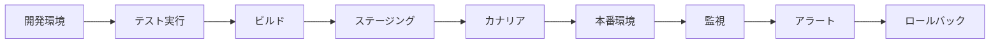
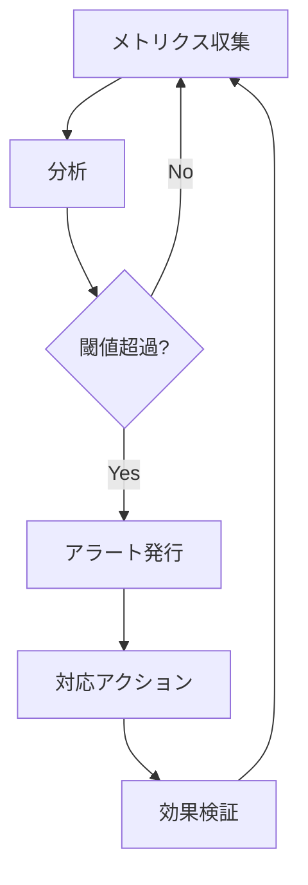

# 運用ガイド

このディレクトリには、Enhanced Modular Monolithアーキテクチャの運用に関するドキュメントが含まれています。

## 📚 ドキュメント一覧

### 監視・ログ

- [**監視・ログ設計**](./MONITORING_LOGGING.md)
  - メトリクス収集とモニタリング
  - 構造化ログの実装
  - アラート設定とダッシュボード
  - ヘルスチェックとプローブ

### セキュリティ

- [**セキュリティ実装**](./SECURITY.md)
  - 認証・認可の実装
  - 入力検証とサニタイゼーション
  - データ暗号化と保護
  - セキュリティヘッダーと監査ログ

### パフォーマンス

- [**パフォーマンス最適化**](./PERFORMANCE_OPTIMIZATION.md)
  - データベース最適化
  - キャッシング戦略
  - 非同期処理とワーカー
  - フロントエンド最適化

### デプロイメント

- [**デプロイメント戦略**](./DEPLOYMENT.md)
  - コンテナ化とDocker
  - CI/CDパイプライン
  - ゼロダウンタイムデプロイ
  - 災害復旧計画

## 🔄 運用フロー

### 1. 開発から本番へ

### 2. 監視サイクル

## 💡 ベストプラクティス

### 監視

1. **主要メトリクスの定義**

   - ビジネスKPI（コンバージョン率、アクティブユーザー数）
   - システムメトリクス（レスポンスタイム、エラー率）
   - インフラメトリクス（CPU、メモリ、ディスク）

2. **アラート設計**
   - 重要度に応じた通知先の設定
   - 誤検知を減らすための適切な閾値
   - エスカレーションルールの明確化

### セキュリティ

1. **Defense in Depth**

   - 多層防御の実装
   - 最小権限の原則
   - セキュリティ更新の自動化

2. **コンプライアンス**
   - 個人情報の適切な処理
   - 監査ログの保持
   - 定期的なセキュリティ監査

### パフォーマンス

1. **継続的な改善**

   - ボトルネックの特定と解消
   - 負荷テストの定期実施
   - キャパシティプランニング

2. **スケーラビリティ**
   - 水平スケーリングの準備
   - キャッシュ戦略の最適化
   - 非同期処理の活用

### デプロイメント

1. **安全性**

   - 段階的ロールアウト
   - 自動ロールバック
   - 本番環境のテスト

2. **効率性**
   - CI/CDの自動化
   - コンテナ化による一貫性
   - Infrastructure as Code

## 📊 運用指標

### SLI（Service Level Indicators）

- **可用性**: 99.9%以上
- **レスポンスタイム**: p95 < 200ms
- **エラー率**: < 0.1%

### SLO（Service Level Objectives）

- **月間稼働率**: 99.95%
- **インシデント解決時間**: < 1時間
- **デプロイ頻度**: 週2回以上

### 運用チェックリスト

#### 日次

- [ ] ヘルスチェックの確認
- [ ] エラーログのレビュー
- [ ] リソース使用率の確認

#### 週次

- [ ] パフォーマンスレポートの作成
- [ ] セキュリティアラートのレビュー
- [ ] バックアップの検証

#### 月次

- [ ] SLOレビュー
- [ ] インシデントの振り返り
- [ ] キャパシティプランニング

## 🚨 インシデント対応

### 対応フロー

1. **検知**: アラートまたはユーザー報告
2. **評価**: 影響範囲と重要度の判定
3. **対応**: 一時対処または恒久対処
4. **記録**: インシデントレポート作成
5. **改善**: 再発防止策の実施

### 連絡体制

- **レベル1（情報）**: Slackに通知
- **レベル2（警告）**: オンコール担当に通知
- **レベル3（緊急）**: チーム全体にエスカレーション

## 📖 参考資料

### 書籍

- "Site Reliability Engineering" - Google
- "The DevOps Handbook" - Gene Kim et al.
- "Observability Engineering" - Charity Majors et al.

### オンラインリソース

- [SRE Book](https://sre.google/books/)
- [AWS Well-Architected Framework](https://aws.amazon.com/architecture/well-architected/)
- [The Twelve-Factor App](https://12factor.net/)

## 🔄 更新履歴

- 2024-12-22: 初版作成
- 運用関連ドキュメントを追加（監視・ログ、セキュリティ、パフォーマンス、デプロイメント）
