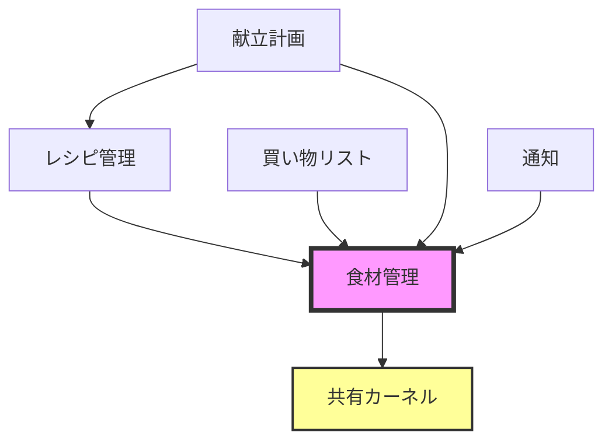

# 境界づけられたコンテキスト（Bounded Contexts）

## 概要

このディレクトリには、各境界づけられたコンテキストのドメイン設計ドキュメントを配置します。
各コンテキストは独立したディレクトリとして管理され、それぞれのビジネスロジックとモデルを含みます。

## 📋 現在のコンテキスト一覧

### 🥘 食材管理（Ingredient Management）

**ディレクトリ**: `ingredient-management/`

**責務**:

- 食材の登録・更新・削除
- 在庫数量の管理
- 賞味期限・消費期限の管理
- カテゴリー・単位のマスタ管理

**主要な概念**:

- 食材（Ingredient）
- カテゴリー（Category）
- 単位（Unit）
- 数量（Quantity）
- 保存場所（StorageLocation）

## 🚀 今後追加予定のコンテキスト

### 📝 レシピ管理（Recipe Management）

食材を使ったレシピの管理。食材管理コンテキストと連携。

### 🛒 買い物リスト（Shopping List）

不足している食材の買い物リスト生成と管理。

### 📅 献立計画（Meal Planning）

日々の献立計画と食材消費の予測。

### 🔔 通知（Notification）

賞味期限切れや在庫不足の通知。

## 📝 新しいコンテキストの追加手順

### 1. ディレクトリの作成

```bash
mkdir contexts/[new-context-name]
```

### 2. テンプレートからファイルをコピー

```bash
cp contexts/TEMPLATE.md contexts/[new-context-name]/README.md
# 必要に応じて他のテンプレートもコピー
```

### 3. 必須ドキュメントの作成

- `README.md` - コンテキストの概要
- `domain-analysis.md` - ドメイン分析
- `domain-model.md` - ドメインモデル定義
- `aggregates.md` - 集約設計
- `ubiquitous-language.md` - このコンテキストの用語集

### 4. このREADMEを更新

新しいコンテキストの情報を「現在のコンテキスト一覧」に追加

### 5. コンテキストマップを更新

`overview/context-map.md`に新しいコンテキストとその関係を追加

## 🔧 コンテキスト設計のガイドライン

### 境界の決め方

1. **言語の境界** - 同じ用語が異なる意味を持つ場所
2. **チームの境界** - 異なるチームが責任を持つ領域
3. **技術の境界** - 異なる技術要件を持つ領域
4. **ライフサイクルの境界** - 異なる変更頻度を持つ領域

### コンテキスト間の統合パターン

- **共有カーネル（Shared Kernel）** - 共通のモデルを共有
- **顧客/供給者（Customer/Supplier）** - 上流/下流の関係
- **順応者（Conformist）** - 上流モデルをそのまま使用
- **腐敗防止層（Anti-corruption Layer）** - 変換層を設ける
- **公開ホストサービス（Open Host Service）** - APIで統合
- **公表された言語（Published Language）** - 標準化された形式

### 命名規則

- ケバブケース（kebab-case）でディレクトリ名
- ビジネス用語を使用
- 技術的な用語は避ける

## 📊 コンテキスト間の依存関係



## 💡 Tips

### 小さく始める

- 最初は1つのコンテキストから
- 必要に応じて分割
- 早すぎる分割は避ける

### 継続的な見直し

- ドメインの理解が深まったら再評価
- チーム構造の変化に合わせて調整
- ビジネス要求の変化に対応

### ドキュメントの保守

- 実装と同期を保つ
- 定期的なレビュー
- チーム全体で更新
