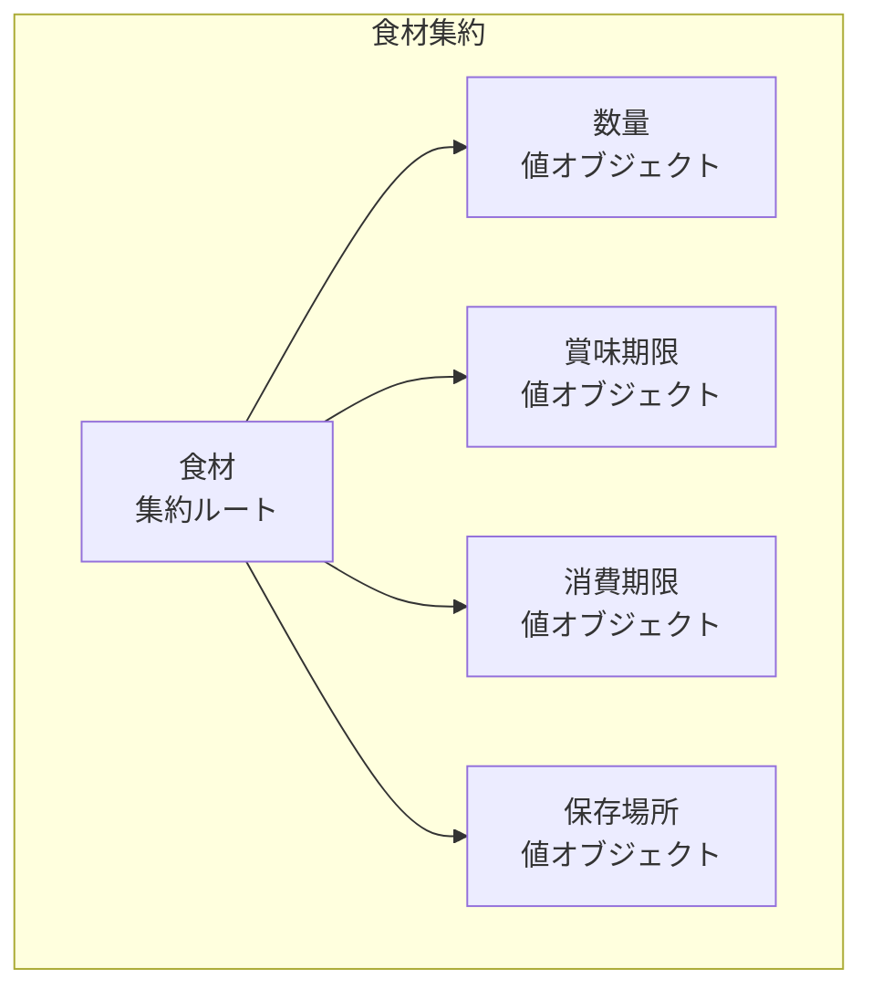
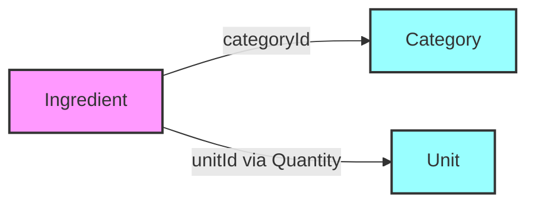

# 食材管理コンテキスト - 集約設計

## 概要

このドキュメントでは、食材管理コンテキストにおける集約（Aggregate）の設計を定義します。
集約はトランザクション整合性の境界を定め、ビジネス不変条件を保護します。

## 集約の一覧

| 集約名         | 集約ルート | 責務                             |
| -------------- | ---------- | -------------------------------- |
| 食材集約       | Ingredient | 個々の食材の管理とライフサイクル |
| カテゴリー集約 | Category   | 食材カテゴリーのマスタ管理       |
| 単位集約       | Unit       | 数量単位のマスタ管理             |

## 食材集約（Ingredient Aggregate）

### 概要

食材集約は、在庫管理の中核となる集約です。食材の登録から消費、廃棄までのライフサイクル全体を管理します。

### 集約の構成



### 集約ルート: Ingredient

```typescript
class Ingredient {
  private readonly id: IngredientId
  private name: IngredientName
  private categoryId: CategoryId
  private quantity: Quantity
  private storageLocation: StorageLocation
  private bestBeforeDate?: BestBeforeDate
  private expiryDate?: ExpiryDate
  private notes?: string
  private readonly createdAt: Date
  private updatedAt: Date
  private deletedAt?: Date

  // コンストラクタ（ファクトリ経由で生成）
  constructor(params: IngredientParams) {
    this.validateInvariants(params)
    // 初期化処理
  }

  // ビジネスメソッド
  consume(amount: Quantity): DomainEvent[] {
    if (!this.quantity.canSubtract(amount)) {
      throw new InsufficientStockError()
    }

    const previousQuantity = this.quantity
    this.quantity = this.quantity.subtract(amount)
    this.updatedAt = new Date()

    const events: DomainEvent[] = [
      new StockUpdatedEvent({
        ingredientId: this.id,
        previousQuantity,
        currentQuantity: this.quantity,
        updatedAt: this.updatedAt,
      }),
    ]

    if (this.quantity.isZero()) {
      events.push(
        new OutOfStockEvent({
          ingredientId: this.id,
          ingredientName: this.name,
          occurredAt: new Date(),
        })
      )
    }

    return events
  }

  replenish(amount: Quantity): DomainEvent[] {
    this.quantity = this.quantity.add(amount)
    this.updatedAt = new Date()

    return [
      new StockUpdatedEvent({
        ingredientId: this.id,
        previousQuantity: this.quantity.subtract(amount),
        currentQuantity: this.quantity,
        updatedAt: this.updatedAt,
      }),
    ]
  }

  updateExpiry(bestBefore?: Date, expiry?: Date): void {
    if (expiry && bestBefore && expiry > bestBefore) {
      throw new InvalidExpiryDateError()
    }

    this.bestBeforeDate = bestBefore ? new BestBeforeDate(bestBefore) : undefined
    this.expiryDate = expiry ? new ExpiryDate(expiry) : undefined
    this.updatedAt = new Date()
  }

  delete(): DomainEvent[] {
    if (this.deletedAt) {
      throw new AlreadyDeletedError()
    }

    this.deletedAt = new Date()
    this.updatedAt = new Date()

    return [
      new IngredientDeletedEvent({
        ingredientId: this.id,
        deletedAt: this.deletedAt,
      }),
    ]
  }

  // 不変条件の検証
  private validateInvariants(params: any): void {
    // 数量は0以上
    // 消費期限は賞味期限以前
    // カテゴリーは必須
    // etc...
  }
}
```

### 不変条件

1. **数量の整合性**

   - 数量は常に0以上
   - 単位の変更時は数量も適切に変換

2. **期限の整合性**

   - 消費期限 ≤ 賞味期限
   - 期限の更新は両方同時に検証

3. **削除状態の整合性**
   - 削除済みの食材は更新不可
   - 削除は論理削除のみ

### トランザクション境界

- 食材の作成・更新・削除は単一トランザクション
- 複数食材の一括更新は各食材ごとにトランザクション
- 他の集約への参照は ID のみ

### ドメインイベント

| イベント          | 発生タイミング | ペイロード             |
| ----------------- | -------------- | ---------------------- |
| IngredientCreated | 食材登録時     | 食材ID、名前、初期数量 |
| StockUpdated      | 数量変更時     | 食材ID、変更前後の数量 |
| OutOfStock        | 在庫切れ時     | 食材ID、食材名         |
| ExpiringSoon      | 期限接近時     | 食材ID、食材名、残日数 |
| IngredientDeleted | 削除時         | 食材ID                 |

## カテゴリー集約（Category Aggregate）

### 概要

カテゴリー集約は、食材の分類マスタを管理します。シンプルな集約で、カテゴリー情報のみを含みます。

### 集約の構成

```typescript
class Category {
  private readonly id: CategoryId
  private name: CategoryName
  private description?: string
  private displayOrder: number
  private readonly createdAt: Date
  private updatedAt: Date

  // ビジネスメソッド
  updateName(name: string): void {
    this.name = new CategoryName(name)
    this.updatedAt = new Date()
  }

  updateDisplayOrder(order: number): void {
    if (order < 0) {
      throw new InvalidDisplayOrderError()
    }
    this.displayOrder = order
    this.updatedAt = new Date()
  }
}
```

### 不変条件

1. カテゴリー名は一意
2. 表示順序は0以上
3. カテゴリーは階層を持たない

### トランザクション境界

- カテゴリーの作成・更新は単一トランザクション
- カテゴリー削除時の食材への影響は別トランザクション

## 単位集約（Unit Aggregate）

### 概要

単位集約は、数量の単位マスタを管理します。単位の種別（個数/重量/容量）によって振る舞いが異なります。

### 集約の構成

```typescript
class Unit {
  private readonly id: UnitId
  private name: UnitName
  private symbol: string
  private type: UnitType
  private displayOrder: number
  private readonly createdAt: Date
  private updatedAt: Date

  // ビジネスメソッド
  canConvertTo(other: Unit): boolean {
    // 同じタイプの単位間のみ変換可能
    return this.type === other.type
  }

  getConversionFactor(to: Unit): number {
    if (!this.canConvertTo(to)) {
      throw new IncompatibleUnitError()
    }

    // 変換係数を返す（例: g → kg = 0.001）
    return UnitConversionService.getConversionFactor(this, to)
  }
}
```

### 不変条件

1. 単位名とシンボルは一意
2. 単位タイプは変更不可
3. 表示順序は0以上

## 集約間の関係

### 参照関係



### 整合性の保証

1. **結果整合性**

   - カテゴリー削除時、食材は「未分類」カテゴリーに移動
   - 単位削除は関連する食材がない場合のみ可能

2. **参照整合性**
   - 食材は必ず存在するカテゴリーを参照
   - 数量は必ず存在する単位を参照

## リポジトリの責務

### IngredientRepository

```typescript
interface IngredientRepository {
  // 基本操作
  save(ingredient: Ingredient): Promise<void>
  findById(id: IngredientId): Promise<Ingredient | null>
  findAll(): Promise<Ingredient[]>
  delete(id: IngredientId): Promise<void>

  // 検索
  findByCategory(categoryId: CategoryId): Promise<Ingredient[]>
  findExpiringSoon(days: number): Promise<Ingredient[]>
  findByStorageLocation(location: StorageLocationType): Promise<Ingredient[]>

  // 一意性チェック
  existsByNameAndExpiryAndLocation(
    name: IngredientName,
    expiry: Date | null,
    location: StorageLocation
  ): Promise<boolean>
}
```

### CategoryRepository

```typescript
interface CategoryRepository {
  save(category: Category): Promise<void>
  findById(id: CategoryId): Promise<Category | null>
  findAll(): Promise<Category[]>
  existsByName(name: CategoryName): Promise<boolean>
}
```

### UnitRepository

```typescript
interface UnitRepository {
  save(unit: Unit): Promise<void>
  findById(id: UnitId): Promise<Unit | null>
  findAll(): Promise<Unit[]>
  findByType(type: UnitType): Promise<Unit[]>
  existsByNameOrSymbol(name: string, symbol: string): Promise<boolean>
}
```

## パフォーマンス考慮事項

### 遅延読み込み

- 食材一覧表示時は必要最小限のフィールドのみ取得
- 詳細画面遷移時に完全なエンティティを取得

### キャッシュ戦略

- カテゴリー・単位はマスタデータなのでキャッシュ可能
- 食材データは更新頻度が高いため慎重にキャッシュ

### バッチ処理

- 期限切れチェックは日次バッチで実行
- 大量の食材更新は非同期処理

## 設計上の決定事項

### なぜ食材を単一の集約としたか

1. **トランザクション境界が明確**

   - 在庫更新は単一食材で完結
   - 他の食材に影響しない

2. **パフォーマンス**

   - 小さな集約は並行性が高い
   - ロック競合が少ない

3. **理解しやすさ**
   - ビジネスロジックが集中
   - テストが容易

### なぜカテゴリーと単位を別集約としたか

1. **ライフサイクルの違い**

   - マスタデータは変更頻度が低い
   - 食材とは独立して管理

2. **参照の方向性**
   - 食材→カテゴリー/単位の単方向
   - 循環参照を避ける

## 更新履歴

| 日付       | 内容     | 作成者  |
| ---------- | -------- | ------- |
| 2025-01-21 | 初版作成 | @system |
