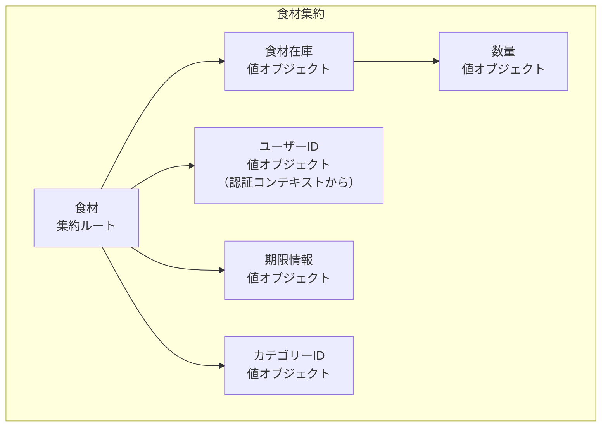
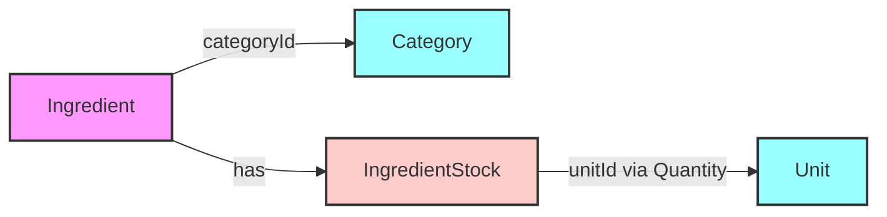

# 食材管理コンテキスト - 集約設計

## 概要

このドキュメントでは、食材管理コンテキストにおける集約（Aggregate）の設計を定義します。
集約はトランザクション整合性の境界を定め、ビジネス不変条件を保護します。

## 集約の一覧

| 集約名         | 集約ルート | 責務                             |
| -------------- | ---------- | -------------------------------- |
| 食材集約       | Ingredient | 個々の食材の管理とライフサイクル |
| カテゴリー集約 | Category   | 食材カテゴリーのマスタ管理       |
| 単位集約       | Unit       | 数量単位のマスタ管理             |

## 食材集約（Ingredient Aggregate）

### 概要

食材集約は、在庫管理の中核となる集約です。食材の登録から消費、廃棄までのライフサイクル全体を管理します。

### 集約の構成

### 不変条件

1. **数量の整合性**

   - 数量は常に0以上
   - 単位の変更時は数量も適切に変換
   - 閾値は数量と同じ単位で管理

2. **期限の整合性**

   - ExpiryInfo内で賞味期限と消費期限の整合性を保証
   - 消費期限は賞味期限以前でなければならない

3. **削除状態の整合性**

   - 削除済みの食材は更新不可
   - 削除は論理削除のみ

4. **ユーザー所有権の整合性**
   - 食材は必ず一人のユーザーに属する
   - 同一ユーザー内で同じ名前・期限・保存場所の組み合わせは重複不可
   - アクセス制御の詳細は[ドメインモデル仕様](./domain-model.md#アクセス制御)を参照

### トランザクション境界

- 食材の作成・更新・削除は単一トランザクション
- 複数食材の一括更新は各食材ごとにトランザクション
- 他の集約への参照は ID のみ

### ドメインイベント

| イベント               | 発生タイミング | ペイロード                         |
| ---------------------- | -------------- | ---------------------------------- |
| IngredientCreated      | 食材登録時     | 食材ID、ユーザーID、名前、初期数量 |
| StockConsumed          | 在庫消費時     | 食材ID、ユーザーID、消費数量       |
| StockReplenished       | 在庫補充時     | 食材ID、ユーザーID、補充数量       |
| StockDepleted          | 在庫切れ時     | 食材ID、ユーザーID、食材名         |
| IngredientExpiringSoon | 期限接近時     | 食材ID、ユーザーID、食材名、残日数 |
| IngredientDeleted      | 削除時         | 食材ID、ユーザーID                 |

## カテゴリー集約（Category Aggregate）

### 概要

カテゴリー集約は、食材の分類マスタを管理します。シンプルな集約で、カテゴリー情報のみを含みます。

### 不変条件

1. カテゴリー名は一意
2. 表示順序は0以上
3. カテゴリーは階層を持たない

### トランザクション境界

- カテゴリーの作成・更新は単一トランザクション
- カテゴリー削除時の食材への影響は別トランザクション

## 単位集約（Unit Aggregate）

### 概要

単位集約は、数量の単位マスタを管理します。単位の種別（個数/重量/容量）によって振る舞いが異なります。

### 不変条件

1. 単位名とシンボルは一意
2. 単位タイプは変更不可
3. 表示順序は0以上

## 集約間の関係

### 参照関係

### 整合性の保証

1. **結果整合性**

   - カテゴリー削除時、食材は「未分類」カテゴリーに移動
   - 単位削除は関連する食材がない場合のみ可能

2. **参照整合性**
   - 食材は必ず存在するカテゴリーを参照
   - 数量は必ず存在する単位を参照

## リポジトリの責務

### IngredientRepository

#### 基本操作

- `save(ingredient)` - 食材の保存
- `findById(id)` - ID による検索
- `findAll()` - 全件取得
- `delete(id)` - 論理削除

#### ビジネス要件に基づく検索

- `findByUserId(userId)` - ユーザー別取得
- `findByCategory(userId, categoryId)` - ユーザー・カテゴリー別取得
- `findExpiringSoon(userId, days)` - ユーザーの期限切れ間近食材の取得
- `findByStorageLocation(userId, location)` - ユーザー・保存場所別取得

#### 一意性チェック

- `existsByUserAndNameAndExpiryAndLocation(userId, name, expiryInfo, location)` - 重複チェック

### CategoryRepository

- `save(category)` - カテゴリーの保存
- `findById(id)` - ID による検索
- `findAll()` - 全件取得（表示順）
- `existsByName(name)` - 名前の重複チェック

### UnitRepository

- `save(unit)` - 単位の保存
- `findById(id)` - ID による検索
- `findAll()` - 全件取得
- `findByType(type)` - タイプ別取得
- `existsByNameOrSymbol(name, symbol)` - 重複チェック

## パフォーマンス考慮事項

### 遅延読み込み

- 食材一覧表示時は必要最小限のフィールドのみ取得
- 詳細画面遷移時に完全なエンティティを取得

### キャッシュ戦略

- カテゴリー・単位はマスタデータなのでキャッシュ可能
- 食材データは更新頻度が高いため慎重にキャッシュ

### バッチ処理

- 期限切れチェックは日次バッチで実行
- 大量の食材更新は非同期処理

## 設計上の決定事項

### なぜ食材を単一の集約としたか

1. **トランザクション境界が明確**

   - 在庫更新は単一食材で完結
   - 他の食材に影響しない

2. **パフォーマンス**

   - 小さな集約は並行性が高い
   - ロック競合が少ない

3. **理解しやすさ**
   - ビジネスロジックが集中
   - テストが容易

### なぜカテゴリーと単位を別集約としたか

1. **ライフサイクルの違い**

   - マスタデータは変更頻度が低い
   - 食材とは独立して管理

2. **参照の方向性**
   - 食材→カテゴリー/単位の単方向
   - 循環参照を避ける

## 更新履歴

| 日付       | 内容                                                                               | 作成者     |
| ---------- | ---------------------------------------------------------------------------------- | ---------- |
| 2025-06-24 | 初版                                                                               | @komei0727 |
| 2025-06-24 | ユーザー認証統合に伴う修正（ドメインイベントへのユーザーID追加、アクセス制御強化） | Claude     |
