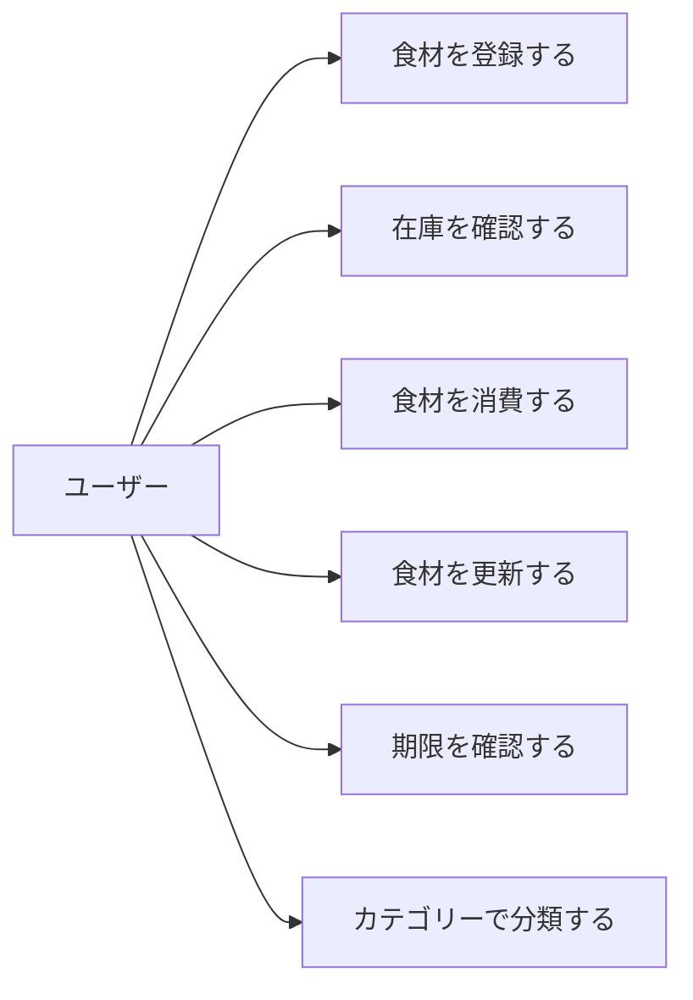
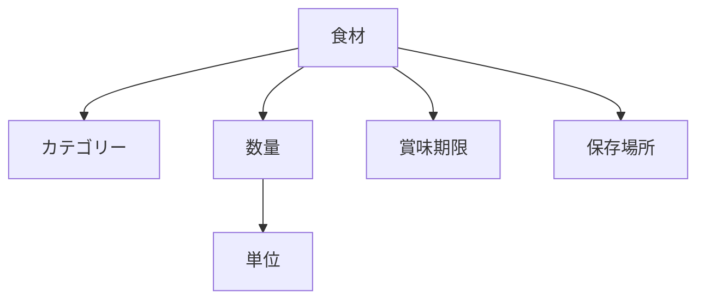

# 食材管理コンテキスト - ドメイン分析

## 概要

このドキュメントでは、食材管理コンテキストのドメイン分析結果を記載します。
ビジネス要求の理解から始まり、ドメインモデルの抽出までのプロセスを文書化します。

## ビジネス要求分析

### 主要な課題

1. **食材の無駄**

   - 買い忘れによる重複購入
   - 在庫把握の困難さ
   - 期限切れによる廃棄

2. **管理の煩雑さ**

   - 手動での在庫管理の限界
   - 賞味期限の見落とし
   - 保存場所の混乱

3. **買い物の非効率性**
   - 在庫確認せずに買い物
   - 必要な食材の買い忘れ
   - 衝動的な購入

### ビジネス価値

- **経済的価値**: 食材廃棄の削減による食費節約
- **時間的価値**: 効率的な買い物による時間短縮
- **環境的価値**: フードロス削減による環境負荷軽減
- **心理的価値**: 在庫管理のストレス軽減

## ユースケース分析

### 主要アクター

1. **一人暮らしユーザー**
   - 食材を登録・管理する
   - 在庫を確認する
   - 期限切れ通知を受ける

### 主要ユースケース

### ユースケース詳細

#### UC1: 食材を登録する

**概要**: 購入した食材をシステムに登録する

**事前条件**: ユーザーがログイン済み

**基本フロー**:

1. ユーザーが食材登録画面を開く
2. 食材名、カテゴリー、数量、単位、賞味期限、保存場所を入力
3. システムが入力値を検証
4. システムが食材を保存
5. 登録完了を通知

**代替フロー**:

- 3a. 既に同じ食材が存在する場合、数量を加算するか確認

**事後条件**: 食材が登録され、一覧に表示される

#### UC2: 在庫を確認する

**概要**: 現在の食材在庫を確認する

**基本フロー**:

1. ユーザーが食材一覧画面を開く
2. システムが食材一覧を表示
3. ユーザーが検索・フィルタリングを実行
4. システムが条件に合う食材を表示

#### UC3: 食材を消費する

**概要**: 使用した食材の数量を減らす

**基本フロー**:

1. ユーザーが食材を選択
2. 消費数量を入力
3. システムが在庫から減算
4. 在庫が0になった場合、削除するか確認

## ドメインモデル抽出

### コア概念の識別

| 概念       | 説明                 | 種別           |
| ---------- | -------------------- | -------------- |
| 食材       | 管理対象の個々の食材 | エンティティ   |
| カテゴリー | 食材の分類           | エンティティ   |
| 単位       | 数量の単位           | エンティティ   |
| 数量       | 食材の量             | 値オブジェクト |
| 賞味期限   | 品質保証期限         | 値オブジェクト |
| 保存場所   | 保管場所             | 値オブジェクト |

### 関連の識別

## ビジネスルールの抽出

### 制約ルール

1. **数量ルール**

   - 数量は0以上
   - 単位と数値はセットで管理

2. **期限ルール**

   - 消費期限 ≤ 賞味期限
   - 期限切れ食材は警告表示

3. **カテゴリールール**
   - 食材は必ず1つのカテゴリーに属する
   - カテゴリーは階層構造を持たない

### 業務フロールール

1. **在庫管理フロー**
   - 登録 → 消費 → 在庫減少 → 在庫切れ
2. **期限管理フロー**
   - 登録 → 期限接近 → 通知 → 消費/廃棄

## ドメインイベントの識別

### ライフサイクルイベント

| イベント | 発生条件       | 影響             |
| -------- | -------------- | ---------------- |
| 食材登録 | 新規食材追加時 | 在庫リスト更新   |
| 在庫更新 | 数量変更時     | 在庫不足チェック |
| 食材削除 | 食材削除時     | 履歴保存         |

### 通知イベント

| イベント     | 発生条件      | アクション   |
| ------------ | ------------- | ------------ |
| 期限切れ間近 | 賞味期限7日前 | 通知送信     |
| 在庫不足     | 閾値以下      | アラート表示 |

## 集約の境界

### 食材集約

**集約ルート**: 食材（Ingredient）

**含まれる要素**:

- 食材基本情報
- 数量
- 賞味期限
- 保存場所

**境界の理由**:

- トランザクション整合性が必要
- ライフサイクルが一致
- 強い凝集性

### カテゴリー集約

**集約ルート**: カテゴリー（Category）

**含まれる要素**:

- カテゴリー情報のみ

**境界の理由**:

- 独立したマスタデータ
- 変更頻度が低い

### 単位集約

**集約ルート**: 単位（Unit）

**含まれる要素**:

- 単位情報のみ

**境界の理由**:

- 独立したマスタデータ
- 参照のみで更新は稀

## コンテキスト境界の妥当性検証

### 境界設定の根拠

1. **言語の一貫性**

   - 「食材」「在庫」「賞味期限」など一貫した用語
   - 他コンテキストと用語の衝突なし

2. **責務の明確性**

   - 食材管理に特化
   - レシピや献立とは明確に分離

3. **変更の独立性**
   - 食材管理の変更が他に影響しない
   - 独立したリリースサイクル

### 統合ポイント

| 統合先       | 統合方法 | データ             |
| ------------ | -------- | ------------------ |
| レシピ管理   | API      | 食材情報、在庫状況 |
| 通知         | イベント | 期限切れ、在庫不足 |
| 買い物リスト | API      | 在庫不足食材       |

## 次のステップ

1. ドメインモデルの詳細設計
2. 集約の詳細設計
3. リポジトリインターフェースの定義
4. ドメインサービスの設計
5. アプリケーションサービスの設計

## 更新履歴

| 日付       | 内容     | 作成者  |
| ---------- | -------- | ------- |
| 2025-01-21 | 初版作成 | @system |
