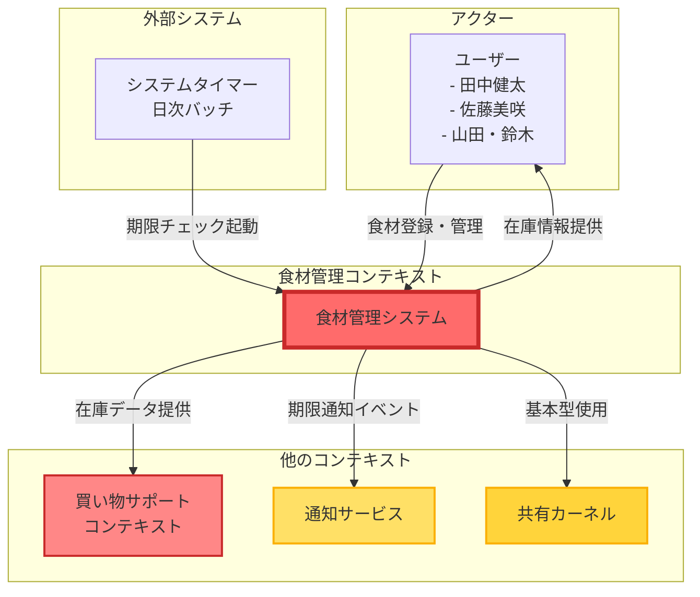
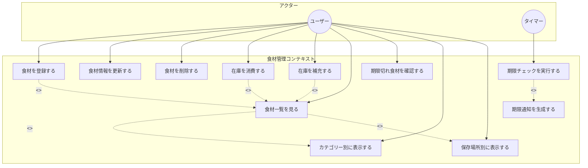
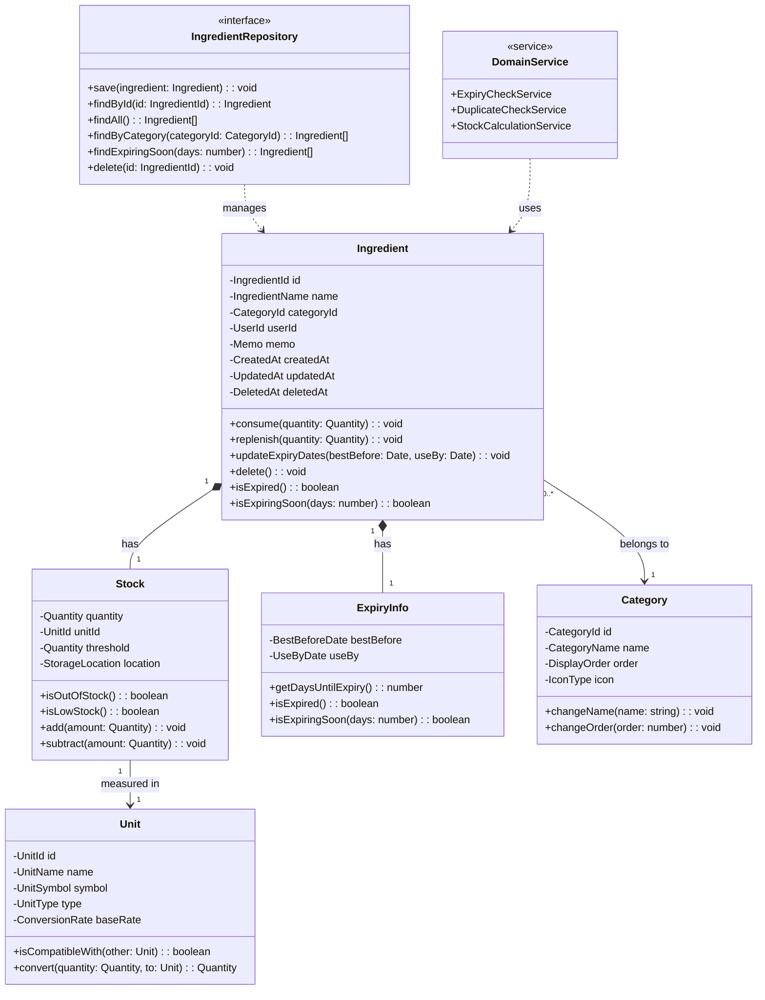
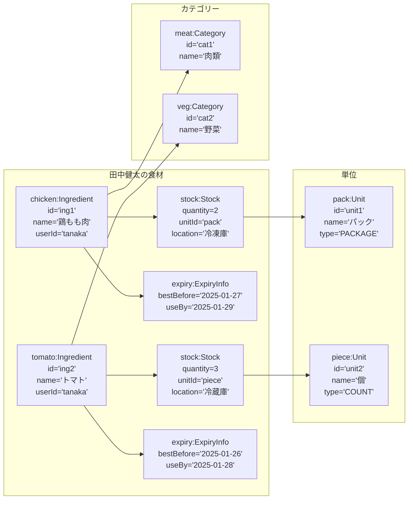
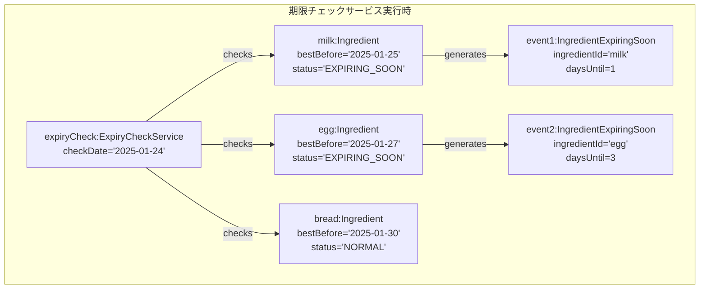
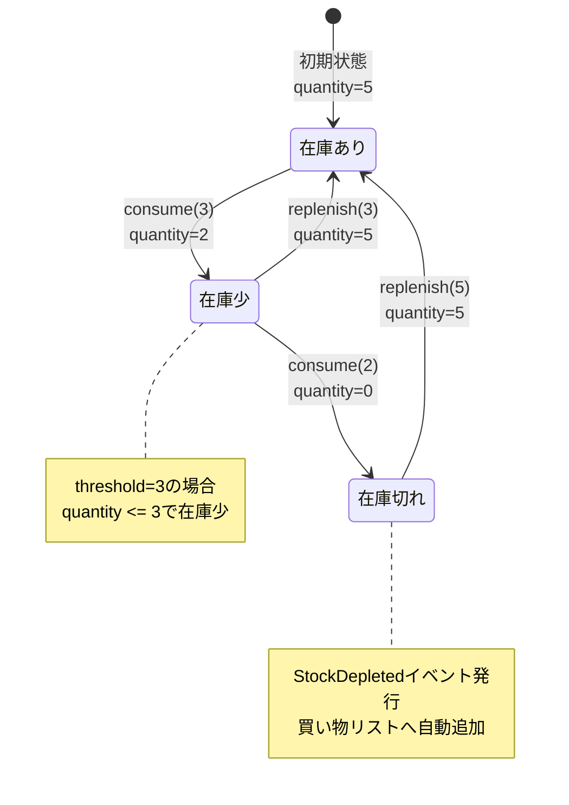

# SUDOモデリング - 食材管理コンテキスト

## 概要

本ドキュメントは、食材管理コンテキスト（Ingredient Management Context）に特化したSUDOモデリングの成果物です。
このコンテキストは、食材の登録・管理・期限管理を中心とした、アプリケーションの中核機能を提供します。

## 1. システム関連図（System Context Diagram）

食材管理コンテキストと外部アクター、他コンテキストとの関係を示します。

## 2. ユースケース図（Use Case Diagram）

食材管理コンテキストの主要なユースケースを示します。

## 3. ドメインモデル図（Domain Model Diagram）

食材管理コンテキストの中核となるドメインモデルを示します。

## 4. オブジェクト図（Object Diagram）

具体的なシナリオでのオブジェクトの状態を示します。

### シナリオ1: 田中健太の食材管理

### シナリオ2: 期限切れ間近の検出

### シナリオ3: 在庫消費フロー

## 5. コンテキスト内の重要な不変条件

1. **在庫の整合性**

   - 在庫数量は常に0以上
   - 消費時は在庫量を超えられない

2. **期限の整合性**

   - 消費期限 ≤ 賞味期限
   - 過去の日付での新規登録は警告

3. **一意性の保証**

   - 同一ユーザー内で「名前＋賞味期限＋保存場所」の組み合わせは一意

4. **削除の制約**
   - 論理削除のみ（履歴保持）
   - カテゴリー・単位は使用中は削除不可

## 6. 他コンテキストとの連携

### 買い物サポートコンテキストへの情報提供

- 在庫状態の照会API
- 期限情報の提供
- カテゴリー別データの提供

### 通知サービスへのイベント発行

- `IngredientExpiringSoon`: 期限3日前
- `StockDepleted`: 在庫切れ
- `IngredientExpired`: 期限切れ

### 共有カーネルの利用

- `Quantity`: 数量の値オブジェクト
- `Money`: 金額の値オブジェクト（将来拡張用）
- `DateRange`: 期間の値オブジェクト

## 更新履歴

| 日付       | 内容     | 作成者     |
| ---------- | -------- | ---------- |
| 2025-06-24 | 初版作成 | @komei0727 |
