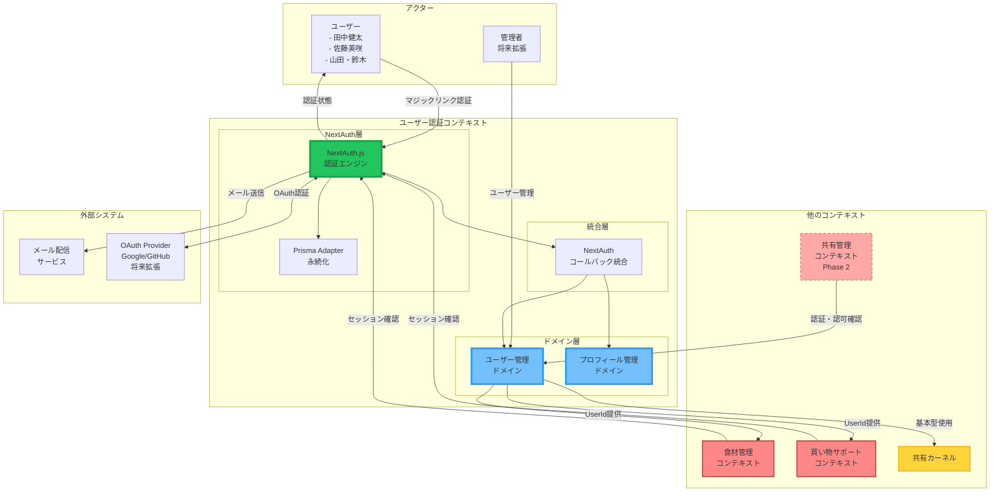
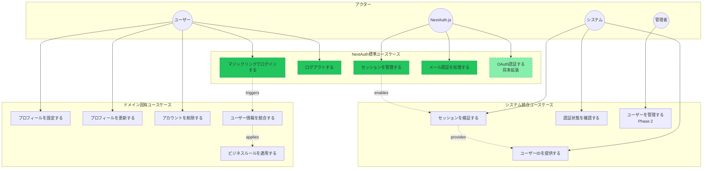
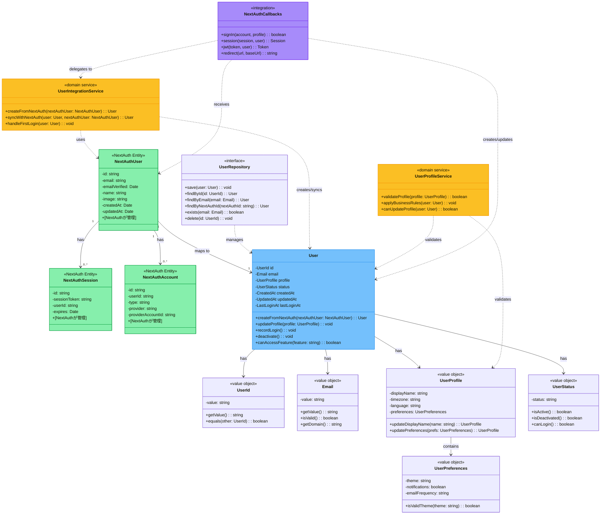
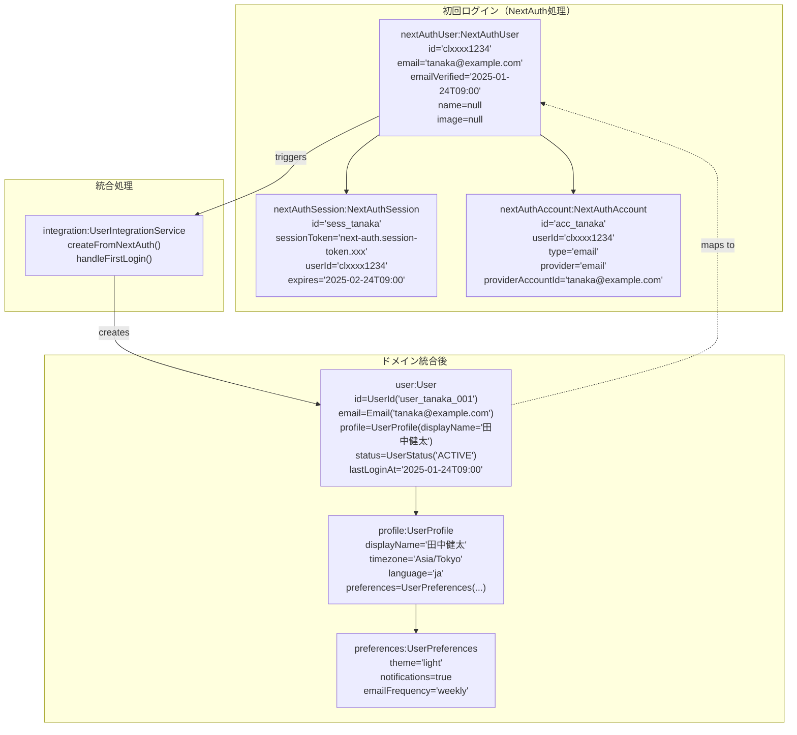
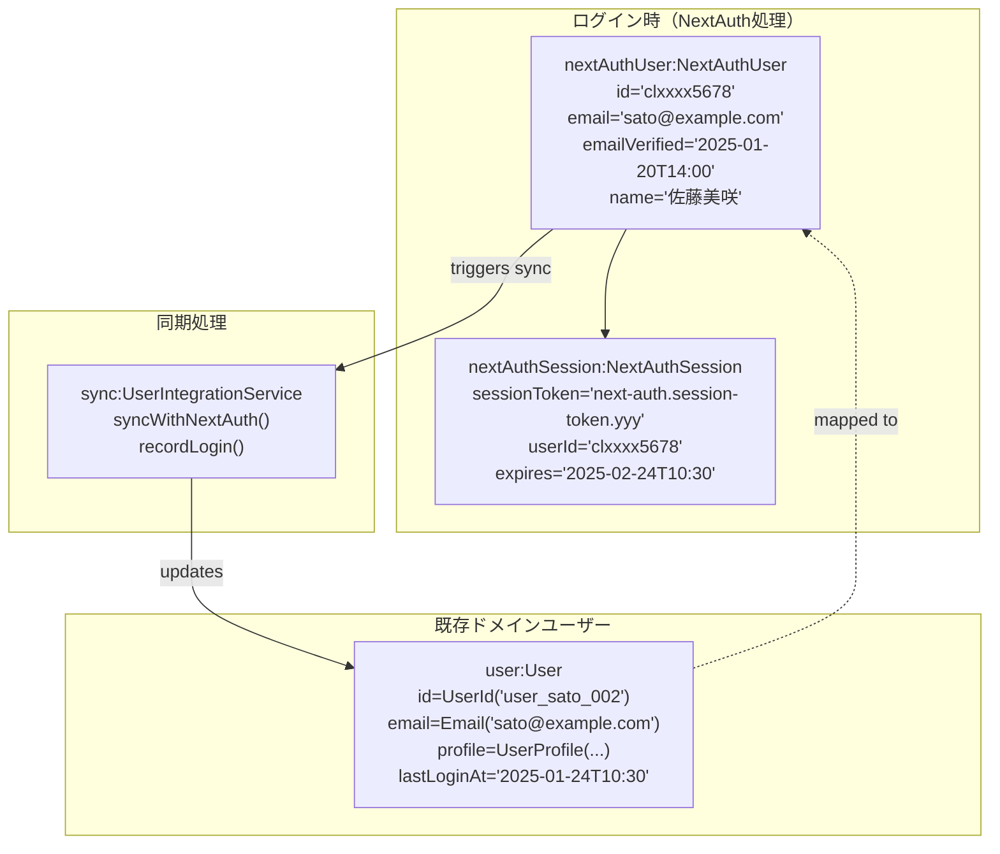
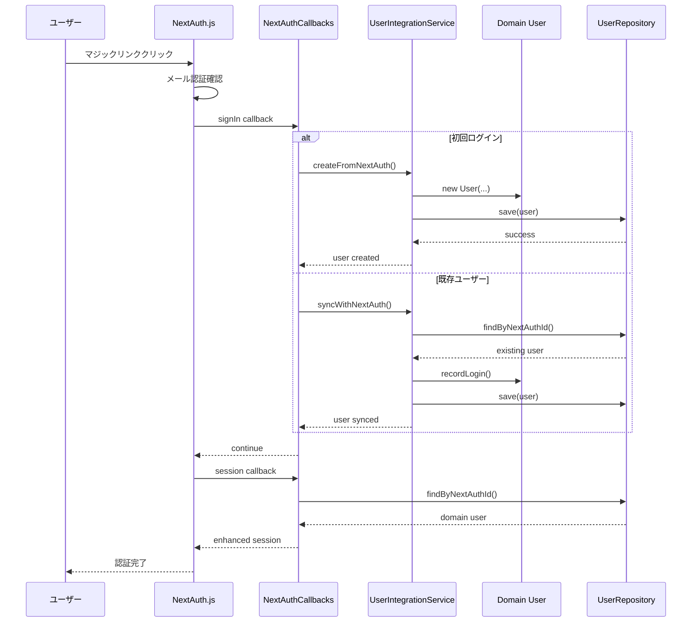
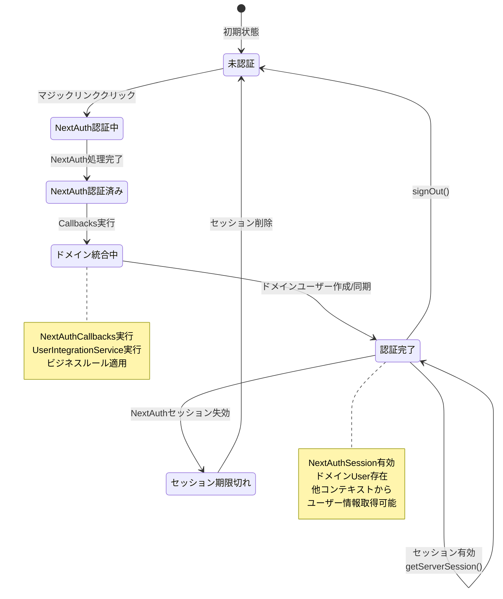

# SUDOモデリング - ユーザー認証コンテキスト（NextAuth版）

## 概要

本ドキュメントは、NextAuth.jsを中核とするユーザー認証コンテキスト（User Authentication Context）のSUDOモデリング成果物です。
このコンテキストは、NextAuthが提供する標準的な認証基盤に、アプリケーション固有のユーザー管理機能を統合した支援サブドメインです。

## 設計原則

- **認証はNextAuthに委譲**: セッション管理、トークン管理、パスワードハッシュ化等
- **ドメインはビジネスロジックに特化**: ユーザープロフィール、ビジネルール、統合ロジック
- **最小限の複雑性**: 食材管理アプリに必要な機能のみ実装

## 1. システム関連図（System Context Diagram）

NextAuthを中核とした認証システムと外部アクター、他コンテキストとの関係を示します。



## 2. ユースケース図（Use Case Diagram）

NextAuth中心の認証システムにおける主要ユースケースを示します。



## 3. ドメインモデル図（Domain Model Diagram）

NextAuth統合を前提とした簡素化されたドメインモデルを示します。



## 4. オブジェクト図（Object Diagram）

NextAuth統合シナリオでの具体的なオブジェクト状態を示します。

### シナリオ1: 田中健太のマジックリンク認証とユーザー統合



### シナリオ2: 既存ユーザーのログインとセッション管理



### シナリオ3: NextAuthコールバック統合フロー



### シナリオ4: 認証状態の管理



## 5. コンテキスト内の重要な不変条件

### NextAuth統合における不変条件

1. **認証の一意性と整合性**
   - メールアドレスはシステム全体で一意（NextAuthレベル）
   - NextAuthユーザーとドメインユーザーは1:1対応を維持
   - アクティブなセッションは同一ユーザーにつき複数許可（異なるデバイス対応）

2. **データ整合性の保証**
   - NextAuthユーザー作成時に必ずドメインユーザーを作成
   - ドメインユーザーのEmailはNextAuthユーザーのemailと常に同期
   - 論理削除されたドメインユーザーは認証を拒否

3. **セキュリティ境界の維持**
   - 認証・認可はNextAuthに委譲（パスワード、トークン、セッション管理）
   - ビジネスロジックはドメイン層で管理（プロフィール、権限、状態）
   - NextAuthコールバックでのみドメイン統合を実行

4. **状態管理の一貫性**
   - 初回ログイン時はUserIntegrationService.createFromNextAuth()を必ず実行
   - 既存ユーザーログイン時はUserIntegrationService.syncWithNextAuth()を実行
   - セッション有効性はNextAuth.getServerSession()で確認

## 6. 他コンテキストとの連携

### 食材管理・買い物サポートコンテキストへの認証提供

**提供する機能**
- **セッション確認**: NextAuth.getServerSession()によるセッション検証
- **ユーザーID提供**: 認証済みユーザーのUserId取得
- **ユーザー情報取得**: プロフィール、設定情報の提供

**統合方法**
```typescript
// 食材管理コンテキストでの使用例
const session = await getServerSession(authOptions)
if (!session?.user?.id) throw new UnauthorizedError()

const userId = new UserId(session.user.id)
const user = await userRepository.findByNextAuthId(session.user.id)
```

### 共有管理コンテキストへの認可提供（Phase 2）

**提供する機能**
- **ロールベースアクセス制御**: UserStatus, UserPreferencesによる権限管理
- **リソースレベル権限チェック**: User.canAccessFeature()メソッド
- **共有グループメンバー管理**: 将来的なマルチテナント対応

### イベント発行（ドメインイベント）

**NextAuth統合特化イベント**
- `UserCreatedFromNextAuth`: NextAuthユーザーからドメインユーザー作成
- `UserSyncedWithNextAuth`: 既存ユーザーとNextAuthユーザーの同期
- `UserProfileUpdated`: プロフィール更新
- `UserDeactivated`: アカウント削除（論理削除）

**従来イベントの簡素化**
- ~~`UserRegistered`~~: NextAuthが処理
- ~~`UserLoggedIn`~~: NextAuthが処理
- ~~`UserLoggedOut`~~: NextAuthが処理
- ~~`PasswordResetRequested`~~: NextAuthが処理

### 共有カーネルの利用

**継続使用する値オブジェクト**
- `Email`: メールアドレス値オブジェクト（バリデーション強化）
- `UserId`: アプリケーション固有のユーザーID
- `DomainEvent`: イベント基底クラス（userId、correlationId追加）

**不要となる値オブジェクト**
- ~~`Token`基底クラス~~: NextAuthが管理
- ~~`Password`関連~~: NextAuthが管理
- ~~`SessionToken`~~: NextAuthが管理

## 7. 実装優先度とロードマップ

### Phase 1: NextAuth基盤構築（高優先度）
1. NextAuth設定とEmailProvider設定
2. Prismaスキーマ（NextAuth標準テーブル）
3. NextAuthCallbacks実装
4. UserIntegrationService実装

### Phase 2: ドメイン機能実装（中優先度）
1. User、UserProfile、UserStatus値オブジェクト
2. UserRepository実装
3. UserProfileService実装
4. プロフィール管理API

### Phase 3: 統合・最適化（低優先度）
1. ドメインイベント発行
2. 他コンテキストとの統合テスト
3. OAuth プロバイダー追加
4. 管理機能実装

## 更新履歴

| 日付       | 内容                             | 作成者 |
| ---------- | -------------------------------- | ------ |
| 2025-06-24 | 初版作成                         | Claude |
| 2025-06-24 | NextAuth前提での全面再設計・更新 | Claude |
