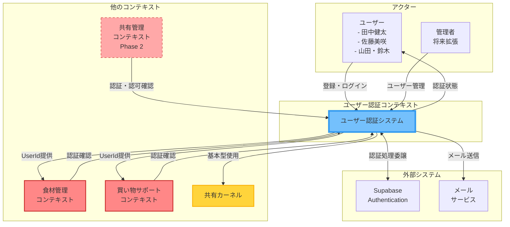
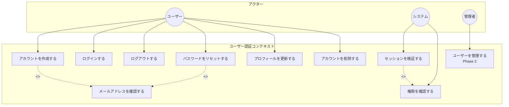
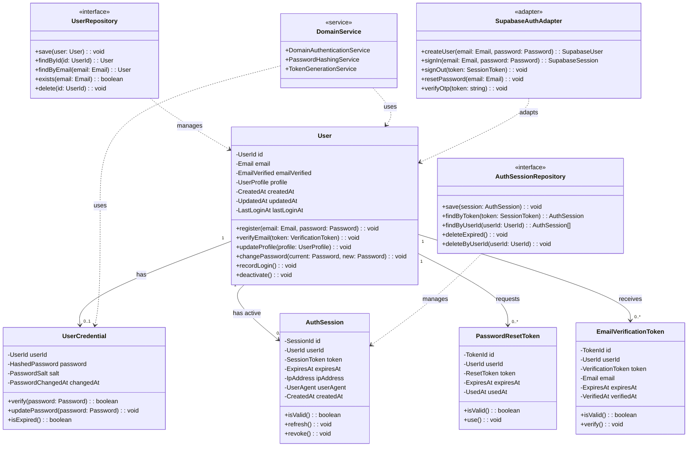
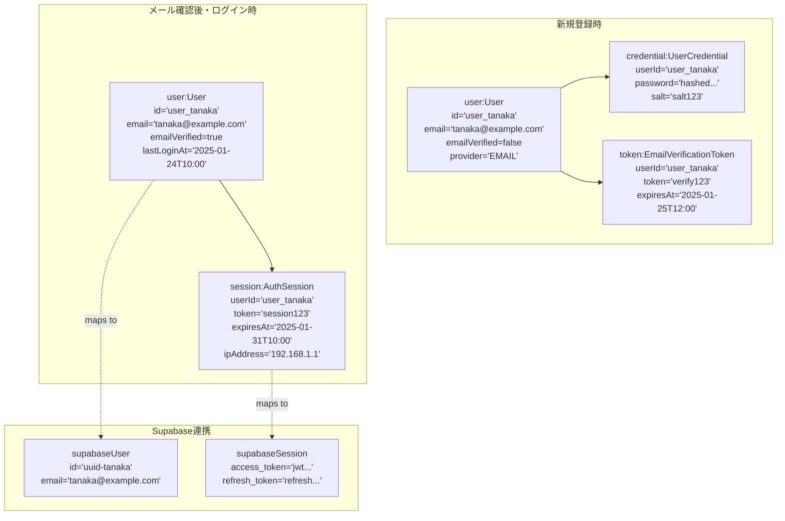
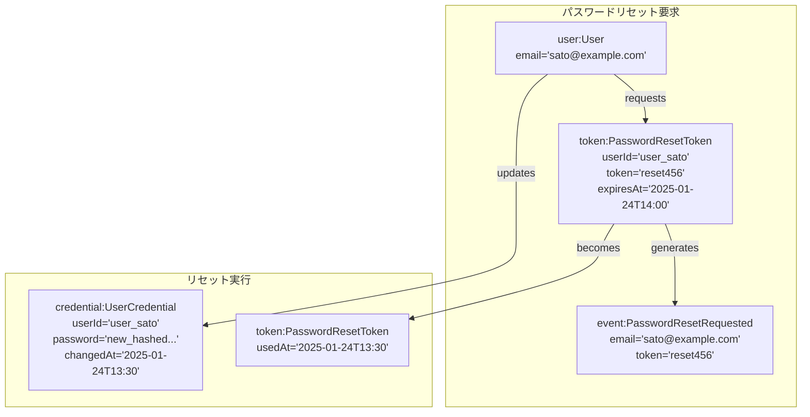
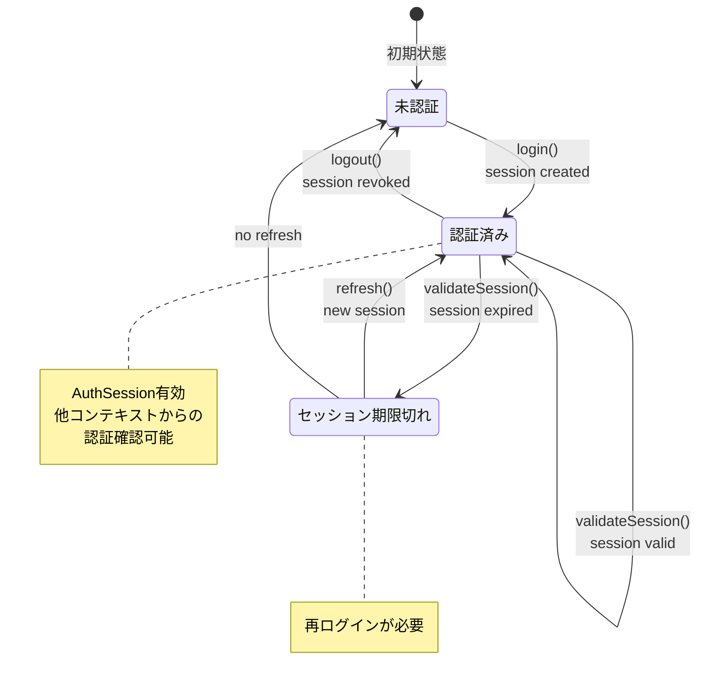

# SUDOモデリング - ユーザー認証コンテキスト

## 概要

本ドキュメントは、ユーザー認証コンテキスト（User Authentication Context）に特化したSUDOモデリングの成果物です。
このコンテキストは、ユーザーの認証・認可・セッション管理を提供し、システム全体のセキュリティ基盤となる支援サブドメインです。

## 1. システム関連図（System Context Diagram）

ユーザー認証コンテキストと外部アクター、他コンテキストとの関係を示します。

## 2. ユースケース図（Use Case Diagram）

ユーザー認証コンテキストの主要なユースケースを示します。

## 3. ドメインモデル図（Domain Model Diagram）

ユーザー認証コンテキストの中核となるドメインモデルを示します。

## 4. オブジェクト図（Object Diagram）

具体的なシナリオでのオブジェクトの状態を示します。

### シナリオ1: 田中健太の新規登録とログイン

### シナリオ2: パスワードリセットフロー

### シナリオ3: セッション管理と認証確認

## 5. コンテキスト内の重要な不変条件

1. **認証の一意性**

   - メールアドレスはシステム全体で一意
   - アクティブなセッションは同一ユーザーにつき複数許可（異なるデバイス対応）

2. **セキュリティの保証**

   - パスワードは必ずハッシュ化して保存
   - トークンは十分なランダム性を持つ
   - 有効期限切れのトークン・セッションは無効

3. **状態の整合性**

   - 未確認メールアドレスのユーザーは制限付きアクセス
   - 削除されたユーザーのセッションは即座に無効化

4. **Supabaseとの同期**
   - ローカルUserとSupabase Userは1:1対応
   - 認証状態は常にSupabaseと同期

## 6. 他コンテキストとの連携

### 食材管理・買い物サポートコンテキストへの認証提供

- UserIdの提供（認証済みユーザーのみ）
- セッション検証API
- 権限確認API（将来拡張）

### 共有管理コンテキストへの認可提供（Phase 2）

- ロールベースアクセス制御
- リソースレベルの権限チェック
- 共有グループのメンバー管理

### イベント発行

- `UserRegistered`: 新規登録完了
- `UserLoggedIn`: ログイン成功
- `UserLoggedOut`: ログアウト
- `PasswordResetRequested`: パスワードリセット要求
- `UserDeleted`: アカウント削除

### 共有カーネルの利用

- `Email`: メールアドレスの値オブジェクト
- `UserId`: ユーザーIDの値オブジェクト
- `Token`: トークンの基底値オブジェクト

## 更新履歴

| 日付       | 内容     | 作成者 |
| ---------- | -------- | ------ |
| 2025-06-24 | 初版作成 | Claude |
