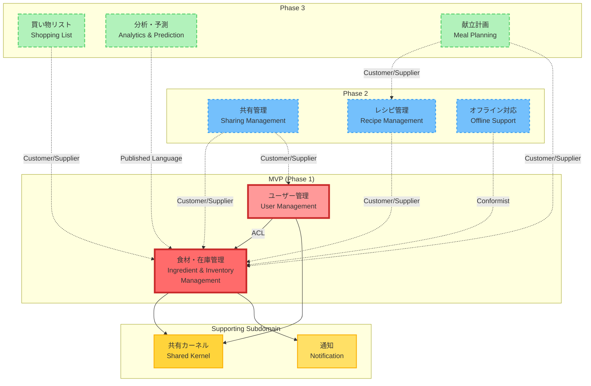

# コンテキストマップ v3.0（食材管理と買い物サポートの統合）

## 1. 概要

本ドキュメントは、MVPの複雑性を適切に管理するため、食材管理コンテキストと買い物サポートコンテキストを統合した新しいコンテキストマップです。
この統合により、データアクセスの簡素化と開発効率の向上を実現します。

**v3.0の主な変更点**:

- 食材管理と買い物サポートを「食材・在庫管理コンテキスト」として統合
- オフライン対応などの複雑な機能をPhase 2以降に移動
- MVPとして適切な複雑性レベルに調整

## 2. 全体コンテキストマップ



## 3. コンテキスト詳細

### 3.1 MVP（Phase 1）コンテキスト

#### 🥘 食材・在庫管理（Ingredient & Inventory Management）

**タイプ**: コアドメイン
**優先度**: 最高
**関連ペルソナ**: 全ペルソナ

**主要な責務**:

1. **食材管理機能**

   - 食材の登録・更新・削除
   - 在庫数量管理
   - 賞味期限管理とアラート
   - カテゴリー・単位管理
   - 保存場所管理

2. **買い物サポート機能**
   - 買い物モード（簡易在庫確認画面）
   - カテゴリー別クイックアクセス
   - 在庫有無の即座確認
   - 最近確認した食材の表示

**ビジネス価値**:

- 食材ロス削減（月3,000-5,000円の節約）
- 賞味期限切れ防止（発生率50%削減）
- 重複購入の防止
- 買い物時間の短縮

**設計方針**:

- 単一のデータベースで在庫情報を管理
- 買い物モードは専用のUIビューとして実装
- リアルタイムで最新の在庫情報を表示
- モバイルファーストのレスポンシブデザイン

#### 👥 ユーザー管理（User Management）

**タイプ**: 汎用サブドメイン
**優先度**: 高（MVP実装）
**関連ペルソナ**: 全ペルソナ（特に山田・鈴木カップル）

**主要な責務**:

- アカウント作成・認証
- メールアドレス認証
- プロフィール管理
- アカウント招待機能（Phase 2での共有機能の基盤）

**ビジネス価値**:

- 個人データの安全な管理
- 将来の共有機能の基盤構築
- マルチデバイス対応の実現

### 3.2 Phase 2 コンテキスト（3-6ヶ月後）

#### 📱 オフライン対応（Offline Support）

**タイプ**: 支援サブドメイン
**優先度**: 中
**関連ペルソナ**: 田中健太、佐藤美咲

**主要な責務**:

- ローカルキャッシュ管理
- オフライン時の操作記録
- オンライン復帰時の自動同期
- 競合解決

**実装時の考慮点**:

- 食材・在庫管理コンテキストの拡張として実装
- Progressive Web App（PWA）技術の活用
- Service WorkerとIndexedDBの使用

#### 🤝 共有管理（Sharing Management）

**タイプ**: 支援サブドメイン
**優先度**: 高（カップル向け必須）
**関連ペルソナ**: 山田・鈴木カップル

**主要な責務**:

- 食材在庫の共有
- リアルタイム同期
- 編集権限管理
- 操作履歴の追跡

#### 🍳 レシピ管理（Recipe Management）

**タイプ**: 支援サブドメイン
**優先度**: 中
**関連ペルソナ**: 佐藤美咲

**主要な責務**:

- 在庫食材からのレシピ提案
- 不足食材の表示
- 外部レシピサイト連携

### 3.3 Phase 3 コンテキスト（6-12ヶ月後）

#### 📋 買い物リスト（Shopping List）

**タイプ**: 支援サブドメイン
**優先度**: 低

**主要な責務**:

- 買い物リスト自動生成
- チェックリスト機能
- 買い物履歴管理

#### 📊 分析・予測（Analytics & Prediction）

**タイプ**: 支援サブドメイン
**優先度**: 低

**主要な責務**:

- 消費パターン分析
- 購入提案
- 適正在庫の算出

### 3.4 共通基盤

#### 📦 共有カーネル（Shared Kernel）

**タイプ**: 共有カーネル
**優先度**: 高

**含まれる概念**:

- Money（金額）
- Quantity（数量）
- DateRange（日付範囲）
- EntityId（ID基底クラス）

#### 🔔 通知（Notification）

**タイプ**: 汎用サブドメイン
**優先度**: 中

**主要な責務**:

- アプリ内通知
- 通知設定管理
- 通知履歴

## 4. 統合パターンと境界

### 4.1 MVP内の統合

**食材・在庫管理内部の機能統合**

- パターン: **単一データベース、複数ビュー**
- 理由: 同じデータを異なる視点で表示
- 実装:
  - 管理画面: 詳細な編集機能
  - 買い物画面: 簡易な確認機能

**ユーザー管理 → 食材・在庫管理**

- パターン: **Anti-Corruption Layer (ACL)**
- 理由: 認証・認可の横断的関心事
- 実装: 認証ミドルウェアとサービス層での統合

### 4.2 Phase 2での統合

**オフライン対応 → 食材・在庫管理**

- パターン: **Conformist**
- 理由: オフライン機能は既存APIに準拠
- 実装: キャッシュレイヤーとして透過的に動作

**共有管理 → 食材・在庫管理**

- パターン: **Customer/Supplier**
- 理由: 共有管理が食材管理のデータに依存
- 実装: 明確なインターフェース定義

**共有管理 → ユーザー管理**

- パターン: **Customer/Supplier**
- 理由: 共有管理がユーザー情報と権限管理に依存
- 実装: ユーザーサービスAPIの利用

### 4.3 イベント駆動統合

```typescript
// 食材・在庫管理 → 通知
interface InventoryDomainEvents {
  // 食材管理イベント
  IngredientExpiringSoon: {
    userId: string
    ingredientId: string
    ingredientName: string
    expiryDate: Date
    daysUntilExpiry: number
  }

  IngredientOutOfStock: {
    userId: string
    ingredientId: string
    ingredientName: string
  }

  // 買い物サポートイベント
  ShoppingSessionStarted: {
    userId: string
    sessionId: string
    startedAt: Date
  }

  ShoppingSessionCompleted: {
    userId: string
    sessionId: string
    duration: number
    itemsChecked: number
  }
}
```

## 5. 統合によるメリット

### 技術的メリット

1. **データアクセスの簡素化**

   - 同一トランザクション内でのデータ操作
   - 遅延なしのリアルタイム反映
   - 一貫性のあるデータモデル

2. **開発効率の向上**

   - コードの重複削減
   - テストの簡素化
   - デプロイの単純化

3. **保守性の向上**
   - 単一のコードベース
   - 統一されたビジネスロジック
   - 明確な責任境界

### ビジネス的メリット

1. **ユーザー体験の向上**

   - シームレスな機能連携
   - 高速なレスポンス
   - 一貫性のあるUI/UX

2. **開発コストの削減**
   - 実装期間の短縮
   - バグの減少
   - 運用負荷の軽減

## 6. ペルソナ別の重要コンテキスト

### 田中健太（24歳・一人暮らし）

1. **食材・在庫管理**: 簡単な登録と買い物中の素早い確認
2. **通知**: 3日前の賞味期限アラート
3. **オフライン対応**: Phase 2で店内でも使える機能

### 佐藤美咲（26歳・一人暮らし）

1. **食材・在庫管理**: 野菜の管理と作り置き記録
2. **レシピ管理**: 在庫からのレシピ提案
3. **分析・予測**: 栄養バランスの可視化

### 山田・鈴木カップル

1. **共有管理**: リアルタイム在庫共有
2. **ユーザー管理**: アカウント連携
3. **買い物リスト**: 共有買い物リスト

## 7. 設計上の決定事項

### なぜ食材管理と買い物サポートを統合したか

1. **データの一貫性**

   - 在庫情報のリアルタイム反映
   - トランザクション管理の簡素化
   - データ不整合のリスク削減

2. **開発効率**

   - 共通のビジネスロジック
   - 重複コードの削減
   - テストの効率化

3. **ユーザー体験**
   - シームレスな画面遷移
   - 統一されたデータ表示
   - 高速なレスポンス

### なぜユーザー管理をMVPに含めたか

- 今後の開発効率の向上
  - Phase 2以降の機能（共有管理、レシピ管理）がユーザー管理を前提とする
  - 後からユーザー管理を追加すると大規模なリファクタリングが必要
- データの一貫性と整合性
  - 最初からユーザーごとのデータ分離を実装
  - マルチテナンシーの基盤を確立
- ユーザー体験の向上
  - マルチデバイス対応が初期から可能
  - 個人設定の保存と同期

### なぜ共有管理を独立させたか

- 複雑な同期ロジック
- 権限管理の複雑性
- カップル以外には不要な機能

## 8. 将来の分離可能性

統合されたコンテキストは、将来的に以下の条件で分離可能：

1. **ユーザー数の増加**（10万人以上）
2. **パフォーマンス要件の変化**
3. **チーム体制の拡大**
4. **異なる技術スタックの採用**

分離時の指針：

- インターフェースを明確に定義
- ビジネスロジックをドメイン層に集約
- イベント駆動アーキテクチャへの移行準備

## 9. 技術的な境界の実装方針

### モジュール構造

```
src/modules/
├── inventory/         # 食材・在庫管理（MVP）
│   ├── domain/        # ドメインモデル
│   ├── application/   # アプリケーションサービス
│   ├── infrastructure/# インフラストラクチャ
│   └── presentation/  # プレゼンテーション層
│       ├── management/# 管理画面
│       └── shopping/  # 買い物モード画面
├── users/             # ユーザー管理（MVP）
├── sharing/           # 共有管理（Phase 2）
├── recipes/           # レシピ管理（Phase 2）
├── offline/           # オフライン対応（Phase 2）
└── shared/            # 共有カーネル
```

### API境界

- 各コンテキストは独自のAPIルートを持つ
- `/api/v1/inventory/*` - 食材・在庫管理
- `/api/v1/inventory/shopping/*` - 買い物モード専用
- `/api/v1/users/*` - ユーザー管理
- `/api/v1/auth/*` - 認証
- `/api/v2/sharing/*`（Phase 2）

## 10. リスクと軽減策

### 統合によるリスク

1. **機能の肥大化**

   - リスク: 単一コンテキストが過度に複雑化
   - 軽減策: 定期的なリファクタリング、明確なモジュール境界

2. **スケーラビリティの制限**
   - リスク: 将来的な拡張が困難
   - 軽減策: マイクロサービス化を考慮した設計

### 段階的な実装

1. **Phase 1**: 基本機能の実装（2ヶ月）
2. **Phase 2**: オフライン対応の追加（1ヶ月）
3. **Phase 3**: パフォーマンス最適化（1ヶ月）

## 更新履歴

| 日付       | 内容                                  | 作成者     |
| ---------- | ------------------------------------- | ---------- |
| 2025-06-24 | v1.0 - 初版                           | @komei0727 |
| 2025-06-26 | v2.1 - ユーザー管理をMVPに移動        | @komei0727 |
| 2025-06-28 | v3.0 - 食材管理と買い物サポートを統合 | Claude     |
