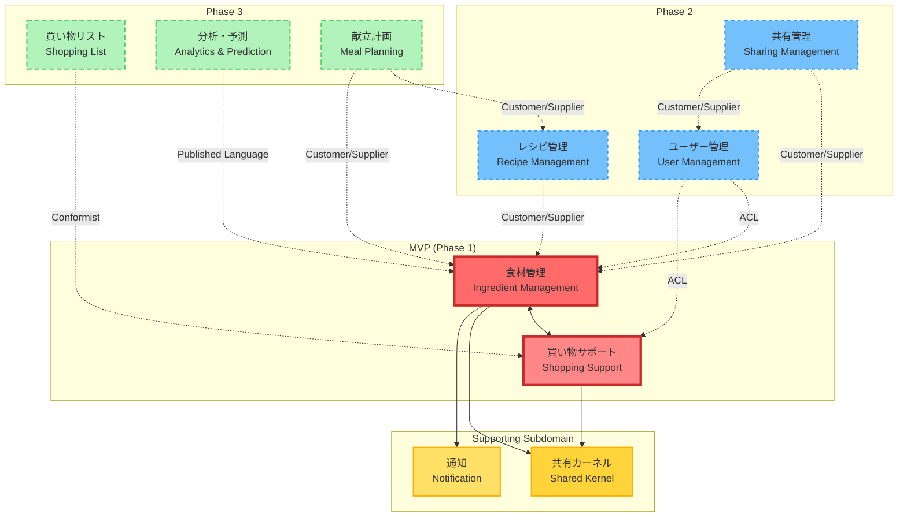

# コンテキストマップ v2.0（ビジネス要求対応版）

## 1. 概要

本ドキュメントは、ビジネス要求文書（BRD）に基づいて再設計したコンテキストマップです。
特に、ペルソナ分析から得られた洞察と、MVPからPhase 3までの段階的な実装計画を反映しています。

## 2. 全体コンテキストマップ



## 3. コンテキスト詳細

### 3.1 MVP（Phase 1）コンテキスト

#### 🥘 食材管理（Ingredient Management）

**タイプ**: コアドメイン
**優先度**: 最高
**関連ペルソナ**: 全ペルソナ

**主要な責務**:

- 食材の登録・更新・削除
- 在庫数量管理
- 賞味期限管理とアラート
- カテゴリー・単位管理
- 保存場所管理

**ビジネス価値**:

- 食材ロス削減（月3,000-5,000円の節約）
- 賞味期限切れ防止（発生率50%削減）

#### 🛒 買い物サポート（Shopping Support）

**タイプ**: コアドメイン
**優先度**: 最高
**関連ペルソナ**: 田中健太、佐藤美咲

**主要な責務**:

- 買い物モード（簡易在庫確認）
- オフライン対応
- カテゴリー別クイックアクセス
- 在庫有無の即座確認

**ビジネス価値**:

- 重複購入の防止
- 買い物時間の短縮

### 3.2 Phase 2 コンテキスト（3-6ヶ月後）

#### 👥 ユーザー管理（User Management）

**タイプ**: 汎用サブドメイン
**優先度**: 高（Phase 2で必須）
**関連ペルソナ**: 山田・鈴木カップル

**主要な責務**:

- アカウント作成・認証
- メールアドレス認証
- プロフィール管理
- アカウント招待機能

#### 🤝 共有管理（Sharing Management）

**タイプ**: 支援サブドメイン
**優先度**: 高（カップル向け必須）
**関連ペルソナ**: 山田・鈴木カップル

**主要な責務**:

- 食材在庫の共有
- リアルタイム同期
- 編集権限管理
- 操作履歴の追跡

#### 🍳 レシピ管理（Recipe Management）

**タイプ**: 支援サブドメイン
**優先度**: 中
**関連ペルソナ**: 佐藤美咲

**主要な責務**:

- 在庫食材からのレシピ提案
- 不足食材の表示
- 外部レシピサイト連携

### 3.3 Phase 3 コンテキスト（6-12ヶ月後）

#### 📋 買い物リスト（Shopping List）

**タイプ**: 支援サブドメイン
**優先度**: 低

**主要な責務**:

- 買い物リスト自動生成
- チェックリスト機能
- 買い物履歴管理

#### 📊 分析・予測（Analytics & Prediction）

**タイプ**: 支援サブドメイン
**優先度**: 低

**主要な責務**:

- 消費パターン分析
- 購入提案
- 適正在庫の算出

### 3.4 共通基盤

#### 📦 共有カーネル（Shared Kernel）

**タイプ**: 共有カーネル
**優先度**: 高

**含まれる概念**:

- Money（金額）
- Quantity（数量）
- DateRange（日付範囲）
- EntityId（ID基底クラス）

#### 🔔 通知（Notification）

**タイプ**: 汎用サブドメイン
**優先度**: 中

**主要な責務**:

- アプリ内通知
- 通知設定管理
- 通知履歴

## 4. 統合パターンと境界

### 4.1 MVP内の統合

**食材管理 ⇔ 買い物サポート**

- パターン: **共有データベース**（同一モジュール内）
- 理由: 高速なデータアクセスが必要
- 実装: 同じ集約を参照

### 4.2 Phase 2での統合

**ユーザー管理 → 食材管理/買い物サポート**

- パターン: **Anti-Corruption Layer (ACL)**
- 理由: 認証・認可の横断的関心事
- 実装: 認証ミドルウェア

**共有管理 → 食材管理**

- パターン: **Customer/Supplier**
- 理由: 共有管理が食材管理のデータに依存
- 実装: 明確なインターフェース定義

### 4.3 イベント駆動統合

```typescript
// 食材管理 → 通知
interface IngredientDomainEvents {
  // 期限切れ間近イベント（田中健太のペインポイント対応）
  IngredientExpiringSoon: {
    userId: string
    ingredientId: string
    ingredientName: string
    expiryDate: Date
    daysUntilExpiry: number
  }

  // 在庫不足イベント
  IngredientOutOfStock: {
    userId: string
    ingredientId: string
    ingredientName: string
  }

  // 共有用イベント（山田・鈴木カップル対応）
  IngredientUpdatedByPartner: {
    householdId: string
    updatedBy: string
    ingredientId: string
    changeType: 'created' | 'updated' | 'deleted'
  }
}
```

## 5. ペルソナ別の重要コンテキスト

### 田中健太（24歳・一人暮らし）

1. **食材管理**: 簡単な登録と在庫確認
2. **買い物サポート**: 店内での素早い確認
3. **通知**: 3日前の賞味期限アラート

### 佐藤美咲（26歳・一人暮らし）

1. **食材管理**: 野菜の管理と作り置き記録
2. **レシピ管理**: 在庫からのレシピ提案
3. **分析・予測**: 栄養バランスの可視化

### 山田・鈴木カップル

1. **共有管理**: リアルタイム在庫共有
2. **ユーザー管理**: アカウント連携
3. **買い物リスト**: 共有買い物リスト

## 6. 設計上の決定事項

### なぜ買い物サポートを独立したコンテキストにしたか

- オフライン対応という特殊な要件
- 買い物中の高速アクセス要求
- 将来的な機能拡張（バーコードスキャン等）

### なぜユーザー管理をPhase 2に延期したか

- MVPでは認証なしでも価値提供可能
- 開発期間3ヶ月の制約
- まず単一ユーザーでの価値検証

### なぜ共有管理を独立させたか

- 複雑な同期ロジック
- 権限管理の複雑性
- カップル以外には不要な機能

## 7. 技術的な境界の実装方針

### モジュール構造

```
src/modules/
├── ingredients/        # 食材管理 + 買い物サポート（MVP）
├── sharing/           # 共有管理（Phase 2）
├── users/             # ユーザー管理（Phase 2）
├── recipes/           # レシピ管理（Phase 2）
└── shared/            # 共有カーネル
```

### API境界

- 各コンテキストは独自のAPIルートを持つ
- `/api/v1/ingredients/*`
- `/api/v1/shopping/*`
- `/api/v2/sharing/*`（Phase 2）

## 8. リスクと軽減策

### 技術的負債のリスク

- **リスク**: MVP段階での簡易実装が将来の足かせに
- **軽減策**: インターフェース分離、テスト充実

### 境界の誤りリスク

- **リスク**: コンテキスト境界の設定ミス
- **軽減策**: 段階的な実装、定期的な見直し

## 更新履歴

| 日付       | 内容 | 作成者     |
| ---------- | ---- | ---------- |
| 2025-06-24 | 初版 | @komei0727 |
