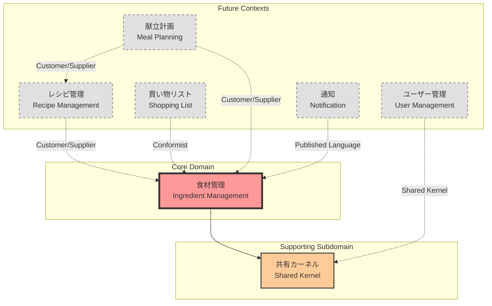

# コンテキストマップ

## 概要

コンテキストマップは、システム全体の境界づけられたコンテキストとその関係を視覚化したものです。
各コンテキストの責務と、コンテキスト間の統合パターンを明確にします。

## 現在のコンテキストマップ



## コンテキストの詳細

### 🥘 食材管理（Ingredient Management）- Core Domain

**タイプ**: コアドメイン
**状態**: 実装中

**責務**:

- 食材の在庫管理
- 賞味期限の追跡
- カテゴリー・単位管理

**主要な集約**:

- Ingredient（食材）
- Category（カテゴリー）
- Unit（単位）

### 📦 共有カーネル（Shared Kernel）

**タイプ**: 共有カーネル
**状態**: 実装中

**責務**:

- 共通の値オブジェクト提供
- ドメインプリミティブの定義
- 共通のビジネスルール

**含まれる概念**:

- Money（金額）
- Quantity（数量）
- DateRange（日付範囲）

## 統合パターンの説明

### Customer/Supplier（顧客/供給者）

- 上流チームと下流チームが協力
- 下流の要求を上流が考慮
- 例：レシピ管理 → 食材管理

### Conformist（順応者）

- 上流のモデルをそのまま受け入れ
- 変換なしで使用
- 例：買い物リスト → 食材管理

### Published Language（公表された言語）

- 明確に定義されたインターフェース
- ドキュメント化されたAPI
- 例：通知 → 食材管理

### Shared Kernel（共有カーネル）

- 複数のコンテキストで共有
- 慎重に管理が必要
- 例：ユーザー管理 ↔ 共有カーネル

## 将来の拡張計画

### Phase 1（現在）

- ✅ 食材管理コンテキストの実装
- ✅ 共有カーネルの基礎

### Phase 2（次期）

- レシピ管理の追加
- 食材管理との統合

### Phase 3

- 買い物リスト機能
- 献立計画機能

### Phase 4

- 通知システム
- ユーザー管理

## コンテキスト間の通信

### 同期通信

```typescript
// レシピ管理 → 食材管理
interface IngredientService {
  checkAvailability(ingredientId: string, quantity: number): Promise<boolean>
  getIngredientDetails(ingredientId: string): Promise<IngredientDTO>
}
```

### 非同期通信（イベント駆動）

```typescript
// 食材管理 → 通知
interface IngredientEvents {
  IngredientExpiringSoon: {
    ingredientId: string
    name: string
    expiryDate: Date
    daysUntilExpiry: number
  }

  IngredientOutOfStock: {
    ingredientId: string
    name: string
  }
}
```

## 設計上の決定事項

### 1. 食材管理を最初のコアドメインとした理由

- ビジネス価値が最も高い
- 他の機能の基盤となる
- 複雑性が適度で実装しやすい

### 2. マイクロサービス化しない理由

- 現段階では過度な複雑性
- モジュラーモノリスで十分
- 将来的な分割は可能

### 3. 共有カーネルを設けた理由

- 共通概念の重複を避ける
- 一貫性の確保
- 保守性の向上

## ベストプラクティス

### DO

- ✅ コンテキスト境界を明確に保つ
- ✅ 各コンテキストで独自の言語を使用
- ✅ 統合ポイントを最小限に
- ✅ イベント駆動で疎結合に

### DON'T

- ❌ コンテキスト間の直接的なDB参照
- ❌ 共有カーネルの肥大化
- ❌ 循環依存
- ❌ 過度に細かい分割

## 更新履歴

| 日付       | 内容     | 作成者  |
| ---------- | -------- | ------- |
| 2025-01-21 | 初版作成 | @system |
