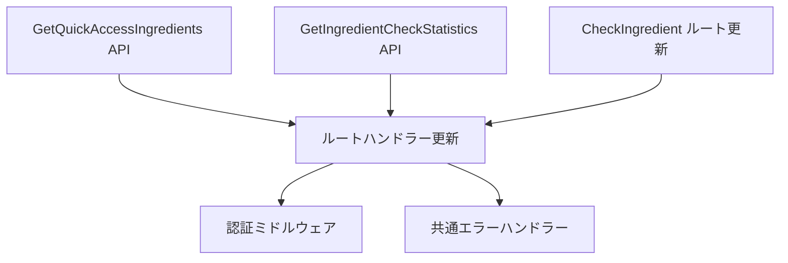

# リファクタリング実装計画（未完了部分）

## 概要

Webアダプターパターンへの移行で未完了の部分をTDDアプローチで実装する詳細計画。
既存の実装（StartShoppingSession、GetActiveShoppingSession等）を参考にして統一的なパターンで実装する。

## 実装優先順位と依存関係



## Task 1: GetQuickAccessIngredients APIのWebアダプター実装

### 1.1 APIハンドラーのテスト作成（Red）

**ファイル**: `tests/unit/modules/ingredients/server/api/handlers/queries/get-quick-access-ingredients.handler.test.ts`

```typescript
import { describe, expect, it, vi, beforeEach } from 'vitest'
import { faker } from '@faker-js/faker'

describe('GetQuickAccessIngredientsApiHandler', () => {
  // 参考: get-active-shopping-session.handler.test.ts

  it('正常系：有効なリクエストでクイックアクセス食材を取得', async () => {
    // Given: 有効なuserId
    // When: handle()を実行
    // Then: 期待されるレスポンス形式
  })

  it('異常系：ユーザーIDが存在しない場合', async () => {
    // ValidationExceptionが発生
  })

  it('異常系：不正なリクエストパラメータ', async () => {
    // ValidationExceptionが発生
  })
})
```

### 1.2 APIハンドラーの実装（Green）

**ファイル**: `src/modules/ingredients/server/api/handlers/queries/get-quick-access-ingredients.handler.ts`

参考実装: `get-shopping-statistics.handler.ts`のパターンを使用

### 1.3 バリデータのテストと実装

**テストファイル**: `tests/unit/modules/ingredients/server/api/validators/get-quick-access-ingredients.validator.test.ts`
**実装ファイル**: `src/modules/ingredients/server/api/validators/get-quick-access-ingredients.validator.ts`

### 1.4 CompositionRootへの登録

```typescript
public getGetQuickAccessIngredientsApiHandler(): GetQuickAccessIngredientsApiHandler {
  return new GetQuickAccessIngredientsApiHandler(
    this.getGetQuickAccessIngredientsHandler()
  )
}
```

### 1.5 API層とアプリケーション層の統合テスト

**ファイル**: `tests/integration/modules/ingredients/server/api/get-quick-access-ingredients.route.integration.test.ts`

```typescript
describe('GetQuickAccessIngredients API Integration', () => {
  // API層 + アプリケーション層の統合テスト
  // 参考: get-active-shopping-session.route.integration.test.ts

  it('実際のハンドラーチェーンで正常に動作する', async () => {
    // CompositionRootから実際のハンドラーを取得
    // APIハンドラー → アプリケーションハンドラーの連携確認
  })
})
```

### 1.6 ルートハンドラーの更新

**更新対象**: `src/app/api/v1/shopping-sessions/quick-access-ingredients/route.ts`

## Task 2: GetIngredientCheckStatistics APIのWebアダプター実装

### 2.1 実装手順（Task 1と同様のパターン）

1. APIハンドラーテスト作成
2. APIハンドラー実装
3. バリデータ実装
4. CompositionRoot登録
5. API層統合テスト: `tests/integration/modules/ingredients/server/api/get-ingredient-check-statistics.route.integration.test.ts`
6. ルートハンドラー更新

**参考にする既存実装**: `get-recent-sessions.handler.ts`

## Task 3: CheckIngredient APIのルートハンドラー更新

### 3.1 API層統合テストの更新

**ファイル**: `tests/integration/modules/ingredients/server/api/check-ingredient.route.integration.test.ts`

```typescript
describe('CheckIngredient API Integration', () => {
  // 既存のテストがあれば、Webアダプターパターンに合わせて更新

  it('APIハンドラー経由で食材チェックが正常に処理される', async () => {
    // CompositionRoot.getCheckIngredientApiHandler()を使用
  })
})
```

### 3.2 ルートハンドラーの更新

現在の実装を以下のパターンに変更：

- `auth()`による認証チェック
- CompositionRootから`getCheckIngredientApiHandler()`を取得
- 統一されたエラーレスポンス形式

**更新対象**: `src/app/api/v1/shopping-sessions/[sessionId]/check-ingredient/route.ts`

## Task 4: 認証ミドルウェアの実装（Optional）

### 4.1 現状分析

現在、各ルートハンドラーで個別に`auth()`を呼び出している。
共通化は可能だが、Next.js App Routerの制約を考慮する必要がある。

### 4.2 実装オプション

1. **高階関数パターン**（推奨）

   ```typescript
   export function withAuth(
     handler: (req: NextRequest, context: any, userId: string) => Promise<NextResponse>
   ) {
     return async (req: NextRequest, context: any) => {
       const session = await auth()
       if (!session?.user?.domainUserId) {
         return unauthorizedResponse()
       }
       return handler(req, context, session.user.domainUserId)
     }
   }
   ```

2. **現状維持**
   各ルートで個別に認証チェック（現在のパターン）

## Task 5: 共通エラーハンドラーの実装（Optional）

### 5.1 エラーレスポンス形式の統一

```typescript
interface ErrorResponse {
  error: {
    code: string
    message: string
    timestamp: string
    path: string
    details?: unknown
  }
}
```

### 5.2 エラーハンドラーヘルパー関数

```typescript
export function handleApiError(error: unknown, path: string): NextResponse {
  if (error instanceof ValidationException) {
    return validationErrorResponse(error, path)
  }
  if (error instanceof BusinessRuleException) {
    return businessRuleErrorResponse(error, path)
  }
  // ... 他のエラータイプ
  return internalServerErrorResponse(path)
}
```

## テストディレクトリ構造

```
tests/
├── unit/
│   └── modules/ingredients/server/
│       └── api/
│           ├── handlers/
│           │   └── queries/
│           │       ├── get-quick-access-ingredients.handler.test.ts
│           │       └── get-ingredient-check-statistics.handler.test.ts
│           └── validators/
│               ├── get-quick-access-ingredients.validator.test.ts
│               └── get-ingredient-check-statistics.validator.test.ts
└── integration/
    └── modules/ingredients/server/
        └── api/
            ├── get-quick-access-ingredients.route.integration.test.ts
            ├── get-ingredient-check-statistics.route.integration.test.ts
            └── check-ingredient.route.integration.test.ts  # 更新
```

## 実装順序とタイムライン

### Phase 1: Query APIのWebアダプター実装（必須）

1. GetQuickAccessIngredients API - 2時間

   - 単体テスト作成
   - APIハンドラー実装
   - 統合テスト作成
   - ルートハンドラー更新

2. GetIngredientCheckStatistics API - 2時間
   - 同上の手順

### Phase 2: ルートハンドラー更新（必須）

3. CheckIngredient ルート更新 - 1時間
   - 統合テスト更新
   - ルートハンドラー更新

### Phase 3: 共通処理（オプション）

4. 認証ミドルウェア - 1時間
5. 共通エラーハンドラー - 1時間

## テスト実行コマンド

各実装後に以下を実行：

```bash
# 単体テスト
pnpm test:unit

# 統合テスト（モジュール内）
pnpm test:integration

# 型チェックとリント
pnpm type-check && pnpm lint && pnpm format:check
```

## 成功基準

1. すべてのAPIがWebアダプターパターンに準拠
2. 統一されたエラーレスポンス形式
3. 認証処理の一貫性
4. テストカバレッジ80%以上
5. 既存の機能に影響なし（後方互換性維持）
6. 統合テストがモジュール内のAPI層に適切に配置される
